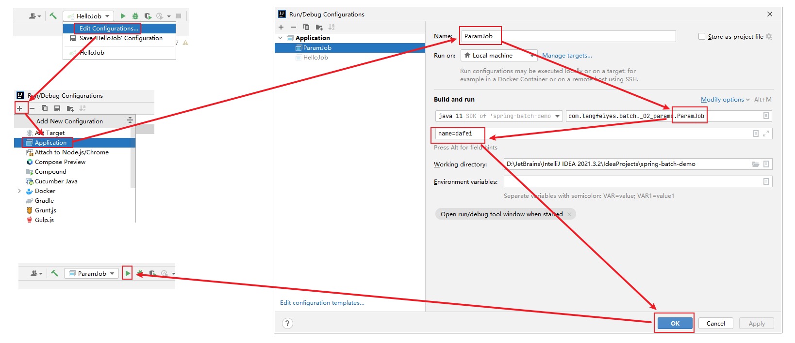

声明：本项目非笔者所写，为大飞老师提供，感谢他对于 spring-batch 教学的贡献。B站搜索spring-batch 教学，可以搜到相关教学视频。
# 一、课程目标

## 课程目标

- 系统了解Spring Batch批处理

- 项目中能熟练使用Spring Batch批处理

  

## 课程内容

## 前置知识

- Java基础
- Maven

- Spring   SpringMVC   SpringBoot
- MyBatis

## 适合人群

- 想学习的所有人


# 二、Spring Batch简介

## 2.1 何为批处理？

何为批处理，大白话：就是将数据分批次进行处理的过程。比如：银行对账逻辑，跨系统数据同步等。

常规的批处理操作步骤：**系统A从数据库中导出数据到文件，系统B读取文件数据并写入到数据库**

**

典型批处理特点：

- 自动执行，根据系统设定的工作步骤自动完成

- 数据量大，少则百万，多则上千万甚至上亿。(如果是10亿，100亿那只能上大数据了)

- 定时执行，比如：每天，每周，每月执行。

  

## 2.2 Spring Batch了解

官网介绍：https://docs.spring.io/spring-batch/docs/current/reference/html/spring-batch-intro.html#spring-batch-intro

这里挑重点讲下：

- Sping Batch 是一个轻量级的、完善的的批处理框架，旨在帮助企业建立健壮、高效的批处理应用。

- Spring Batch 是Spring的一个子项目，基于Spring框架为基础的开发的框架
- Spring Batch 提供大量可重用的组件，比如：日志，追踪，事务，任务作业统计，任务重启，跳过，重复，资源管理等
- Spring Batch 是一个批处理应用框架，不提供调度框架，如果需要定时处理需要额外引入-调度框架，比如： Quartz


## 2.3 Spring Batch 优势

Spring Batch 框架通过提供丰富的开箱即用的组件和高可靠性、高扩展性的能力，使得开发批处理应用的人员专注于业务处理，提高处理应用的开发能力。下面就是使用Spring Batch后能获取到优势：

- 丰富的开箱即用组件

- 面向Chunk的处理

- 事务管理能力

- 元数据管理

- 易监控的批处理应用

- 丰富的流程定义

- 健壮的批处理应用

- 易扩展的批处理应用

- 复用企业现有的IT代码

  

## 2.4 Spring Batch 架构

Spring Batch 核心架构分三层：应用层，核心层，基础架构层。

**

**Application**：应用层，包含所有的批处理作业，程序员自定义代码实现逻辑。

**Batch Core**：核心层，包含Spring Batch启动和控制所需要的核心类，比如：JobLauncher， Job，Step等。

**Batch Infrastructure**：基础架构层，提供通用的读，写与服务处理。

三层体系使得Spring Batch 架构可以在不同层面进行扩展，避免影响，实现高内聚低耦合设计。


# 三、入门案例

## 3.1 批量处理流程

前面对Spring Batch 有大体了解之后，那么开始写个案例玩一下。

开始前，先了解一下Spring Batch程序运行大纲：

**

**JobLauncher**：作业调度器，作业启动主要入口。

**Job**：作业，需要执行的任务逻辑，

**Step**：作业步骤，一个Job作业由1个或者多个Step组成，完成所有Step操作，一个完整Job才算执行结束。

**ItemReader**：Step步骤执行过程中数据输入。可以从数据源(文件系统，数据库，队列等)中读取Item(数据记录)。

**ItemWriter**：Step步骤执行过程中数据输出，将Item(数据记录)写入数据源(文件系统，数据库，队列等)。

**ItemProcessor**：Item数据加工逻辑(输入)，比如：数据清洗，数据转换，数据过滤，数据校验等

**JobRepository**： 保存Job或者检索Job的信息。SpringBatch需要持久化Job(可以选择数据库/内存)，JobRepository就是持久化的接口


## 3.2 入门案例-H2版(内存)

**需求：打印一个hello spring  batch！不带读/写/处理**

**步骤1：导入依赖**

```xml
<parent>
    <groupId>org.springframework.boot</groupId>
    <artifactId>spring-boot-starter-parent</artifactId>
    <version>2.7.3</version>
    <relativePath/>
</parent>
<dependencies>
    <dependency>
        <groupId>org.springframework.boot</groupId>
        <artifactId>spring-boot-starter-batch</artifactId>
    </dependency>
    <dependency>
        <groupId>org.projectlombok</groupId>
        <artifactId>lombok</artifactId>
    </dependency>

	<!--内存版-->
    <dependency>
        <groupId>com.h2database</groupId>
        <artifactId>h2</artifactId>
        <scope>runtime</scope>
    </dependency>

    <dependency>
        <groupId>org.springframework.boot</groupId>
        <artifactId>spring-boot-starter-test</artifactId>
    </dependency>

</dependencies>
```

其中的h2是一个嵌入式内存数据库，后续可以使用MySQL替换

**步骤2：创建测试方法**

```java
package com.langfeiyes.batch._01_hello;

import org.springframework.batch.core.Job;
import org.springframework.batch.core.Step;
import org.springframework.batch.core.StepContribution;
import org.springframework.batch.core.configuration.annotation.EnableBatchProcessing;
import org.springframework.batch.core.configuration.annotation.JobBuilderFactory;
import org.springframework.batch.core.configuration.annotation.StepBuilderFactory;
import org.springframework.batch.core.launch.JobLauncher;
import org.springframework.batch.core.scope.context.ChunkContext;
import org.springframework.batch.core.step.tasklet.Tasklet;
import org.springframework.batch.repeat.RepeatStatus;
import org.springframework.beans.factory.annotation.Autowired;
import org.springframework.boot.SpringApplication;
import org.springframework.boot.autoconfigure.SpringBootApplication;
import org.springframework.context.annotation.Bean;

@SpringBootApplication
@EnableBatchProcessing
public class HelloJob {
    //job调度器
    @Autowired
    private JobLauncher jobLauncher;
    //job构造器工厂
    @Autowired
    private JobBuilderFactory jobBuilderFactory;
    //step构造器工厂
    @Autowired
    private StepBuilderFactory stepBuilderFactory;
    //任务-step执行逻辑由tasklet完成
    @Bean
    public Tasklet tasklet(){
        return new Tasklet() {
            @Override
            public RepeatStatus execute(StepContribution contribution, ChunkContext chunkContext) throws Exception {
                System.out.println("Hello SpringBatch....");
                return RepeatStatus.FINISHED;
            }
        };
    }
    //作业步骤-不带读/写/处理
    @Bean
    public Step step1(){
        return stepBuilderFactory.get("step1")
                .tasklet(tasklet())
                .build();
    }
    //定义作业
    @Bean
    public Job job(){
        return jobBuilderFactory.get("hello-job")
                .start(step1())
                .build();
    }
    public static void main(String[] args) {
        SpringApplication.run(HelloJob.class, args);
    }

}

```

**步骤3：分析**

例子是一个简单的SpringBatch 入门案例，使用了最简单的一种步骤处理模型：Tasklet模型，step1中没有带上读/写/处理逻辑，只有简单打印操作，后续随学习深入，我们再讲解更复杂化模型。


## 3.3 入门案例-MySQL版

MySQL跟上面的h2一样，区别在连接数据库不一致。

**步骤1：在H2版本基础上导入MySQL依赖**

```xml
<!-- <dependency>
    <groupId>com.h2database</groupId>
    <artifactId>h2</artifactId>
    <scope>runtime</scope>
</dependency> -->

<dependency>
    <groupId>mysql</groupId>
    <artifactId>mysql-connector-java</artifactId>
    <version>8.0.12</version>
</dependency>
```

**步骤2：配置数据库四要素与初始化SQL脚本**

```yaml
spring:
  datasource:
    username: root
    password: admin
    url: jdbc:mysql://127.0.0.1:3306/springbatch?serverTimezone=GMT%2B8&useSSL=false&allowPublicKeyRetrieval=true
    driver-class-name: com.mysql.cj.jdbc.Driver
    # 初始化数据库，文件在依赖jar包中
  sql:
    init:
      schema-locations: classpath:org/springframework/batch/core/schema-mysql.sql
      mode: always
      #mode: never
```

这里要注意， sql.init.model 第一次启动为always， 后面启动需要改为never，否则每次执行SQL都会异常。

第一次启动会自动执行指定的脚本，后续不需要再初始化


**步骤3：测试**

跟H2版一样。


# 四、入门案例解析

**1>@EnableBatchProcessing**

批处理启动注解，要求贴配置类或者启动类上

```java
@SpringBootApplication
@EnableBatchProcessing
public class HelloJob {
    ...
}
```

贴上@EnableBatchProcessing注解后，SpringBoot会自动加载JobLauncher  JobBuilderFactory  StepBuilderFactory 类并创建对象交给容器管理，要使用时，直接@Autowired即可

```java
//job调度器
@Autowired
private JobLauncher jobLauncher;
//job构造器工厂
@Autowired
private JobBuilderFactory jobBuilderFactory;
//step构造器工厂
@Autowired
private StepBuilderFactory stepBuilderFactory;
```

**2>配置数据库四要素**

批处理允许重复执行，异常重试，此时需要保存批处理状态与数据，Spring Batch 将数据缓存在H2内存中或者缓存在指定数据库中。入门案例如果要保存在MySQL中，所以需要配置数据库四要素。

**3>创建Tasklet对象**

```java
//任务-step执行逻辑由tasklet完成
@Bean
public Tasklet tasklet(){
    return new Tasklet() {
        @Override
        public RepeatStatus execute(StepContribution contribution, ChunkContext chunkContext) throws Exception {
            System.out.println("Hello SpringBatch....");
            return RepeatStatus.FINISHED;
        }
    };
}
```

Tasklet负责批处理step步骤中具体业务执行，它是一个接口，有且只有一个execute方法，用于定制step执行逻辑。

```java
public interface Tasklet {
	RepeatStatus execute(StepContribution contribution, ChunkContext chunkContext) throws Exception;
}
```

execute方法返回值是一个状态枚举类：RepeatStatus，里面有可继续执行态与已经完成态

```java
public enum RepeatStatus {
	/**
	 * 可继续执行的-tasklet返回这个状态会进入死循环
	 */
	CONTINUABLE(true), 
	/**
	 * 已经完成态
	 */
	FINISHED(false);
    ....
}
```

**4>创建Step对象**

```java
//作业步骤-不带读/写/处理
@Bean
public Step step1(){
    return stepBuilderFactory.get("step1")
        .tasklet(tasklet())
        .build();
}
```

Job作业执行靠Step步骤执行，入门案例选用最简单的Tasklet模式，后续再讲Chunk块处理模式。

**5>创建Job并执行Job**

```java
//定义作业
@Bean
public Job job(){
    return jobBuilderFactory.get("hello-job")
        .start(step1())
        .build();
}
```

创建Job对象交给容器管理，当springboot启动之后，会自动去从容器中加载Job对象，并将Job对象交给JobLauncherApplicationRunner类，再借助JobLauncher类实现job执行。

验证过程；

打断点，debug模式启动

**

**SpringApplication类run方法**

**

**

**

**JobLauncherApplicationRunner类**

**

**

**

**

**JobLauncher接口--实现类：SimpleJobLauncher**

**


# 五、作业对象 Job

## 5.1 作业介绍

### 5.1.1 作业定义

Job作业可以简单理解为一段业务流程的实现，可以根据业务逻辑拆分一个或者多个逻辑块(step)，然后业务逻辑顺序，逐一执行。

所以作业可以定义为：**能从头到尾独立执行的有序的步骤(Step)列表。**

- 有序的步骤列表

  一次作业由不同的步骤组成，这些步骤顺序是有意义的，如果不按照顺序执行，会引起逻辑混乱，比如购物结算，先点结算，再支付，最后物流，如果反过来那就乱套了，作业也是这么一回事。

- 从头到尾

  一次作业步骤固定了，在没有外部交互情况下，会从头到尾执行，前一个步骤做完才会到后一个步骤执行，不允许随意跳转，但是可以按照一定逻辑跳转。

- 独立

  每一个批处理作业都应该不受外部依赖影响情况下执行。

看回这幅图，批处理作业Job是由一组步骤Step对象组成，每一个作业都有自己名称，可以定义Step执行顺序。

**

### 5.1.2 作业代码设计

前面定义讲了作业执行是相互独立的，代码该怎么设计才能保证每次作业独立的性呢？

答案是：**Job instance**(作业实例) 与 **Job Execution**(作业执行对象)

**Job instance**(作业实例)

当作业运行时，会创建一个Job Instance(作业实例)，它代表作业的一次逻辑运行，可通过作业名称与作业标识参数进行区分。

比如一个业务需求： 每天定期数据同步，**作业名称-daily-sync-job**    **作业标记参数-当天时间**

**Job Execution**(作业执行对象)

当作业运行时，也会创建一个Job Execution(作业执行器)，负责记录Job执行情况(比如：开始执行时间，结束时间，处理状态等)。

**

那为啥会出现上面架构设计呢？原因：批处理执行过程中可能出现两种情况：

- 一种是一次成功

  仅一次就成从头到尾正常执行完毕，在数据库中会记录一条Job Instance 信息， 跟一条 Job Execution 信息

- 另外一种异常执行

  在执行过程因异常导致作业结束，在数据库中会记录一条Job Instance 信息， 跟一条Job Execution 信息。如果此时使用相同识别参数再次启动作业，那么数据库中不会多一条Job Instance 信息， 但是会多了一条Job Execution 信息，这就意味中任务重复执行了。刚刚说每天批处理任务案例，如果当天执行出异常，那么人工干预修复之后，可以再次执行。

  

最后来个总结：

**Job Instance  =  Job名称  +  识别参数**

**Job Instance 一次执行创建一个 Job Execution对象**

**完整的一次Job Instance 执行可能创建一个Job Execution对象，也可能创建多个Job  Execution对象**


## 5.2 作业配置

再看回入门案例

```java
package com.langfeiyes.batch._01_hello;

import org.springframework.batch.core.Job;
import org.springframework.batch.core.Step;
import org.springframework.batch.core.StepContribution;
import org.springframework.batch.core.configuration.annotation.EnableBatchProcessing;
import org.springframework.batch.core.configuration.annotation.JobBuilderFactory;
import org.springframework.batch.core.configuration.annotation.StepBuilderFactory;
import org.springframework.batch.core.launch.JobLauncher;
import org.springframework.batch.core.scope.context.ChunkContext;
import org.springframework.batch.core.step.tasklet.Tasklet;
import org.springframework.batch.repeat.RepeatStatus;
import org.springframework.beans.factory.annotation.Autowired;
import org.springframework.boot.SpringApplication;
import org.springframework.boot.autoconfigure.SpringBootApplication;
import org.springframework.context.annotation.Bean;

@SpringBootApplication
@EnableBatchProcessing
public class HelloJob {
    //job构造器工厂
    @Autowired
    private JobBuilderFactory jobBuilderFactory;
    //step构造器工厂
    @Autowired
    private StepBuilderFactory stepBuilderFactory;
    //任务-step执行逻辑由tasklet完成
    @Bean
    public Tasklet tasklet(){
        return new Tasklet() {
            @Override
            public RepeatStatus execute(StepContribution contribution, ChunkContext chunkContext) throws Exception {
                System.out.println("Hello SpringBatch....");
                return RepeatStatus.FINISHED;
            }
        };
    }
    //作业步骤-不带读/写/处理
    @Bean
    public Step step1(){
        return stepBuilderFactory.get("step1")
                .tasklet(tasklet())
                .build();
    }
    //定义作业
    @Bean
    public Job job(){
        return jobBuilderFactory.get("hello-job")
                .start(step1())
                .build();
    }
    
    public static void main(String[] args) {
        SpringApplication.run(HelloJob.class, args);
    }

}

```

在启动类中贴上@EnableBatchProcessing注解，SpringBoot会自动听JobLauncher  JobBuilderFactory  StepBuilderFactory 对象，分别用于执行Job，创建Job，创建Step逻辑。有了这些逻辑，Job批处理就剩下组装了。


## 5.3 作业参数

### 5.3.1 JobParameters

前面提到，作业的启动条件是作业名称 + 识别参数，Spring Batch使用**JobParameters**类来封装了所有传给作业的参数。

我们看下JobParameters 源码

```java
public class JobParameters implements Serializable {

	private final Map<String,JobParameter> parameters;

	public JobParameters() {
		this.parameters = new LinkedHashMap<>();
	}

	public JobParameters(Map<String,JobParameter> parameters) {
		this.parameters = new LinkedHashMap<>(parameters);
	}
    .....
}
```

**

从上面代码/截图来看，JobParameters 类底层维护了Map<String,JobParameter>，是一个Map集合的封装器，提供了不同类型的get操作。

### 5.3.2 作业参数设置

还记得Spring Batch 入门案例吗，当初debug时候看到Job作业最终是调用时 **JobLauncher **(job启动器)接口run方法启动。

看下源码：JobLauncher

```java
public interface JobLauncher {
	public JobExecution run(Job job, JobParameters jobParameters) throws JobExecutionAlreadyRunningException,
			JobRestartException, JobInstanceAlreadyCompleteException, JobParametersInvalidException;

}
```

在JobLauncher 启动器执行run方法时，直接传入即可。

```java
jobLauncher.run(job, params);
```

那我们使用SpringBoot 方式启动Spring Batch该怎么传值呢？

**1>定义ParamJob类，准备好要执行的job**

```java
package com.langfeiyes.batch._02_params;

import org.springframework.batch.core.*;
import org.springframework.batch.core.configuration.annotation.EnableBatchProcessing;
import org.springframework.batch.core.configuration.annotation.JobBuilderFactory;
import org.springframework.batch.core.configuration.annotation.StepBuilderFactory;
import org.springframework.batch.core.configuration.annotation.StepScope;
import org.springframework.batch.core.scope.context.ChunkContext;
import org.springframework.batch.core.step.tasklet.Tasklet;
import org.springframework.batch.repeat.RepeatStatus;
import org.springframework.beans.factory.annotation.Autowired;
import org.springframework.beans.factory.annotation.Value;
import org.springframework.boot.SpringApplication;
import org.springframework.boot.autoconfigure.SpringBootApplication;
import org.springframework.context.annotation.Bean;


@SpringBootApplication
@EnableBatchProcessing
public class ParamJob {
    //job构造器工厂
    @Autowired
    private JobBuilderFactory jobBuilderFactory;
    //step构造器工厂
    @Autowired
    private StepBuilderFactory stepBuilderFactory;

    @Bean
    public Tasklet tasklet(){
        return new Tasklet() {
            @Override
            public RepeatStatus execute(StepContribution contribution, ChunkContext chunkContext) throws Exception {
                System.out.println("param SpringBatch....");
                return RepeatStatus.FINISHED;
            }
        };
    }
    @Bean
    public Step  step1(){
        return  stepBuilderFactory.get("step1")
                .tasklet(tasklet())
                .build();
    }
    @Bean
    public Job job(){
        return jobBuilderFactory.get("param-job")
                .start(step1())
                .build();
    }
    public static void main(String[] args) {
        SpringApplication.run(HelloJob.class, args);
    }
}
```

**2>使用idea的命令传值的方式设置job作业参数**

****

>  **注意：如果不想这么麻烦，其实也可以，先空参数执行一次，然后指定参数后再执行。**

点击绿色按钮，启动SpringBoot程序，作业运行之后，会在batch_job_execution_params 增加一条记录，用于区分唯一的Job Instance实例

**


**注意：如果不改动JobParameters 参数内容，再执行一次批处理，会直接报错。**

**

**原因：Spring Batch 相同Job名与相同标识参数只能成功执行一次。**


### 5.3.3 作业参数获取

当将作业参数传入到作业流程，该如何获取呢？

**


Spring Batch 提供了2种方案：

**方案1：使用ChunkContext类**

ParamJob类中tasklet写法

```java
@Bean
public Tasklet tasklet(){
    return new Tasklet() {
        @Override
        public RepeatStatus execute(StepContribution contribution, ChunkContext chunkContext) throws Exception {
            Map<String, Object> parameters = chunkContext.getStepContext().getJobParameters();
            System.out.println("params---name:" + parameters.get("name"));
            return RepeatStatus.FINISHED;
        }
    };
}
```

**注意：job名：param-job    job参数：name=dafei 已经执行了，再执行会报错**

**所以要么改名字，要么改参数，这里选择改job名字（拷贝一份job实例方法，然后注释掉，修改Job名称）**

```java
//    @Bean
//    public Job job(){
//        return jobBuilderFactory.get("param-job")
//                .start(step1())
//                .build();
//    }

    @Bean
    public Job job(){
        return jobBuilderFactory.get("param-chunk-job")
                .start(step1())
                .build();
    }
```


**方案2：使用@Value 延时获取**

```java
@StepScope
@Bean
public Tasklet tasklet(@Value("#{jobParameters['name']}")String name){
    return new Tasklet() {
        @Override
        public RepeatStatus execute(StepContribution contribution, ChunkContext chunkContext) throws Exception {
            System.out.println("params---name:" + name);
            return RepeatStatus.FINISHED;
        }
    };
}

@Bean
public Step  step1(){
    return  stepBuilderFactory.get("step1")
        .tasklet(tasklet(null))
        .build();
}
```

step1调用tasklet实例方法时不需要传任何参数，Spring Boot 在加载Tasklet Bean实例时会自动注入。

```java
//    @Bean
//    public Job job(){
//        return jobBuilderFactory.get("param-chunk-job")
//                .start(step1())
//                .build();
//    }

@Bean
public Job job(){
    return jobBuilderFactory.get("param-value-job")
        .start(step1())
        .build();
}
```

这里要注意，**必须贴上@StepScope** ，否则会报错，表示在启动项目的时候，不加载该Step步骤bean，等step1()被调用时才加载。这就是所谓延时获取。


### 5.3.4 作业参数校验

当外部传入的参数进入作业时，如何确保参数符合期望呢？使用Spring Batch 的参数校验器：**JobParametersValidator** 接口。

先来看下JobParametersValidator 接口源码：

```java
public interface JobParametersValidator {
	void validate(@Nullable JobParameters parameters) throws JobParametersInvalidException;
}
```

JobParametersValidator 接口有且仅有唯一的validate方法，参数为JobParameters，没有返回值。这就意味着不符合参数要求，需要抛出异常来结束步骤。

#### 定制参数校验器

Spring Batch 提供JobParametersValidator参数校验接口，其目的就是让我们通过实现接口方式定制参数校验逻辑。

**需求：如果传入作业的参数name值 为null 或者 "" 时报错**

```java
public class NameParamValidator  implements JobParametersValidator {
    @Override
    public void validate(JobParameters parameters) throws JobParametersInvalidException {
        String name = parameters.getString("name");

        if(!StringUtils.hasText(name)){
            throw new JobParametersInvalidException("name 参数不能为空");
        }
    }
}
```

其中的JobParametersInvalidException 异常是Spring Batch 专门提供参数校验失败异常，当然我们也可以自定义或使用其他异常。

```java
package com.langfeiyes.batch._03_param_validator;

import org.springframework.batch.core.Job;
import org.springframework.batch.core.Step;
import org.springframework.batch.core.StepContribution;
import org.springframework.batch.core.configuration.annotation.EnableBatchProcessing;
import org.springframework.batch.core.configuration.annotation.JobBuilderFactory;
import org.springframework.batch.core.configuration.annotation.StepBuilderFactory;
import org.springframework.batch.core.configuration.annotation.StepScope;
import org.springframework.batch.core.scope.context.ChunkContext;
import org.springframework.batch.core.step.tasklet.Tasklet;
import org.springframework.batch.repeat.RepeatStatus;
import org.springframework.beans.factory.annotation.Autowired;
import org.springframework.beans.factory.annotation.Value;
import org.springframework.boot.SpringApplication;
import org.springframework.boot.autoconfigure.SpringBootApplication;
import org.springframework.context.annotation.Bean;

import java.util.Map;

@SpringBootApplication
@EnableBatchProcessing
public class ParamValidatorJob {
    @Autowired
    private JobBuilderFactory jobBuilderFactory;
    @Autowired
    private StepBuilderFactory stepBuilderFactory;

    @Bean
    public Tasklet tasklet(){
        return new Tasklet() {
            @Override
            public RepeatStatus execute(StepContribution contribution, ChunkContext chunkContext) throws Exception {
                Map<String, Object> parameters = chunkContext.getStepContext().getJobParameters();
                System.out.println("params---name:" + parameters.get("name"));
                return RepeatStatus.FINISHED;
            }
        };
    }

    @Bean
    public Step  step1(){
        return  stepBuilderFactory.get("step1")
                .tasklet(tasklet())
                .build();
    }

    //配置name参数校验器
    @Bean
    public NameParamValidator validator(){
        return new NameParamValidator();
    }

    @Bean
    public Job job(){
        return jobBuilderFactory.get("name-param-validator-job")
                .start(step1())
                .validator(validator())  //参数校验器
                .build();
    }
    public static void main(String[] args) {
        SpringApplication.run(ParamValidatorJob.class, args);
    }
}

```

新定义**validator()**实例方法，将定制的参数解析器加到Spring容器中，修改job()实例方法，加上**.validator(validator())**   校验逻辑。

第一次启动时，没有传任何参数

```java
String name = parameters.getString("name");
```

name为null，直接报错


加上name=dafei参数之后，正常执行

**


#### 默认参数校验器

除去上面的定制参数校验器外，Spring Batch 也提供2个默认参数校验器：DefaultJobParametersValidator(默认参数校验器) 跟 CompositeJobParametersValidator(组合参数校验器)。

DefaultJobParametersValidator参数校验器

```java
public class DefaultJobParametersValidator implements JobParametersValidator, InitializingBean {
	private Collection<String> requiredKeys;
	private Collection<String> optionalKeys;
    ....
}   
```

默认的参数校验器它功能相对简单，维护2个key集合requiredKeys 跟 optionalKeys

- requiredKeys  是一个集合，表示作业参数jobParameters中必须包含集合中指定的keys
- optionalKeys  也是一个集合，该集合中的key 是可选参数


**需求：如果作业参数没有name参数报错，age参数可有可无**

```java
package com.langfeiyes.batch._03_param_validator;

import org.springframework.batch.core.Job;
import org.springframework.batch.core.Step;
import org.springframework.batch.core.StepContribution;
import org.springframework.batch.core.configuration.annotation.EnableBatchProcessing;
import org.springframework.batch.core.configuration.annotation.JobBuilderFactory;
import org.springframework.batch.core.configuration.annotation.StepBuilderFactory;
import org.springframework.batch.core.configuration.annotation.StepScope;
import org.springframework.batch.core.job.DefaultJobParametersValidator;
import org.springframework.batch.core.scope.context.ChunkContext;
import org.springframework.batch.core.step.tasklet.Tasklet;
import org.springframework.batch.repeat.RepeatStatus;
import org.springframework.beans.factory.annotation.Autowired;
import org.springframework.beans.factory.annotation.Value;
import org.springframework.boot.SpringApplication;
import org.springframework.boot.autoconfigure.SpringBootApplication;
import org.springframework.context.annotation.Bean;

import java.util.Map;

@SpringBootApplication
@EnableBatchProcessing
public class ParamValidatorJob {
    @Autowired
    private JobBuilderFactory jobBuilderFactory;
    @Autowired
    private StepBuilderFactory stepBuilderFactory;

    @Bean
    public Tasklet tasklet(){
        return new Tasklet() {
            @Override
            public RepeatStatus execute(StepContribution contribution, ChunkContext chunkContext) throws Exception {
                Map<String, Object> parameters = chunkContext.getStepContext().getJobParameters();
                System.out.println("params---name:" + parameters.get("name"));
                System.out.println("params---age:" + parameters.get("age"));
                return RepeatStatus.FINISHED;
            }
        };
    }

    @Bean
    public Step  step1(){
        return  stepBuilderFactory.get("step1")
                .tasklet(tasklet())
                .build();
    }

    //配置name参数校验器
    @Bean
    public NameParamValidator validator(){
        return new NameParamValidator();
    }

     //配置默认参数校验器
    @Bean
    public DefaultJobParametersValidator defaultValidator(){
        DefaultJobParametersValidator defaultValidator = new DefaultJobParametersValidator();
        defaultValidator.setRequiredKeys(new String[]{"name"});  //必填
        defaultValidator.setOptionalKeys(new String[]{"age"});   //可选
        return defaultValidator;
    }

    @Bean
    public Job job(){
        return jobBuilderFactory.get("default-param-validator-job")
                .start(step1())
                //.validator(validator())  //参数校验器
                .validator(defaultValidator())  //默认参数校验器
                .build();
    }
    public static void main(String[] args) {
        SpringApplication.run(ParamValidatorJob.class, args);
    }
}

```

新定义defaultValidator() 实例方法，将默认参数解析器加到Spring容器中，修改job实例方法，加上**.validator(defaultValidator())。** 

右键启动，不填name 跟 age 参数，直接报错


如果填上name参数，即使不填age参数，可以通过，原因是age是可选的。

**


#### 组合参数校验器

CompositeJobParametersValidator 组合参数校验器，顾名思义就是将多个参数校验器组合在一起。

看源码，大体能看出该校验器逻辑

```java
public class CompositeJobParametersValidator implements JobParametersValidator, InitializingBean {

	private List<JobParametersValidator> validators;

	@Override
	public void validate(@Nullable JobParameters parameters) throws JobParametersInvalidException {
		for (JobParametersValidator validator : validators) {
			validator.validate(parameters);
		}
	}
	
	public void setValidators(List<JobParametersValidator> validators) {
		this.validators = validators;
	}

	@Override
	public void afterPropertiesSet() throws Exception {
		Assert.notNull(validators, "The 'validators' may not be null");
		Assert.notEmpty(validators, "The 'validators' may not be empty");
	}
}
```

底层维护一个validators 集合，校验时调用validate 方法，依次执行校验器集合中校验器方法。另外，多了一个afterPropertiesSet方法，用于校验validators 集合中的校验器是否为null。

**需求：要求步骤中必须有name属性，并且不能为空**

分析：必须有，使用DefaultJobParametersValidator 参数校验器， 不能为null，使用指定定义的NameParamValidator参数校验器

```java
package com.langfeiyes.batch._03_param_validator;

import org.springframework.batch.core.Job;
import org.springframework.batch.core.Step;
import org.springframework.batch.core.StepContribution;
import org.springframework.batch.core.configuration.annotation.EnableBatchProcessing;
import org.springframework.batch.core.configuration.annotation.JobBuilderFactory;
import org.springframework.batch.core.configuration.annotation.StepBuilderFactory;
import org.springframework.batch.core.configuration.annotation.StepScope;
import org.springframework.batch.core.job.CompositeJobParametersValidator;
import org.springframework.batch.core.job.DefaultJobParametersValidator;
import org.springframework.batch.core.scope.context.ChunkContext;
import org.springframework.batch.core.step.tasklet.Tasklet;
import org.springframework.batch.repeat.RepeatStatus;
import org.springframework.beans.factory.annotation.Autowired;
import org.springframework.beans.factory.annotation.Value;
import org.springframework.boot.SpringApplication;
import org.springframework.boot.autoconfigure.SpringBootApplication;
import org.springframework.context.annotation.Bean;

import java.util.Arrays;
import java.util.Map;

@SpringBootApplication
@EnableBatchProcessing
public class ParamValidatorJob {
    @Autowired
    private JobBuilderFactory jobBuilderFactory;
    @Autowired
    private StepBuilderFactory stepBuilderFactory;

    @Bean
    public Tasklet tasklet(){
        return new Tasklet() {
            @Override
            public RepeatStatus execute(StepContribution contribution, ChunkContext chunkContext) throws Exception {
                Map<String, Object> parameters = chunkContext.getStepContext().getJobParameters();
                System.out.println("params---name:" + parameters.get("name"));
                System.out.println("params---age:" + parameters.get("age"));
                return RepeatStatus.FINISHED;
            }
        };
    }

    @Bean
    public Step  step1(){
        return  stepBuilderFactory.get("step1")
                .tasklet(tasklet())
                .build();
    }

    //配置name参数校验器
    @Bean
    public NameParamValidator validator(){
        return new NameParamValidator();
    }

     //配置默认参数校验器
    @Bean
    public DefaultJobParametersValidator defaultValidator(){
        DefaultJobParametersValidator defaultValidator = new DefaultJobParametersValidator();
        defaultValidator.setRequiredKeys(new String[]{"name"});  //必填
        defaultValidator.setOptionalKeys(new String[]{"age"});   //可选
        return defaultValidator;
    }

    //配置组合参数校验器
    @Bean
    public CompositeJobParametersValidator compositeValidator(){

        DefaultJobParametersValidator defaultValidator = new DefaultJobParametersValidator();
        defaultValidator.setRequiredKeys(new String[]{"name"});  //name必填
        defaultValidator.setOptionalKeys(new String[]{"age"});   //age可选

        NameParamValidator nameParamValidator = new NameParamValidator();  //name 不能为空

        CompositeJobParametersValidator compositeValidator = new CompositeJobParametersValidator();
        //按照传入的顺序，先执行defaultValidator 后执行nameParamValidator
        compositeValidator.setValidators(Arrays.asList(defaultValidator, nameParamValidator));

        try {
            compositeValidator.afterPropertiesSet();  //判断校验器是否为null
        } catch (Exception e) {
            e.printStackTrace();
        }

        return compositeValidator;
    }

    @Bean
    public Job job(){
        return jobBuilderFactory.get("composite-param-validator-job")
                .start(step1())
                //.validator(validator())  //参数校验器
                //.validator(defaultValidator())  //默认参数校验器
                .validator(compositeValidator())  //组合参数校验器
                .build();
    }
    public static void main(String[] args) {
        SpringApplication.run(ParamValidatorJob.class, args);
    }
}

```

新定义compositeValidator() 实例方法，将组合参数解析器加到spring容器中，修改job()实例方法，加上**.validator(compositeValidator())。** 

右键启动，不填name参数，测试报错。如果放开name参数，传null值，一样报错。

**


### 5.3.5 作业增量参数

不知道大家发现了没有，每次运行作业时，都改动作业名字，或者改动作业的参数，原因是作业启动有限制：相同标识参数与相同作业名的作业，只能成功运行一次。那如果想每次启动，又不想改动标识参数跟作业名怎么办呢？答案是：**使用JobParametersIncrementer (作业参数增量器)**

看下源码，了解一下原理

```java
public interface JobParametersIncrementer {
	JobParameters getNext(@Nullable JobParameters parameters);

}
```

JobParametersIncrementer 增量器是一个接口，里面只有getNext方法，参数是JobParameters 返回值也是JobParameters。通过这个getNext方法，在作业启动时我们可以给JobParameters 添加或者修改参数。**简单理解就是让标识参数每次都变动**

#### 作业递增run.id参数

Spring Batch 提供一个run.id自增参数增量器：**RunIdIncrementer**，每次启动时，里面维护名为**run.id** 标识参数，每次启动让其自增 1。

看下源码：

```java
public class RunIdIncrementer implements JobParametersIncrementer {

	private static String RUN_ID_KEY = "run.id";

	private String key = RUN_ID_KEY;

	public void setKey(String key) {
		this.key = key;
	}

	@Override
	public JobParameters getNext(@Nullable JobParameters parameters) {

		JobParameters params = (parameters == null) ? new JobParameters() : parameters;
		JobParameter runIdParameter = params.getParameters().get(this.key);
		long id = 1;
		if (runIdParameter != null) {
			try {
				id = Long.parseLong(runIdParameter.getValue().toString()) + 1;
			}
			catch (NumberFormatException exception) {
				throw new IllegalArgumentException("Invalid value for parameter "
						+ this.key, exception);
			}
		}
		return new JobParametersBuilder(params).addLong(this.key, id).toJobParameters();
	}

}
```

核心getNext方法，在JobParameters 对象维护一个**run.id**，每次作业启动时，都调用getNext方法获取JobParameters，保证其 **run.id** 参数能自增1

具体用法：

```java
package com.langfeiyes.batch._04_param_incr;

import com.langfeiyes.batch._03_param_validator.NameParamValidator;
import org.springframework.batch.core.Job;
import org.springframework.batch.core.Step;
import org.springframework.batch.core.StepContribution;
import org.springframework.batch.core.configuration.annotation.EnableBatchProcessing;
import org.springframework.batch.core.configuration.annotation.JobBuilderFactory;
import org.springframework.batch.core.configuration.annotation.StepBuilderFactory;
import org.springframework.batch.core.configuration.annotation.StepScope;
import org.springframework.batch.core.job.CompositeJobParametersValidator;
import org.springframework.batch.core.job.DefaultJobParametersValidator;
import org.springframework.batch.core.launch.support.RunIdIncrementer;
import org.springframework.batch.core.scope.context.ChunkContext;
import org.springframework.batch.core.step.tasklet.Tasklet;
import org.springframework.batch.repeat.RepeatStatus;
import org.springframework.beans.factory.annotation.Autowired;
import org.springframework.boot.SpringApplication;
import org.springframework.boot.autoconfigure.SpringBootApplication;
import org.springframework.context.annotation.Bean;

import java.util.Arrays;
import java.util.Map;

@SpringBootApplication
@EnableBatchProcessing
public class IncrementParamJob {
    @Autowired
    private JobBuilderFactory jobBuilderFactory;
    @Autowired
    private StepBuilderFactory stepBuilderFactory;

    @Bean
    public Tasklet tasklet(){
        return new Tasklet() {
            @Override
            public RepeatStatus execute(StepContribution contribution, ChunkContext chunkContext) throws Exception {
                Map<String, Object> parameters = chunkContext.getStepContext().getJobParameters();
                System.out.println("params---run.id:" + parameters.get("run.id"));
                return RepeatStatus.FINISHED;
            }
        };
    }

    @Bean
    public Step  step1(){
        return  stepBuilderFactory.get("step1")
                .tasklet(tasklet())
                .build();
    }

    @Bean
    public Job job(){
        return jobBuilderFactory.get("incr-params-job")
                .start(step1())
                .incrementer(new RunIdIncrementer())  //参数增量器(run.id自增)
                .build();
    }
    public static void main(String[] args) {
        SpringApplication.run(IncrementParamJob.class, args);
    }
}

```

修改tasklet()方法，获取**run.id**参数，修改job实例方法，加上**.incrementer(new RunIdIncrementer())** ，保证参数能自增。

连续执行3次，观察：**batch_job_execution_params** 表

**

其中的run.id参数值一直增加，其中再多遍也没啥问题。

#### 作业时间戳参数

run.id 作为标识参数貌似没有具体业务意义，如果将时间戳作为标识参数那就不一样了，比如这种运用场景：每日任务批处理，这时就需要记录每天的执行时间了。那该怎么实现呢？

Spring Batch 中没有现成时间戳增量器，需要自己定义

```java
//时间戳作业参数增量器
public class DailyTimestampParamIncrementer implements JobParametersIncrementer {
    @Override
    public JobParameters getNext(JobParameters parameters) {
        return new JobParametersBuilder(parameters)
                .addLong("daily", new Date().getTime())  //添加时间戳
                .toJobParameters();
    }
}
```

定义一个标识参数：daily，记录当前时间戳

```java
package com.langfeiyes.batch._04_param_incr;

import com.langfeiyes.batch._03_param_validator.NameParamValidator;
import org.springframework.batch.core.Job;
import org.springframework.batch.core.Step;
import org.springframework.batch.core.StepContribution;
import org.springframework.batch.core.configuration.annotation.EnableBatchProcessing;
import org.springframework.batch.core.configuration.annotation.JobBuilderFactory;
import org.springframework.batch.core.configuration.annotation.StepBuilderFactory;
import org.springframework.batch.core.configuration.annotation.StepScope;
import org.springframework.batch.core.job.CompositeJobParametersValidator;
import org.springframework.batch.core.job.DefaultJobParametersValidator;
import org.springframework.batch.core.launch.support.RunIdIncrementer;
import org.springframework.batch.core.scope.context.ChunkContext;
import org.springframework.batch.core.step.tasklet.Tasklet;
import org.springframework.batch.repeat.RepeatStatus;
import org.springframework.beans.factory.annotation.Autowired;
import org.springframework.boot.SpringApplication;
import org.springframework.boot.autoconfigure.SpringBootApplication;
import org.springframework.context.annotation.Bean;

import java.util.Arrays;
import java.util.Map;

@SpringBootApplication
@EnableBatchProcessing
public class IncrementParamJob {
    @Autowired
    private JobBuilderFactory jobBuilderFactory;
    @Autowired
    private StepBuilderFactory stepBuilderFactory;

    @Bean
    public Tasklet tasklet(){
        return new Tasklet() {
            @Override
            public RepeatStatus execute(StepContribution contribution, ChunkContext chunkContext) throws Exception {
                Map<String, Object> parameters = chunkContext.getStepContext().getJobParameters();
                System.out.println("params---daily:" + parameters.get("daily"));
                return RepeatStatus.FINISHED;
            }
        };
    }

    //时间戳增量器
    @Bean
    public DailyTimestampParamIncrementer dailyTimestampParamIncrementer(){
        return new DailyTimestampParamIncrementer();
    }


    @Bean
    public Step  step1(){
        return  stepBuilderFactory.get("step1")
                .tasklet(tasklet())
                .build();
    }

    @Bean
    public Job job(){
        return jobBuilderFactory.get("incr-params-job")
                .start(step1())
                //.incrementer(new RunIdIncrementer())  //参数增量器(run.id自增)
                .incrementer(dailyTimestampParamIncrementer())  //时间戳增量器
                .build();
    }
    public static void main(String[] args) {
        SpringApplication.run(IncrementParamJob.class, args);
    }
}

```

定义实例方法**dailyTimestampParamIncrementer()**将自定义时间戳增量器添加Spring容器中，修改job()实例方法，添加**.incrementer(dailyTimestampParamIncrementer())**  增量器，修改tasklet() 方法，获取 **daily**参数。

连续执行3次，查看**batch_job_execution_params** 表

**

很明显可以看出daily在变化，而run.id 没有动，是3，为啥？因为**.incrementer(new RunIdIncrementer())**  被注释掉了。

## 5.4 作业监听器

作业监听器：用于监听作业的执行过程逻辑。在作业执行前，执行后2个时间点嵌入业务逻辑。

- 执行前：一般用于初始化操作， 作业执行前需要着手准备工作，比如：各种连接建立，线程池初始化等。
- 执行后：业务执行完后，需要做各种清理动作，比如释放资源等。

Spring Batch 使用**JobExecutionListener** 接口 实现作业监听。

```java
public interface JobExecutionListener {
    //作业执行前
	void beforeJob(JobExecution jobExecution);
    //作业执行后
	void afterJob(JobExecution jobExecution);
}
```

**需求：记录作业执行前，执行中，与执行后的状态**

**方式一：接口方式**

```java
//作业状态--接口方式
public class JobStateListener  implements JobExecutionListener {
    //作业执行前
    @Override
    public void beforeJob(JobExecution jobExecution) {
        System.err.println("执行前-status：" + jobExecution.getStatus());
    }
    //作业执行后
    @Override
    public void afterJob(JobExecution jobExecution) {
        System.err.println("执行后-status：" + jobExecution.getStatus());
    }
}
```

定义JobStateListener 实现JobExecutionListener 接口，重写beforeJob，afterJob 2个方法。

```java

import org.springframework.batch.core.Job;
import org.springframework.batch.core.JobExecution;
import org.springframework.batch.core.Step;
import org.springframework.batch.core.StepContribution;
import org.springframework.batch.core.configuration.annotation.EnableBatchProcessing;
import org.springframework.batch.core.configuration.annotation.JobBuilderFactory;
import org.springframework.batch.core.configuration.annotation.StepBuilderFactory;
import org.springframework.batch.core.scope.context.ChunkContext;
import org.springframework.batch.core.step.tasklet.Tasklet;
import org.springframework.batch.repeat.RepeatStatus;
import org.springframework.beans.factory.annotation.Autowired;
import org.springframework.boot.SpringApplication;
import org.springframework.boot.autoconfigure.SpringBootApplication;
import org.springframework.context.annotation.Bean;

@SpringBootApplication
@EnableBatchProcessing
public class StatusListenerJob {
    @Autowired
    private JobBuilderFactory jobBuilderFactory;
    @Autowired
    private StepBuilderFactory stepBuilderFactory;

    @Bean
    public Tasklet tasklet(){
        return new Tasklet() {
            @Override
            public RepeatStatus execute(StepContribution contribution, ChunkContext chunkContext) throws Exception {
                JobExecution jobExecution = contribution.getStepExecution().getJobExecution();
                System.err.println("执行中-status：" + jobExecution.getStatus());
                return RepeatStatus.FINISHED;
            }
        };
    }

    //状态监听器
    @Bean
    public JobStateListener jobStateListener(){
        return new JobStateListener();
    }

    @Bean
    public Step  step1(){
        return  stepBuilderFactory.get("step1")
                .tasklet(tasklet())
                .build();
    }
    @Bean
    public Job job(){
        return jobBuilderFactory.get("status-listener-job")
                .start(step1())
                .listener(jobStateListener())  //设置状态监听器
                .build();
    }
    public static void main(String[] args) {
        SpringApplication.run(StatusListenerJob.class, args);
    }
}
```

新加**jobStateListener()**实例方法创建对象交个Spring容器管理，修改job()方法，添加**.listener(jobStateListener())**  状态监听器，直接执行，观察结果

**


**方式二：注解方式**

除去上面通过实现接口方式实现监听之外，也可以使用**@BeforeJob  @AfterJob** 2个注解实现

```java
//作业状态--注解方式
public class JobStateAnnoListener  {
    @BeforeJob
    public void beforeJob(JobExecution jobExecution) {
        System.err.println("执行前-anno-status：" + jobExecution.getStatus());
    }

    @AfterJob
    public void afterJob(JobExecution jobExecution) {
        System.err.println("执行后-anno-status：" + jobExecution.getStatus());
    }
}
```

```java

import org.springframework.batch.core.Job;
import org.springframework.batch.core.JobExecution;
import org.springframework.batch.core.Step;
import org.springframework.batch.core.StepContribution;
import org.springframework.batch.core.configuration.annotation.EnableBatchProcessing;
import org.springframework.batch.core.configuration.annotation.JobBuilderFactory;
import org.springframework.batch.core.configuration.annotation.StepBuilderFactory;
import org.springframework.batch.core.launch.support.RunIdIncrementer;
import org.springframework.batch.core.listener.JobListenerFactoryBean;
import org.springframework.batch.core.scope.context.ChunkContext;
import org.springframework.batch.core.step.tasklet.Tasklet;
import org.springframework.batch.repeat.RepeatStatus;
import org.springframework.beans.factory.annotation.Autowired;
import org.springframework.boot.SpringApplication;
import org.springframework.boot.autoconfigure.SpringBootApplication;
import org.springframework.context.annotation.Bean;

@SpringBootApplication
@EnableBatchProcessing
public class StatusListenerJob {
    @Autowired
    private JobBuilderFactory jobBuilderFactory;
    @Autowired
    private StepBuilderFactory stepBuilderFactory;

    @Bean
    public Tasklet tasklet(){
        return new Tasklet() {
            @Override
            public RepeatStatus execute(StepContribution contribution, ChunkContext chunkContext) throws Exception {
                JobExecution jobExecution = contribution.getStepExecution().getJobExecution();
                System.err.println("执行中-anno-status：" + jobExecution.getStatus());
                return RepeatStatus.FINISHED;
            }
        };
    }

    //状态监听器
/*    @Bean
    public JobStateListener jobStateListener(){
        return new JobStateListener();
    }*/

    @Bean
    public Step  step1(){
        return  stepBuilderFactory.get("step1")
                .tasklet(tasklet())
                .build();
    }
    @Bean
    public Job job(){
        return jobBuilderFactory.get("status-listener-job1")
                .start(step1())
                .incrementer(new RunIdIncrementer())
                //.listener(jobStateListener())  //设置状态监听器
                .listener(JobListenerFactoryBean.getListener(new JobStateAnnoListener()))
                .build();
    }
    public static void main(String[] args) {
        SpringApplication.run(StatusListenerJob.class, args);
    }
}
```

修改job()方法，添加**.listener(JobListenerFactoryBean.getListener(new JobStateAnnoListener()))**状态监听器，直接执行，观察结果

**

不需要纠结那一长串方法是啥逻辑，只需要知道它能将指定监听器对象加载到spring容器中。


## 5.5 执行上下文

### 5.5.1 作业与步骤上下文

语文中有个词叫上下文，比如：联系上下文解读一下作者所有表达意思。从这看上下文有环境，语境，氛围的意思。类比到编程，业内也喜欢使用Context表示上下文。比如Spring容器： SpringApplicationContext 。有上下文这个铺垫之后，我们来看下Spring Batch的上下文。

Spring Batch 有2个比较重要的上下文： 

- **JobContext**

  JobContext 绑定 JobExecution 执行对象为Job作业执行提供执行环境(上下文)。

  **作用：维护JobExecution 对象，实现作业收尾工作，与处理各种作业回调逻辑**

- **StepContext**  

  StepContext 绑定 StepExecution 执行对象为Step步骤执行提供执行环境(上下文)。

  **作用：维护StepExecution 对象，实现步骤收尾工作，与处理各种步骤回调逻辑**

  

### 5.5.2 执行上下文

除了上面讲的**JobContext** 作业上下文，  **StepContext**   步骤上线下文外，还有Spring Batch还维护另外一个上下文：**ExecutionContext** 执行上下文，作用是：**数据共享**

Spring Batch 中 ExecutionContext 分2大类

- **Job ExecutionContext**

   作用域：一次作业运行，所有Step步骤间数据共享。

- **Step ExecutionContext：** 

  作用域：一次步骤运行，单个Step步骤间(ItemReader/ItemProcessor/ItemWrite组件间)数据共享。

  

**


### 5.5.3 作业与步骤执行链

**

### 5.5.4 作业与步骤引用链

- **作业线**

  **Job**---**JobInstance**---**JobContext**---**JobExecution**--**ExecutionContext**(包括 Job ExecutionContext 和 Step ExecutionContext)

- **步骤线**

  **Step**--**StepContext** --**StepExecution**--**ExecutionContext**(包括 Job ExecutionContext 和 Step ExecutionContext)


### 5.5.5 作业上下文API

```java
JobContext context = JobSynchronizationManager.getContext();
JobExecution jobExecution = context.getJobExecution();
Map<String, Object> jobParameters = context.getJobParameters();
Map<String, Object> jobExecutionContext = context.getJobExecutionContext();
```

### 5.5.6 步骤上下文API

```java
ChunkContext chunkContext = xxx;
StepContext stepContext = chunkContext.getStepContext();
StepExecution stepExecution = stepContext.getStepExecution();
Map<String, Object> stepExecutionContext = stepContext.getStepExecutionContext();
Map<String, Object> jobExecutionContext = stepContext.getJobExecutionContext();
```

### 5.5.7 执行上下文API

```java
ChunkContext chunkContext = xxx;
//步骤
StepContext stepContext = chunkContext.getStepContext();
StepExecution stepExecution = stepContext.getStepExecution();
ExecutionContext executionContext = stepExecution.getExecutionContext();
executionContext.put("key", "value");
//-------------------------------------------------------------------------
//作业
JobExecution jobExecution = stepExecution.getJobExecution();
ExecutionContext executionContext = jobExecution.getExecutionContext();
executionContext.put("key", "value");

```

### 5.5.8 API综合小案例

**需求：观察作业ExecutionContext与 步骤ExecutionContext数据共享**

分析： 

1>定义step1 与step2 2个步骤

2>在step1中设置数据

​	作业-ExecutionContext  添加： key-step1-job   value-step1-job

​	步骤-ExecutionContext  添加： key-step1-step   value-step1-step

3>在step2中打印观察

​	作业-ExecutionContext      步骤-ExecutionContext  

```java
package com.langfeiyes.batch._06_context;

import com.langfeiyes.batch._04_param_incr.DailyTimestampParamIncrementer;
import org.springframework.batch.core.*;
import org.springframework.batch.core.configuration.annotation.EnableBatchProcessing;
import org.springframework.batch.core.configuration.annotation.JobBuilderFactory;
import org.springframework.batch.core.configuration.annotation.StepBuilderFactory;
import org.springframework.batch.core.launch.JobLauncher;
import org.springframework.batch.core.launch.support.RunIdIncrementer;
import org.springframework.batch.core.listener.JobListenerFactoryBean;
import org.springframework.batch.core.scope.context.ChunkContext;
import org.springframework.batch.core.scope.context.JobContext;
import org.springframework.batch.core.scope.context.JobSynchronizationManager;
import org.springframework.batch.core.scope.context.StepContext;
import org.springframework.batch.core.step.tasklet.Tasklet;
import org.springframework.batch.item.ExecutionContext;
import org.springframework.batch.repeat.RepeatStatus;
import org.springframework.beans.factory.annotation.Autowired;
import org.springframework.boot.SpringApplication;
import org.springframework.boot.autoconfigure.SpringBootApplication;
import org.springframework.context.annotation.Bean;
@SpringBootApplication
@EnableBatchProcessing
public class ExecutionContextJob {
    @Autowired
    private JobBuilderFactory jobBuilderFactory;
    @Autowired
    private StepBuilderFactory stepBuilderFactory;

    @Bean
    public Tasklet tasklet1(){
        return new Tasklet() {
            @Override
            public RepeatStatus execute(StepContribution contribution, ChunkContext chunkContext) throws Exception {

                //步骤
                ExecutionContext stepEC = chunkContext.getStepContext().getStepExecution().getExecutionContext();
                stepEC.put("key-step1-step","value-step1-step");
                System.out.println("------------------1---------------------------");
                //作业
                ExecutionContext jobEC = chunkContext.getStepContext().getStepExecution().getJobExecution().getExecutionContext();
                jobEC.put("key-step1-job","value-step1-job");

                return RepeatStatus.FINISHED;
            }
        };
    }
    @Bean
    public Tasklet tasklet2(){
        return new Tasklet() {
            @Override
            public RepeatStatus execute(StepContribution contribution, ChunkContext chunkContext) throws Exception {

                //步骤
                ExecutionContext stepEC = chunkContext.getStepContext().getStepExecution().getExecutionContext();
                System.err.println(stepEC.get("key-step1-step"));
                System.out.println("------------------2---------------------------");
                //作业
                ExecutionContext jobEC = chunkContext.getStepContext().getStepExecution().getJobExecution().getExecutionContext();
                System.err.println(jobEC.get("key-step1-job"));


                return RepeatStatus.FINISHED;
            }
        };
    }

    @Bean
    public Step  step1(){
        return  stepBuilderFactory.get("step1")
                .tasklet(tasklet1())
                .build();
    }
    @Bean
    public Step  step2(){
        return  stepBuilderFactory.get("step2")
                .tasklet(tasklet2())
                .build();
    }

    @Bean
    public Job job(){
        return jobBuilderFactory.get("execution-context-job")
                .start(step1())
                .next(step2())
                .incrementer(new RunIdIncrementer())
                .build();
    }
    public static void main(String[] args) {
        SpringApplication.run(ExecutionContextJob.class, args);
    }
}

```

运行结果：

**

可以看出，在**stepContext** 设置的参数作用域仅在**StepExecution** 执行范围有效，而**JobContext** 设置参数作用与在所有**StepExcution** 有效，有点局部与全局 的意思。


打开数据库观察表：batch_job_execution_context  跟 batch_step_execution_context 表


**JobContext数据保存到：batch_job_execution_context**

**StepContext数据保存到：batch_step_execution_context**


总结：

**步骤数据保存在Step ExecutionContext，只能在Step中使用，作业数据保存在Job ExecutionContext，可以在所有Step中共享**


# 六、步骤对象 Step

前面一章节讲完了作业的相关介绍，本章节重点讲解步骤。

## 6.1 步骤介绍

**

一般认为步骤是一个独立功能组件，因为它包含了一个工作单元需要的所有内容，比如：输入模块，输出模块，数据处理模块等。这种设计好处在哪？给开发者带来更自由的操作空间。

目前Spring Batch 支持2种步骤处理模式：

- 简单基于Tasklet 处理模式

  这种模式相对简单，前面讲的都是居于这个模式批处理

  ```java
  @Bean
  public Tasklet tasklet(){
      return new Tasklet() {
          @Override
          public RepeatStatus execute(StepContribution contribution, ChunkContext chunkContext) throws Exception {
              System.out.println("Hello SpringBatch....");
              return RepeatStatus.FINISHED;
          }
      };
  }
  ```

  只需要实现Tasklet接口，就可以构建一个step代码块。循环执行step逻辑，直到tasklet.execute方法返回RepeatStatus.FINISHED

- 基于块(chunk)的处理模式

  基于块的步骤一般包含2个或者3个组件：1>ItemReader  2>ItemProcessor(可选)  3>ItemWriter 。 当用上这些组件之后，Spring Batch 会按块处理数据。


## 6.2 简单Tasklet

学到这，我们写过很多简单Tasklet模式步骤，但是都没有深入了解过，这节就细致分析一下具有Tasklet 步骤使用。

先看下Tasklet源码

```java
public interface Tasklet {
	@Nullable
	RepeatStatus execute(StepContribution contribution, ChunkContext chunkContext) throws Exception;
}
```

Tasklet 接口有且仅有一个方法：execute，

参数有2个：

StepContribution：步骤信息对象，用于保存当前步骤执行情况信息，核心用法：设置步骤结果状态**contribution.setExitStatus(ExitStatus status)**

```java
contribution.setExitStatus(ExitStatus.COMPLETED);
```

ChunkContext：chuck上下文，跟之前学的StepContext   JobContext一样，区别是它用于记录chunk块执行场景。通过它可以获取前面2个对象。

返回值1个：

RepeatStatus：当前步骤状态， 它是枚举类，有2个值，一个表示execute方法可以循环执行，一个表示已经执行结束。

```java
public enum RepeatStatus {

	/**
	 * 当前步骤依然可以执行，如果步骤返回该值，会一直循环执行
	 */
	CONTINUABLE(true), 
	/**
	 * 当前步骤结束，可以为成功也可以表示不成，仅代表当前step执行结束了
	 */
	FINISHED(false);
}    
```


**需求：练习上面RepeatStatus状态**

```java
@SpringBootApplication
@EnableBatchProcessing
public class SimpleTaskletJob {
    @Autowired
    private JobLauncher jobLauncher;
    @Autowired
    private JobBuilderFactory jobBuilderFactory;
    @Autowired
    private StepBuilderFactory stepBuilderFactory;
    @Bean
    public Tasklet tasklet(){
        return new Tasklet() {
            @Override
            public RepeatStatus execute(StepContribution contribution, ChunkContext chunkContext) throws Exception {
                System.out.println("------>" + System.currentTimeMillis());
                //return RepeatStatus.CONTINUABLE;  //循环执行
                return RepeatStatus.FINISHED;
            }
        };
    }
    @Bean
    public Step step1(){
        return stepBuilderFactory.get("step1")
                .tasklet(tasklet())
                .build();
    }
    //定义作业
    @Bean
    public Job job(){
        return jobBuilderFactory.get("step-simple-tasklet-job")
                .start(step1())
                .build();
    }
    public static void main(String[] args) {
        SpringApplication.run(SimpleTaskletJob.class, args);
    }

}

```


## 6.3 基于块Tasklet

基于块的Tasklet相对简单Tasklet来说，多了3个模块：ItemReader( 读模块)， ItemProcessor(处理模块)，ItemWriter(写模块)， 跟它们名字一样， 一个负责数据读， 一个负责数据加工，一个负责数据写。

结构图：

**

时序图：

**

**需求：简单演示chunk Tasklet使用**

ItemReader  ItemProcessor   ItemWriter 都接口，直接使用匿名内部类方式方便创建

```java
package com.langfeiyes.batch._08_step_chunk_tasklet;

import org.springframework.batch.core.Job;
import org.springframework.batch.core.Step;
import org.springframework.batch.core.StepContribution;
import org.springframework.batch.core.configuration.annotation.EnableBatchProcessing;
import org.springframework.batch.core.configuration.annotation.JobBuilderFactory;
import org.springframework.batch.core.configuration.annotation.StepBuilderFactory;
import org.springframework.batch.core.launch.JobLauncher;
import org.springframework.batch.core.launch.support.RunIdIncrementer;
import org.springframework.batch.core.scope.context.ChunkContext;
import org.springframework.batch.core.step.tasklet.Tasklet;
import org.springframework.batch.item.*;
import org.springframework.batch.repeat.RepeatStatus;
import org.springframework.beans.factory.annotation.Autowired;
import org.springframework.boot.SpringApplication;
import org.springframework.boot.autoconfigure.SpringBootApplication;
import org.springframework.context.annotation.Bean;

import java.util.Arrays;
import java.util.List;

@SpringBootApplication
@EnableBatchProcessing
public class ChunkTaskletJob {
    @Autowired
    private JobLauncher jobLauncher;
    @Autowired
    private JobBuilderFactory jobBuilderFactory;
    @Autowired
    private StepBuilderFactory stepBuilderFactory;


    @Bean
    public ItemReader itemReader(){
        return new ItemReader() {
            @Override
            public Object read() throws Exception, UnexpectedInputException, ParseException, NonTransientResourceException {
                System.out.println("-------------read------------");
                return "read-ret";
            }
        };
    }

    @Bean
    public ItemProcessor itemProcessor(){
        return new ItemProcessor() {
            @Override
            public Object process(Object item) throws Exception {
                System.out.println("-------------process------------>" + item);
                return "process-ret->" + item;
            }
        };
    }
    @Bean
    public ItemWriter itemWriter(){
        return new ItemWriter() {
            @Override
            public void write(List items) throws Exception {
                System.out.println(items);
            }
        };
    }
    @Bean
    public Step step1(){
        return stepBuilderFactory.get("step1")
                .chunk(3)  //设置块的size为3次
                .reader(itemReader())
                .processor(itemProcessor())
                .writer(itemWriter())
                .build();
    }
    //定义作业
    @Bean
    public Job job(){
        return jobBuilderFactory.get("step-chunk-tasklet-job")
                .start(step1())
                .incrementer(new RunIdIncrementer())
                .build();
    }
    public static void main(String[] args) {
        SpringApplication.run(ChunkTaskletJob.class, args);
    }
}
```

执行完了之后结果

```java
-------------read------------
-------------read------------
-------------read------------
-------------process------------>read-ret
-------------process------------>read-ret
-------------process------------>read-ret
[process-ret->read-ret, process-ret->read-ret, process-ret->read-ret]
-------------read------------
-------------read------------
-------------read------------
-------------process------------>read-ret
-------------process------------>read-ret
-------------process------------>read-ret
[process-ret->read-ret, process-ret->read-ret, process-ret->read-ret]
-------------read------------
-------------read------------
-------------read------------
-------------process------------>read-ret
-------------process------------>read-ret
-------------process------------>read-ret
[process-ret->read-ret, process-ret->read-ret, process-ret->read-ret]
....
```

观察上面打印结果，得出2个得出。

1>程序一直在循环打印，先循环打印3次reader， 再循环打印3次processor，最后一次性输出3个值。

2>死循环重复上面步骤

问题来了，为啥会出现这种效果，该怎么改进？

其实这个是ChunkTasklet 执行特点，**ItemReader会一直循环读，直到返回null**，才停止。而processor也是一样，itemReader读多少次，它处理多少次， itemWriter 一次性输出当前次输入的所有数据。

我们改进一下上面案例，要求只读3次， 只需要改动itemReader方法就行

```java
int timer = 3;
@Bean
public ItemReader itemReader(){
    return new ItemReader() {
        @Override
        public Object read() throws Exception, UnexpectedInputException, ParseException, NonTransientResourceException {

            if(timer > 0){
                System.out.println("-------------read------------");
                return  "read-ret-" + timer--;
            }else{
                return null;
            }

        }
    };
}
```

结果不在死循环了

```java
-------------read------------
-------------read------------
-------------read------------
-------------process------------>read-ret-3
-------------process------------>read-ret-2
-------------process------------>read-ret-1
[process-ret->read-ret-3, process-ret->read-ret-2, process-ret->read-ret-1]
```

思考一个问题， 如果将timer改为 10，而 **.chunk(3)**   不变结果会怎样？

```java
-------------read------------
-------------read------------
-------------read------------
-------------process------------>read-ret-10
-------------process------------>read-ret-9
-------------process------------>read-ret-8
[process-ret->read-ret-10, process-ret->read-ret-9, process-ret->read-ret-8]
-------------read------------
-------------read------------
-------------read------------
-------------process------------>read-ret-7
-------------process------------>read-ret-6
-------------process------------>read-ret-5
[process-ret->read-ret-7, process-ret->read-ret-6, process-ret->read-ret-5]
-------------read------------
-------------read------------
-------------read------------
-------------process------------>read-ret-4
-------------process------------>read-ret-3
-------------process------------>read-ret-2
[process-ret->read-ret-4, process-ret->read-ret-3, process-ret->read-ret-2]
-------------read------------
-------------process------------>read-ret-1
[process-ret->read-ret-1]
```

找出规律了嘛？

当chunkSize = 3 表示 reader 先读3次，提交给processor处理3次，最后由writer输出3个值

timer =10， 表示数据有10条，一个批次(趟)只能处理3条数据，需要4个批次(趟)来处理。

**是不是有批处理味道出来**

**结论：chunkSize 表示： 一趟需要ItemReader读多少次，ItemProcessor要处理多少次。**


### **ChunkTasklet 泛型**

上面案例默认的是使用Object类型读、写、处理数据，如果明确了Item的数据类型，可以明确指定具体操作泛型。

```java
import org.springframework.batch.core.Job;
import org.springframework.batch.core.Step;
import org.springframework.batch.core.StepContribution;
import org.springframework.batch.core.configuration.annotation.EnableBatchProcessing;
import org.springframework.batch.core.configuration.annotation.JobBuilderFactory;
import org.springframework.batch.core.configuration.annotation.StepBuilderFactory;
import org.springframework.batch.core.launch.JobLauncher;
import org.springframework.batch.core.launch.support.RunIdIncrementer;
import org.springframework.batch.core.scope.context.ChunkContext;
import org.springframework.batch.core.step.tasklet.Tasklet;
import org.springframework.batch.item.*;
import org.springframework.batch.repeat.RepeatStatus;
import org.springframework.beans.factory.annotation.Autowired;
import org.springframework.boot.SpringApplication;
import org.springframework.boot.autoconfigure.SpringBootApplication;
import org.springframework.context.annotation.Bean;

import java.util.List;

//开启 spring batch 注解--可以让spring容器创建springbatch操作相关类对象
@EnableBatchProcessing
//springboot 项目，启动注解， 保证当前为为启动类
@SpringBootApplication
public class ChunkTaskletJob {

    //作业启动器
    @Autowired
    private JobLauncher jobLauncher;

    //job构造工厂---用于构建job对象
    @Autowired
    private JobBuilderFactory jobBuilderFactory;

    //step 构造工厂--用于构造step对象
    @Autowired
    private StepBuilderFactory stepBuilderFactory;


    int timer = 10;
    //读操作
    @Bean
    public ItemReader<String> itemReader(){
        return new ItemReader<String>() {
            @Override
            public String read() throws Exception, UnexpectedInputException, ParseException, NonTransientResourceException {
                if(timer > 0){
                    System.out.println("-------------read------------");
                    return "read-ret-->" + timer--;
                }else{
                    return null;
                }
            }
        };
    }
    //处理操作
    @Bean
    public ItemProcessor<String, String> itemProcessor(){
        return new ItemProcessor<String, String>() {
            @Override
            public String process(String item) throws Exception {
                System.out.println("-------------process------------>" + item);
                return "process-ret->" + item;
            }
        };
    }

    //写操作
    @Bean
    public ItemWriter<String> itemWriter(){
        return new ItemWriter<String>() {
            @Override
            public void write(List<? extends String> items) throws Exception {
                System.out.println(items);
            }
        };
    }

    //构造一个step对象--chunk
    @Bean
    public Step step1(){
        //tasklet 执行step逻辑， 类似 Thread()--->可以执行runable接口
        return stepBuilderFactory.get("step1")
                .<String, String>chunk(3)  //暂时为3
                .reader(itemReader())
                .processor(itemProcessor())
                .writer(itemWriter())
                .build();
    }

    @Bean
    public  Job job(){
        return jobBuilderFactory.get("chunk-tasklet-job")
                .start(step1())
                .incrementer(new RunIdIncrementer())
                .build();
    }

    public static void main(String[] args) {
        SpringApplication.run(ChunkTaskletJob.class, args);
    }

}

```


## 6.4 步骤监听器

前面我们讲了作业的监听器，步骤也有监听器，也是执行步骤执行前监听，步骤执行后监听。

步骤监听器有2个分别是：StepExecutionListener   ChunkListener  意义很明显，就是step前后，chunk块执行前后监听。

先看下StepExecutionListener接口

```java
public interface StepExecutionListener extends StepListener {
	void beforeStep(StepExecution stepExecution);
	@Nullable
	ExitStatus afterStep(StepExecution stepExecution);
}
```

**需求：演示StepExecutionListener 用法**

自定义监听接口

```java
public class MyStepListener implements StepExecutionListener {
    @Override
    public void beforeStep(StepExecution stepExecution) {
        System.out.println("-----------beforeStep--------->");
    }

    @Override
    public ExitStatus afterStep(StepExecution stepExecution) {
        System.out.println("-----------afterStep--------->");
        return stepExecution.getExitStatus();  //不改动返回状态
    }
}
```

```java
package com.langfeiyes.batch._09_step_listener;

import org.springframework.batch.core.Job;
import org.springframework.batch.core.Step;
import org.springframework.batch.core.StepContribution;
import org.springframework.batch.core.configuration.annotation.EnableBatchProcessing;
import org.springframework.batch.core.configuration.annotation.JobBuilderFactory;
import org.springframework.batch.core.configuration.annotation.StepBuilderFactory;
import org.springframework.batch.core.launch.JobLauncher;
import org.springframework.batch.core.launch.support.RunIdIncrementer;
import org.springframework.batch.core.scope.context.ChunkContext;
import org.springframework.batch.core.step.tasklet.Tasklet;
import org.springframework.batch.repeat.RepeatStatus;
import org.springframework.beans.factory.annotation.Autowired;
import org.springframework.boot.SpringApplication;
import org.springframework.boot.autoconfigure.SpringBootApplication;
import org.springframework.context.annotation.Bean;

@SpringBootApplication
@EnableBatchProcessing
public class StepListenerJob {
    @Autowired
    private JobLauncher jobLauncher;
    @Autowired
    private JobBuilderFactory jobBuilderFactory;
    @Autowired
    private StepBuilderFactory stepBuilderFactory;
    @Bean
    public Tasklet tasklet(){
        return new Tasklet() {
            @Override
            public RepeatStatus execute(StepContribution contribution, ChunkContext chunkContext) throws Exception {
                System.out.println("------>" + System.currentTimeMillis());
                return RepeatStatus.FINISHED;
            }
        };
    }


    @Bean
    public MyStepListener stepListener(){
        return new MyStepListener();
    }
    @Bean
    public Step step1(){
        return stepBuilderFactory.get("step1")
                .tasklet(tasklet())
                .listener(stepListener())  
                .build();
    }
    //定义作业
    @Bean
    public Job job(){
        return jobBuilderFactory.get("step-listener-job1")
                .start(step1())
                .incrementer(new RunIdIncrementer())
                .build();
    }
    public static void main(String[] args) {
        SpringApplication.run(StepListenerJob.class, args);
    }

}

```

在step1方法中，加入：**.listener(stepListener())**   即可

同理ChunkListener 操作跟上面一样

```java
public interface ChunkListener extends StepListener {
	static final String ROLLBACK_EXCEPTION_KEY = "sb_rollback_exception";
	void beforeChunk(ChunkContext context);
	void afterChunk(ChunkContext context);
	void afterChunkError(ChunkContext context);
}

```

唯一的区别是多了一个afterChunkError 方法，表示当chunk执行失败后回调。


## 6.5 多步骤执行

到目前为止，我们演示的案例基本上都是一个作业， 一个步骤，那如果有多个步骤会怎样？Spring Batch 支持多步骤执行，以应对复杂业务需要多步骤配合执行的场景。


**需求：定义2个步骤，然后依次执行**

```java
package com.langfeiyes.batch._10_step_multi;

import com.langfeiyes.batch._09_step_listener.MyChunkListener;
import org.springframework.batch.core.Job;
import org.springframework.batch.core.Step;
import org.springframework.batch.core.StepContribution;
import org.springframework.batch.core.configuration.annotation.EnableBatchProcessing;
import org.springframework.batch.core.configuration.annotation.JobBuilderFactory;
import org.springframework.batch.core.configuration.annotation.StepBuilderFactory;
import org.springframework.batch.core.launch.JobLauncher;
import org.springframework.batch.core.launch.support.RunIdIncrementer;
import org.springframework.batch.core.scope.context.ChunkContext;
import org.springframework.batch.core.step.tasklet.Tasklet;
import org.springframework.batch.repeat.RepeatStatus;
import org.springframework.beans.factory.annotation.Autowired;
import org.springframework.boot.SpringApplication;
import org.springframework.boot.autoconfigure.SpringBootApplication;
import org.springframework.context.annotation.Bean;

@SpringBootApplication
@EnableBatchProcessing
public class MultiStepJob {
    @Autowired
    private JobLauncher jobLauncher;
    @Autowired
    private JobBuilderFactory jobBuilderFactory;
    @Autowired
    private StepBuilderFactory stepBuilderFactory;
    @Bean
    public Tasklet tasklet1(){
        return new Tasklet() {
            @Override
            public RepeatStatus execute(StepContribution contribution, ChunkContext chunkContext) throws Exception {
                System.out.println("--------------tasklet1---------------");
                return RepeatStatus.FINISHED;
            }
        };
    }
    @Bean
    public Tasklet tasklet2(){
        return new Tasklet() {
            @Override
            public RepeatStatus execute(StepContribution contribution, ChunkContext chunkContext) throws Exception {
                System.out.println("--------------tasklet2---------------");
                return RepeatStatus.FINISHED;
            }
        };
    }

    @Bean
    public Step step1(){
        return stepBuilderFactory.get("step1")
                .tasklet(tasklet1())
                .build();
    }

    @Bean
    public Step step2(){
        return stepBuilderFactory.get("step2")
                .tasklet(tasklet2())
                .build();
    }

    //定义作业
    @Bean
    public Job job(){
        return jobBuilderFactory.get("step-multi-job1")
                .start(step1())
                .next(step2()) //job 使用next 执行下一步骤
                .incrementer(new RunIdIncrementer())
                .build();
    }
    public static void main(String[] args) {
        SpringApplication.run(MultiStepJob.class, args);
    }
}

```

定义2个tasklet： tasklet1  tasklet2， 定义2个step： step1 step2  修改 job方法，**从.start(step1()) 然后执行到 .next(step2())**

Spring Batch 使用next 执行下一步步骤，如果还有第三个step，再加一个next(step3)即可

## 6.6 步骤控制

上面多个步骤操作，先执行step1 然后是step2，如果有step3， step4，那执行顺序也是从step1到step4。此时爱思考的小伙伴肯定会想，步骤的执行能不能进行条件控制呢？比如：step1执行结束根据业务条件选择执行step2或者执行step3，亦或者直接结束呢？**答案是yes：设置步骤执行条件即可**

Spring Batch 使用 **start**  **next**  **on**   **from**  **to**    **end**  不同的api 改变步骤执行顺序。

### 6.6.1 条件分支控制-使用默认返回状态

**需求：作业执行firstStep步骤，如果处理成功执行sucessStep，如果处理失败执行failStep**

```java
package com.langfeiyes.batch._11_step_condition;

import org.springframework.batch.core.Job;
import org.springframework.batch.core.Step;
import org.springframework.batch.core.StepContribution;
import org.springframework.batch.core.configuration.annotation.EnableBatchProcessing;
import org.springframework.batch.core.configuration.annotation.JobBuilderFactory;
import org.springframework.batch.core.configuration.annotation.StepBuilderFactory;
import org.springframework.batch.core.launch.JobLauncher;
import org.springframework.batch.core.launch.support.RunIdIncrementer;
import org.springframework.batch.core.scope.context.ChunkContext;
import org.springframework.batch.core.step.tasklet.Tasklet;
import org.springframework.batch.repeat.RepeatStatus;
import org.springframework.beans.factory.annotation.Autowired;
import org.springframework.boot.SpringApplication;
import org.springframework.boot.autoconfigure.SpringBootApplication;
import org.springframework.context.annotation.Bean;

@SpringBootApplication
@EnableBatchProcessing
public class ConditionStepJob {
    @Autowired
    private JobLauncher jobLauncher;
    @Autowired
    private JobBuilderFactory jobBuilderFactory;
    @Autowired
    private StepBuilderFactory stepBuilderFactory;
    @Bean
    public Tasklet firstTasklet(){
        return new Tasklet() {
            @Override
            public RepeatStatus execute(StepContribution contribution, ChunkContext chunkContext) throws Exception {
                System.out.println("--------------firstTasklet---------------");
                return RepeatStatus.FINISHED;
                //throw new RuntimeException("测试fail结果");
            }
        };
    }
    @Bean
    public Tasklet successTasklet(){
        return new Tasklet() {
            @Override
            public RepeatStatus execute(StepContribution contribution, ChunkContext chunkContext) throws Exception {
                System.out.println("--------------successTasklet---------------");
                return RepeatStatus.FINISHED;
            }
        };
    }
    @Bean
    public Tasklet failTasklet(){
        return new Tasklet() {
            @Override
            public RepeatStatus execute(StepContribution contribution, ChunkContext chunkContext) throws Exception {
                System.out.println("--------------failTasklet---------------");
                return RepeatStatus.FINISHED;
            }
        };
    }
    @Bean
    public Step firstStep(){
        return stepBuilderFactory.get("step1")
                .tasklet(firstTasklet())
                .build();
    }
    @Bean
    public Step successStep(){
        return stepBuilderFactory.get("successStep")
                .tasklet(successTasklet())
                .build();
    }
    @Bean
    public Step failStep(){
        return stepBuilderFactory.get("failStep")
                .tasklet(failTasklet())
                .build();
    }

    //定义作业
    @Bean
    public Job job(){
        return jobBuilderFactory.get("condition-multi-job")
                .start(firstStep())
                .on("FAILED").to(failStep())
                .from(firstStep()).on("*").to(successStep())
                .end()
                .incrementer(new RunIdIncrementer())
                .build();
    }
    public static void main(String[] args) {
        SpringApplication.run(ConditionStepJob.class, args);
    }
}

```

观察给出的案例，job方法以 **.start(firstStep())** 开始作业，执行完成之后， 使用**on** 与**from**  2个方法实现流程转向。

**.on("FAILED").to(failStep())**  表示当**firstStep()**返回FAILED时执行。

**.from(firstStep()).on("*").to(successStep())** 另外一个分支，表示当**firstStep()**返回 * 时执行。

上面逻辑有点像 if / else 语法

```java
if("FAILED".equals(firstStep())){
    failStep();
}else{
    successStep();
}
```

几个注意点：

1>  on 方法表示条件， 上一个步骤返回值，匹配指定的字符串，满足后执行后续 to 步骤

2> * 为通配符，表示能匹配任意返回值

3> from 表示从某个步骤开始进行条件判断

4> 分支判断结束，流程以end方法结束，表示if/else逻辑结束

5> on 方法中字符串取值于 ExitStatus 类常量，当然也可以自定义。


### 6.6.2 条件分支控制-使用自定义状态值

前面也说了，on条件的值取值于ExitStatus 类常量，具体值有：UNKNOWN，EXECUTING，COMPLETED，NOOP，FAILED，STOPPED等，如果此时我想自定义返回值呢，是否可行？答案还是yes：Spring Batch 提供JobExecutionDecider 接口实现状态值定制。

**需求：先执行firstStep，如果返回值为A，执行stepA， 返回值为B，执行stepB， 其他执行defaultStep**

分析：先定义一个决策器，随机决定返回A / B / C

```java
public class MyStatusDecider implements JobExecutionDecider {
    @Override
    public FlowExecutionStatus decide(JobExecution jobExecution, StepExecution stepExecution) {
        long ret = new Random().nextInt(3);
        if(ret == 0){
            return new FlowExecutionStatus("A");
        }else if(ret == 1){
            return new FlowExecutionStatus("B");
        }else{
            return new FlowExecutionStatus("C");
        }
    }
}
```

```java
package com.langfeiyes.batch._11_step_condition_decider;

import org.springframework.batch.core.Job;
import org.springframework.batch.core.Step;
import org.springframework.batch.core.StepContribution;
import org.springframework.batch.core.configuration.annotation.EnableBatchProcessing;
import org.springframework.batch.core.configuration.annotation.JobBuilderFactory;
import org.springframework.batch.core.configuration.annotation.StepBuilderFactory;
import org.springframework.batch.core.launch.JobLauncher;
import org.springframework.batch.core.launch.support.RunIdIncrementer;
import org.springframework.batch.core.scope.context.ChunkContext;
import org.springframework.batch.core.step.tasklet.Tasklet;
import org.springframework.batch.repeat.RepeatStatus;
import org.springframework.beans.factory.annotation.Autowired;
import org.springframework.boot.SpringApplication;
import org.springframework.boot.autoconfigure.SpringBootApplication;
import org.springframework.context.annotation.Bean;

@SpringBootApplication
@EnableBatchProcessing
public class CustomizeStatusStepJob {
    @Autowired
    private JobBuilderFactory jobBuilderFactory;
    @Autowired
    private StepBuilderFactory stepBuilderFactory;
    @Bean
    public Tasklet taskletFirst(){
        return new Tasklet() {
            @Override
            public RepeatStatus execute(StepContribution contribution, ChunkContext chunkContext) throws Exception {
                System.out.println("--------------taskletFirst---------------");
                return RepeatStatus.FINISHED;
            }
        };
    }
    @Bean
    public Tasklet taskletA(){
        return new Tasklet() {
            @Override
            public RepeatStatus execute(StepContribution contribution, ChunkContext chunkContext) throws Exception {
                System.out.println("--------------taskletA---------------");
                return RepeatStatus.FINISHED;
            }
        };
    }
    @Bean
    public Tasklet taskletB(){
        return new Tasklet() {
            @Override
            public RepeatStatus execute(StepContribution contribution, ChunkContext chunkContext) throws Exception {
                System.out.println("--------------taskletB---------------");
                return RepeatStatus.FINISHED;
            }
        };
    }
    @Bean
    public Tasklet taskletDefault(){
        return new Tasklet() {
            @Override
            public RepeatStatus execute(StepContribution contribution, ChunkContext chunkContext) throws Exception {
                System.out.println("--------------taskletDefault---------------");
                return RepeatStatus.FINISHED;
            }
        };
    }


    @Bean
    public Step firstStep(){
        return stepBuilderFactory.get("firstStep")
                .tasklet(taskletFirst())
                .build();
    }

    @Bean
    public Step stepA(){
        return stepBuilderFactory.get("stepA")
                .tasklet(taskletA())
                .build();
    }

    @Bean
    public Step stepB(){
        return stepBuilderFactory.get("stepB")
                .tasklet(taskletB())
                .build();
    }

    @Bean
    public Step defaultStep(){
        return stepBuilderFactory.get("defaultStep")
                .tasklet(taskletDefault())
                .build();
    }


    //决策器
    @Bean
    public MyStatusDecider statusDecider(){
        return new MyStatusDecider();
    }


    //定义作业
    @Bean
    public Job job(){
        return jobBuilderFactory.get("customize-step-job")
                .start(firstStep())
                .next(statusDecider()) 
                .from(statusDecider()).on("A").to(stepA())
                .from(statusDecider()).on("B").to(stepB())
                .from(statusDecider()).on("*").to(defaultStep())
                .end()
                .incrementer(new RunIdIncrementer())
                .build();
    }
    public static void main(String[] args) {
        SpringApplication.run(CustomizeStepJob.class, args);
    }

}
```

反复执行，会返回打印的值有

```java
--------------taskletA---------------
--------------taskletB---------------
--------------taskletDefault---------------    
```

它们随机切换，为啥能做到这样？注意，并不是**firstStep()** 执行返回值为A/B/C控制流程跳转，而是由后面**.next(statusDecider())**  决策器。


## 6.7 步骤状态

Spring Batch 使用ExitStatus 类表示步骤、块、作业执行状态，大体上有以下几种：

```java
public class ExitStatus implements Serializable, Comparable<ExitStatus> {

    //未知状态
	public static final ExitStatus UNKNOWN = new ExitStatus("UNKNOWN");

    //执行中
	public static final ExitStatus EXECUTING = new ExitStatus("EXECUTING");

    //执行完成
	public static final ExitStatus COMPLETED = new ExitStatus("COMPLETED");

    //无效执行
	public static final ExitStatus NOOP = new ExitStatus("NOOP");

    //执行失败
	public static final ExitStatus FAILED = new ExitStatus("FAILED");

    //执行中断
	public static final ExitStatus STOPPED = new ExitStatus("STOPPED");
    ...
}    
```

一般来说，作业启动之后，这些状态皆为流程自行控制。顺利结束返回：**COMPLETED**， 异常结束返回：**FAILED**，无效执行返回：**NOOP**， 这是肯定有小伙伴说，能不能编程控制呢？答案是可以的。

Spring Batch 提供 3个方法决定作业流程走向：

end()：作业流程直接成功结束，返回状态为：**COMPLETED**

fail()：作业流程直接失败结束，返回状态为：**FAILED**

stopAndRestart(step) ：作业流程中断结束，返回状态：**STOPPED**   再次启动时，从step位置开始执行 (注意：前提是参数与Job Name一样)


**需求：当步骤firstStep执行抛出异常时，通过end， fail，stopAndRestart改变步骤执行状态 **

```java
package com.langfeiyes.batch._12_step_status;

import org.springframework.batch.core.Job;
import org.springframework.batch.core.Step;
import org.springframework.batch.core.StepContribution;
import org.springframework.batch.core.configuration.annotation.EnableBatchProcessing;
import org.springframework.batch.core.configuration.annotation.JobBuilderFactory;
import org.springframework.batch.core.configuration.annotation.StepBuilderFactory;
import org.springframework.batch.core.launch.JobLauncher;
import org.springframework.batch.core.launch.support.RunIdIncrementer;
import org.springframework.batch.core.scope.context.ChunkContext;
import org.springframework.batch.core.step.tasklet.Tasklet;
import org.springframework.batch.repeat.RepeatStatus;
import org.springframework.beans.factory.annotation.Autowired;
import org.springframework.boot.SpringApplication;
import org.springframework.boot.autoconfigure.SpringBootApplication;
import org.springframework.context.annotation.Bean;

//开启 spring batch 注解--可以让spring容器创建springbatch操作相关类对象
@EnableBatchProcessing
//springboot 项目，启动注解， 保证当前为为启动类
@SpringBootApplication
public class StatusStepJob {

    //作业启动器
    @Autowired
    private JobLauncher jobLauncher;

    //job构造工厂---用于构建job对象
    @Autowired
    private JobBuilderFactory jobBuilderFactory;

    //step 构造工厂--用于构造step对象
    @Autowired
    private StepBuilderFactory stepBuilderFactory;


    //构造一个step对象执行的任务（逻辑对象）
    @Bean
    public Tasklet firstTasklet(){
        return new Tasklet() {
            @Override
            public RepeatStatus execute(StepContribution contribution, ChunkContext chunkContext) throws Exception {

                System.out.println("----------------firstTasklet---------------");

                throw new RuntimeException("假装失败了");
                //return RepeatStatus.FINISHED;  //执行完了
            }
        };
    }

    @Bean
    public Tasklet successTasklet(){
        return new Tasklet() {
            @Override
            public RepeatStatus execute(StepContribution contribution, ChunkContext chunkContext) throws Exception {

                System.out.println("----------------successTasklet--------------");

                return RepeatStatus.FINISHED;  //执行完了
            }
        };
    }
    @Bean
    public Tasklet failTasklet(){
        return new Tasklet() {
            @Override
            public RepeatStatus execute(StepContribution contribution, ChunkContext chunkContext) throws Exception {

                System.out.println("----------------failTasklet---------------");

                return RepeatStatus.FINISHED;  //执行完了
            }
        };
    }


    //构造一个step对象
    @Bean
    public Step firstStep(){
        //tasklet 执行step逻辑， 类似 Thread()--->可以执行runable接口
        return stepBuilderFactory.get("firstStep")
                .tasklet(firstTasklet())
                .build();
    }
    //构造一个step对象
    @Bean
    public Step successStep(){
        //tasklet 执行step逻辑， 类似 Thread()--->可以执行runable接口
        return stepBuilderFactory.get("successStep")
                .tasklet(successTasklet())
                .build();
    }

    //构造一个step对象
    @Bean
    public Step failStep(){
        //tasklet 执行step逻辑， 类似 Thread()--->可以执行runable接口
        return stepBuilderFactory.get("failStep")
                .tasklet(failTasklet())
                .build();
    }

    //如果firstStep 执行成功：下一步执行successStep 否则是failStep
    @Bean
    public  Job job(){
        return jobBuilderFactory.get("status-step-job")
                .start(firstStep())
                //表示将当前本应该是失败结束的步骤直接转成正常结束--COMPLETED
                //.on("FAILED").end()  
                //表示将当前本应该是失败结束的步骤直接转成失败结束：FAILED
                //.on("FAILED").fail()  
                //表示将当前本应该是失败结束的步骤直接转成停止结束：STOPPED   里面参数表示后续要重启时， 从successStep位置开始
                .on("FAILED").stopAndRestart(successStep())
                .from(firstStep()).on("*").to(successStep())
                .end()
                .incrementer(new RunIdIncrementer())
                .build();
    }

    public static void main(String[] args) {
        SpringApplication.run(StatusStepJob.class, args);
    }

}

```


## 6.8 流式步骤

FlowStep 流式步骤，也可以理解为步骤集合，由多个子步骤组成。作业执行时，将它当做一个普通步骤执行。一般用于较为复杂的业务，比如：一个业务逻辑需要拆分成按顺序执行的子步骤。


**需求：先后执行stepA，stepB，stepC， 其中stepB中包含stepB1， stepB2，stepB3。**

```java
package com.langfeiyes.batch._13_flow_step;

import org.springframework.batch.core.Job;
import org.springframework.batch.core.Step;
import org.springframework.batch.core.StepContribution;
import org.springframework.batch.core.configuration.annotation.EnableBatchProcessing;
import org.springframework.batch.core.configuration.annotation.JobBuilderFactory;
import org.springframework.batch.core.configuration.annotation.StepBuilderFactory;
import org.springframework.batch.core.job.builder.FlowBuilder;
import org.springframework.batch.core.job.builder.JobBuilder;
import org.springframework.batch.core.job.builder.SimpleJobBuilder;
import org.springframework.batch.core.job.flow.Flow;
import org.springframework.batch.core.launch.support.RunIdIncrementer;
import org.springframework.batch.core.scope.context.ChunkContext;
import org.springframework.batch.core.step.tasklet.Tasklet;
import org.springframework.batch.repeat.RepeatStatus;
import org.springframework.beans.factory.annotation.Autowired;
import org.springframework.boot.SpringApplication;
import org.springframework.boot.autoconfigure.SpringBootApplication;
import org.springframework.context.annotation.Bean;

@SpringBootApplication
@EnableBatchProcessing
public class FlowStepJob {
    @Autowired
    private JobBuilderFactory jobBuilderFactory;
    @Autowired
    private StepBuilderFactory stepBuilderFactory;

    @Bean
    public Tasklet taskletA(){
        return new Tasklet() {
            @Override
            public RepeatStatus execute(StepContribution contribution, ChunkContext chunkContext) throws Exception {
                System.out.println("------------stepA--taskletA---------------");
                return RepeatStatus.FINISHED;
            }
        };
    }
    @Bean
    public Tasklet taskletB1(){
        return new Tasklet() {
            @Override
            public RepeatStatus execute(StepContribution contribution, ChunkContext chunkContext) throws Exception {
                System.out.println("------------stepB--taskletB1---------------");
                return RepeatStatus.FINISHED;
            }
        };
    }
    @Bean
    public Tasklet taskletB2(){
        return new Tasklet() {
            @Override
            public RepeatStatus execute(StepContribution contribution, ChunkContext chunkContext) throws Exception {
                System.out.println("------------stepB--taskletB2---------------");
                return RepeatStatus.FINISHED;
            }
        };
    }
    @Bean
    public Tasklet taskletB3(){
        return new Tasklet() {
            @Override
            public RepeatStatus execute(StepContribution contribution, ChunkContext chunkContext) throws Exception {
                System.out.println("------------stepB--taskletB3---------------");
                return RepeatStatus.FINISHED;
            }
        };
    }
    @Bean
    public Tasklet taskletC(){
        return new Tasklet() {
            @Override
            public RepeatStatus execute(StepContribution contribution, ChunkContext chunkContext) throws Exception {
                System.out.println("------------stepC--taskletC---------------");
                return RepeatStatus.FINISHED;
            }
        };
    }


    @Bean
    public Step stepA(){
        return stepBuilderFactory.get("stepA")
                .tasklet(taskletA())
                .build();
    }


    @Bean
    public Step stepB1(){
        return stepBuilderFactory.get("stepB1")
                .tasklet(taskletB1())
                .build();
    }
    @Bean
    public Step stepB2(){
        return stepBuilderFactory.get("stepB2")
                .tasklet(taskletB2())
                .build();
    }
    @Bean
    public Step stepB3(){
        return stepBuilderFactory.get("stepB3")
                .tasklet(taskletB3())
                .build();
    }
    @Bean
    public Flow flowB(){
        return new FlowBuilder<Flow>("flowB")
                .start(stepB1())
                .next(stepB2())
                .next(stepB3())
                .build();
    }
    @Bean
    public Step stepB(){
        return stepBuilderFactory.get("stepB")
                .flow(flowB())
                .build();
    }

    @Bean
    public Step stepC(){
        return stepBuilderFactory.get("stepC")
                .tasklet(taskletC())
                .build();
    }

    //定义作业
    @Bean
    public Job job(){
        return jobBuilderFactory.get("flow-step-job")
                .start(stepA())
                .next(stepB())
                .next(stepC())
                .incrementer(new RunIdIncrementer())
                .build();
    }
    public static void main(String[] args) {
        SpringApplication.run(FlowStepJob.class, args);
    }

}

```

此时的flowB()就是一个FlowStep，包含了stepB1, stepB2, stepB3  3个子step，他们全部执行完后， stepB才能算执行完成。下面执行结果也验证了这点。

```java
2022-12-03 14:54:16.644  INFO 19116 --- [           main] o.s.batch.core.job.SimpleStepHandler     : Executing step: [stepA]
------------stepA--taskletA---------------
2022-12-03 14:54:16.699  INFO 19116 --- [           main] o.s.batch.core.step.AbstractStep         : Step: [stepA] executed in 55ms
2022-12-03 14:54:16.738  INFO 19116 --- [           main] o.s.batch.core.job.SimpleStepHandler     : Executing step: [stepB]
2022-12-03 14:54:16.788  INFO 19116 --- [           main] o.s.batch.core.job.SimpleStepHandler     : Executing step: [stepB1]
------------stepB--taskletB1---------------
2022-12-03 14:54:16.844  INFO 19116 --- [           main] o.s.batch.core.step.AbstractStep         : Step: [stepB1] executed in 56ms
2022-12-03 14:54:16.922  INFO 19116 --- [           main] o.s.batch.core.job.SimpleStepHandler     : Executing step: [stepB2]
------------stepB--taskletB2---------------
2022-12-03 14:54:16.952  INFO 19116 --- [           main] o.s.batch.core.step.AbstractStep         : Step: [stepB2] executed in 30ms
2022-12-03 14:54:16.996  INFO 19116 --- [           main] o.s.batch.core.job.SimpleStepHandler     : Executing step: [stepB3]
------------stepB--taskletB3---------------
2022-12-03 14:54:17.032  INFO 19116 --- [           main] o.s.batch.core.step.AbstractStep         : Step: [stepB3] executed in 36ms
2022-12-03 14:54:17.057  INFO 19116 --- [           main] o.s.batch.core.step.AbstractStep         : Step: [stepB] executed in 318ms
2022-12-03 14:54:17.165  INFO 19116 --- [           main] o.s.batch.core.job.SimpleStepHandler     : Executing step: [stepC]
------------stepC--taskletC---------------
2022-12-03 14:54:17.215  INFO 19116 --- [           main] o.s.batch.core.step.AbstractStep         : Step: [stepC] executed in 50ms
```

使用FlowStep的好处在于，在处理复杂额批处理逻辑中，flowStep可以单独实现一个子步骤流程，为批处理提供更高的灵活性。


# 七、批处理数据表

如果选择数据库方式存储批处理数据，Spring Batch 在启动时会自动创建9张表，分别存储： JobExecution、JobContext、JobParameters、JobInstance、JobExecution id序列、Job id序列、StepExecution、StepContext/ChunkContext、StepExecution id序列 等对象。Spring Batch 提供 JobRepository 组件来实现这些表的CRUD操作，并且这些操作基本上封装在步骤，块，作业api操作中，并不需要我们太多干预，所以这章内容了解即可。


## 7.1 batch_job_instance表

当作业第一次执行时，会根据作业名，标识参数生成一个唯一JobInstance对象，batch_job_instance表会记录一条信息代表这个作业实例。

**

| 字段            | 描述                                              |
| --------------- | ------------------------------------------------- |
| JOB_INSTANCE_ID | 作业实例主键                                      |
| VERSION         | 乐观锁控制的版本号                                |
| JOB_NAME        | 作业名称                                          |
| JOB_KEY         | 作业名与标识性参数的哈希值，能唯一标识一个job实例 |

## 7.2 batch_job_execution表

每次启动作业时，都会创建一个JobExecution对象，代表一次作业执行，该对象记录存放于batch_job_execution 表。

**

| 字段             | 描述                                 |
| ---------------- | ------------------------------------ |
| JOB_EXECUTION_ID | job执行对象主键                      |
| VERSION          | 乐观锁控制的版本号                   |
| JOB_INSTANCE_ID  | JobInstanceId(归属于哪个JobInstance) |
| CREATE_TIME      | 记录创建时间                         |
| START_TIME       | 作业执行开始时间                     |
| END_TIME         | 作业执行结束时间                     |
| STATUS           | 作业执行的批处理状态                 |
| EXIT_CODE        | 作业执行的退出码                     |
| EXIT_MESSAGE     | 作业执行的退出信息                   |
| LAST_UPDATED     | 最后一次更新记录的时间               |

## 7.3 batch_job_execution_context表

batch_job_execution_context用于保存JobContext对应的ExecutionContext对象数据。

**

| 字段               | 描述                         |
| ------------------ |----------------------------|
| JOB_EXECUTION_ID   | job执行对象主键                  |
| SHORT_CONTEXT      | ExecutionContext序列化后字符串缩减版 |
| SERIALIZED_CONTEXT | ExecutionContext序列化后字符串    |

## 7.4 batch_job_execution_params表

作业启动时使用标识性参数保存的位置：batch_job_execution_params， 一个参数一个记录

**

| 字段             | 描述                           |
| ---------------- | ------------------------------ |
| JOB_EXECUTION_ID | job执行对象主键                |
| TYPE_CODE        | 标记参数类型                   |
| KEY_NAME         | 参数名                         |
| STRING_VALUE     | 当参数类型为String时有值       |
| DATE_VALUE       | 当参数类型为Date时有值         |
| LONG_VAL         | 当参数类型为LONG时有值         |
| DOUBLE_VAL       | 当参数类型为DOUBLE时有值       |
| IDENTIFYING      | 用于标记该参数是否为标识性参数 |

## 7.5 btch_step_execution表

作业启动，执行步骤，每个步骤执行信息保存在tch_step_execution表中

**

| 字段               | 描述                                        |
| ------------------ | ------------------------------------------- |
| STEP_EXECUTION_ID  | 步骤执行对象id                              |
| VERSION            | 乐观锁控制版本号                            |
| STEP_NAME          | 步骤名称                                    |
| JOB_EXECUTION_ID   | 作业执行对象id                              |
| START_TIME         | 步骤执行的开始时间                          |
| END_TIME           | 步骤执行的结束时间                          |
| STATUS             | 步骤批处理状态                              |
| COMMIT_COUNT       | 在步骤执行中提交的事务次数                  |
| READ_COUNT         | 读入的条目数量                              |
| FILTER_COUNT       | 由于ItemProcessor返回null而过滤掉的条目数   |
| WRITE_COUNT        | 写入条目数量                                |
| READ_SKIP_COUNT    | 由于ItemReader中抛出异常而跳过的条目数量    |
| PROCESS_SKIP_COUNT | 由于ItemProcessor中抛出异常而跳过的条目数量 |
| WRITE_SKIP_COUNT   | 由于ItemWriter中抛出异常而跳过的条目数量    |
| ROLLBACK_COUNT     | 在步骤执行中被回滚的事务数量                |
| EXIT_CODE          | 步骤的退出码                                |
| EXT_MESSAGE        | 步骤执行返回的信息                          |
| LAST_UPDATE        | 最后一次更新记录时间                        |


## 7.6 batch_step_execution_context表

StepContext对象对应的ExecutionContext 保存的数据表：batch_step_execution_context

**

| 字段               | 描述                                 |
| ------------------ | ------------------------------------ |
| STEP_EXECUTION_ID  | 步骤执行对象id                       |
| SHORT_CONTEXT      | ExecutionContext系列化后字符串缩减版 |
| SERIALIZED_CONTEXT | ExecutionContext系列化后字符串       |

## 7.7 H2内存数据库

除了关系型数据库保存的数据外，Spring Batch 也执行内存数据库，比如H2，HSQLDB，这些数据库将数据缓存在内存中，当批处理结束后，数据会被清除，一般用于进行单元测试，不建议在生产环境中使用。


# 八、作业控制

作业的运行指的是对作业的控制，包括作业启动，作业停止，作业异常处理，作业重启处理等。


## 8.1 作业启动

### 8.1.1 SpringBoot 启动

目前为止，上面所有的案例都是使用Spring Boot 原生功能来启动作业的，其核心类：**JobLauncherApplicationRunner** ， Spring Boot启动之后，马上调用该类run方法，然后将操作委托给SimpleJobLauncher类run方法执行。默认情况下，Spring Boot一启动马上执行作业。

如果不想Spring Boot启动就执行，可以通过配置进行修改

```yml
spring:
  batch:
    job:
      enabled: false   #false表示不启动
```

### 8.1.2 Spring 单元测试启动

开发中如果想简单验证批处理逻辑是否能运行，可以使用单元测试方式启动作业

先引入spring-test测试依赖

```xml
<dependency>
    <groupId>org.springframework.boot</groupId>
    <artifactId>spring-boot-starter-test</artifactId>
</dependency>
```

建立启动类

```java
@SpringBootApplication
@EnableBatchProcessing
public class App {
    public static void main(String[] args) {
        SpringApplication.run(App.class, args);
    }
}

```

建立测试类

```java
package com.langfeiyes.batch._14_job_start_test;

import org.junit.jupiter.api.Test;
import org.springframework.batch.core.*;
import org.springframework.batch.core.configuration.annotation.JobBuilderFactory;
import org.springframework.batch.core.configuration.annotation.StepBuilderFactory;
import org.springframework.batch.core.launch.JobLauncher;
import org.springframework.batch.core.scope.context.ChunkContext;
import org.springframework.batch.core.step.tasklet.Tasklet;
import org.springframework.batch.core.step.tasklet.TaskletStep;
import org.springframework.batch.repeat.RepeatStatus;
import org.springframework.beans.factory.annotation.Autowired;
import org.springframework.boot.test.context.SpringBootTest;

@SpringBootTest(classes = App.class)
public class StartJobTest {
    //job调度器
    @Autowired
    private JobLauncher jobLauncher;
    @Autowired
    private JobBuilderFactory jobBuilderFactory;
    @Autowired
    private StepBuilderFactory stepBuilderFactory;
    public Tasklet tasklet(){
        return new Tasklet() {
            @Override
            public RepeatStatus execute(StepContribution contribution, ChunkContext chunkContext) throws Exception {
                System.out.println("Hello SpringBatch....");
                return RepeatStatus.FINISHED;
            }
        };
    }
    public Step  step1(){
        TaskletStep step1 = stepBuilderFactory.get("step1")
                .tasklet(tasklet())
                .build();
        return step1;
    }
    //定义作业
    public Job job(){
        Job job = jobBuilderFactory.get("start-test-job")
                .start(step1())
                .build();
        return job;
    }

    @Test
    public void testStart() throws Exception{
        //job作业启动
        //参数1：作业实例，参数2：作业运行携带参数
        jobLauncher.run(job(), new JobParameters());
    }
}

```

跟之前的SpringBoot启动区别在于多了JobLauncher 对象的获取，再由这个对象调用run方法启动。

### 8.1.3 RESTful API 启动

如果批处理不是SpringBoot启动就启动，而是通过web请求控制，那该怎么办呢？不难，引入web环境即可

1>首先限制，不随SpringBoot启动而启动

```yml
spring:
  batch:
    job:
      enabled: false   #false表示不启动
```

2>引入web 环境

```xml
<dependency>
    <groupId>org.springframework.boot</groupId>
    <artifactId>spring-boot-starter-web</artifactId>
</dependency>
```

3>编写启动类

```java
@SpringBootApplication
public class App {
    public static void main(String[] args) {
        SpringApplication.run(App.class, args);
    }
}
```

4>编写配置类

```java
package com.langfeiyes.batch._15_job_start_restful;

import org.springframework.batch.core.Job;
import org.springframework.batch.core.Step;
import org.springframework.batch.core.StepContribution;
import org.springframework.batch.core.configuration.annotation.EnableBatchProcessing;
import org.springframework.batch.core.configuration.annotation.JobBuilderFactory;
import org.springframework.batch.core.configuration.annotation.StepBuilderFactory;
import org.springframework.batch.core.scope.context.ChunkContext;
import org.springframework.batch.core.step.tasklet.Tasklet;
import org.springframework.batch.core.step.tasklet.TaskletStep;
import org.springframework.batch.repeat.RepeatStatus;
import org.springframework.beans.factory.annotation.Autowired;
import org.springframework.context.annotation.Bean;
import org.springframework.context.annotation.Configuration;

@EnableBatchProcessing
@Configuration
public class BatchConfig {
    @Autowired
    private JobBuilderFactory jobBuilderFactory;
    @Autowired
    private StepBuilderFactory stepBuilderFactory;

    @Bean
    public Tasklet tasklet(){
        return new Tasklet() {
            @Override
            public RepeatStatus execute(StepContribution contribution, ChunkContext chunkContext) throws Exception {
                System.out.println("Hello SpringBatch....");
                return RepeatStatus.FINISHED;
            }
        };
    }

    @Bean
    public Step step1(){
        TaskletStep step1 = stepBuilderFactory.get("step1")
                .tasklet(tasklet())
                .build();
        return step1;
    }
    //定义作业
    @Bean
    public Job job(){
        Job job = jobBuilderFactory.get("hello-restful-job")
                .start(step1())
                .build();
        return job;
    }
}
```

5>编写Controller类

```java
package com.langfeiyes.batch._15_job_start_restful;

import org.springframework.batch.core.*;
import org.springframework.batch.core.launch.JobLauncher;
import org.springframework.batch.core.repository.JobExecutionAlreadyRunningException;
import org.springframework.batch.core.repository.JobInstanceAlreadyCompleteException;
import org.springframework.batch.core.repository.JobRestartException;
import org.springframework.beans.factory.annotation.Autowired;
import org.springframework.web.bind.annotation.GetMapping;
import org.springframework.web.bind.annotation.RestController;

import java.util.Map;
import java.util.Properties;

@RestController
public class HelloController {
    @Autowired
    private JobLauncher jobLauncher;
    @Autowired
    private Job job;
    @GetMapping("/job/start")
    public ExitStatus start() throws Exception {
         //启动job作业
        JobExecution jobExet = launcher.run(job, jp);
        return jobExet.getExitStatus();
    }
}

```

6>测试

**


**注意：如果需要接收参数**

**

1>作业使用run.id自增

```java
//构造一个job对象
@Bean
public Job job(){
    return jobBuilderFactory.get("hello-restful-job")
        .start(step1())
        .incrementer(new RunIdIncrementer())
        .build();
}
```

2>改动HelloController接口方法

```java
@RestController
public class HelloController {
    @Autowired
    private JobLauncher launcher;
    @Autowired
    private Job job;
    @Autowired
    private JobExplorer jobExplorer;  //job 展示对象
    @GetMapping("/job/start")
    public ExitStatus startJob(String name) throws Exception {
        //启动job作业
        JobParameters jp = new JobParametersBuilder(jobExplorer)
                .getNextJobParameters(job)
                .addString("name", name)
                .toJobParameters();
        JobExecution jobExet = launcher.run(job, jp);
        return jobExet.getExitStatus();
    }
}
```


## 8.2 作业停止

作业的停止，存在有3种情况：

- 一种自然结束

  作业成功执行，正常停止，此时作业返回状态为：**COMPLETED**

- 一种异常结束
  作业执行过程因为各种意外导致作业中断而停止，大多数作业返回状态为：**FAILED**

- 一种编程结束

 某个步骤处理数据结果不满足下一步骤执行前提，手动让其停止，一般设置返回状态为：**STOPED**

上面1,2种情况相对简单，我们重点说下第三种：以编程方式让作业停止。


模拟一个操作场景

1>有一个资源类，里面有2个属性：总数：totalCount = 100， 读取数：readCount = 0

2>设计2个步骤，step1 用于叠加readCount 模拟从数据库中读取资源， step2 用于执行逻辑

3>当totalCount  == readCount  时，为正常情况，正常结束。如果不等时，为异常状态。此时不执行step2，直接停止作业。

4>修复数据，在从step1开始执行，并完成作业

```java
public class ResouceCount {
    public static int totalCount = 100;  //总数
    public static int  readCount = 0;    //读取数
}
```

要实现上面需求，有2种方式可以实现

**方案1：Step 步骤监听器方式**

监听器

```java
public class StopStepListener implements StepExecutionListener {
    @Override
    public void beforeStep(StepExecution stepExecution) {
    }

    @Override
    public ExitStatus afterStep(StepExecution stepExecution) {

       //不满足
        if(ResouceCount.totalCount != ResouceCount.readCount){
            return ExitStatus.STOPPED;  //手动停止，后续可以重启
        }
        return stepExecution.getExitStatus();
    }
}
```

代码

```java
package com.langfeiyes.batch._16_job_stop;

import com.langfeiyes.batch._01_hello.HelloJob;
import org.springframework.batch.core.Job;
import org.springframework.batch.core.Step;
import org.springframework.batch.core.StepContribution;
import org.springframework.batch.core.configuration.annotation.EnableBatchProcessing;
import org.springframework.batch.core.configuration.annotation.JobBuilderFactory;
import org.springframework.batch.core.configuration.annotation.StepBuilderFactory;
import org.springframework.batch.core.scope.context.ChunkContext;
import org.springframework.batch.core.step.tasklet.Tasklet;
import org.springframework.batch.repeat.RepeatStatus;
import org.springframework.beans.factory.annotation.Autowired;
import org.springframework.boot.SpringApplication;
import org.springframework.boot.autoconfigure.SpringBootApplication;
import org.springframework.context.annotation.Bean;

@SpringBootApplication
@EnableBatchProcessing
public class ListenerJobStopJob {

    @Autowired
    private JobBuilderFactory jobBuilderFactory;
    @Autowired
    private StepBuilderFactory stepBuilderFactory;

    private int readCount = 50; //模拟只读取50个
    @Bean
    public Tasklet tasklet1(){
        return new Tasklet() {
            @Override
            public RepeatStatus execute(StepContribution contribution, ChunkContext chunkContext) throws Exception {
                for (int i = 1; i <= readCount; i++) {
                    System.out.println("---------------step1执行-"+i+"------------------");
                    ResouceCount.readCount ++;
                }
                return RepeatStatus.FINISHED;
            }
        };
    }

    @Bean
    public Tasklet tasklet2(){
        return new Tasklet() {
            @Override
            public RepeatStatus execute(StepContribution contribution, ChunkContext chunkContext) throws Exception {
                System.err.println("step2执行了.......");
                System.err.println("readCount:" + ResouceCount.readCount + ", totalCount:" + ResouceCount.totalCount);
                return RepeatStatus.FINISHED;
            }
        };
    }

    @Bean
    public StopStepListener stopStepListener(){
        return new StopStepListener();
    }
    @Bean
    public Step step1(){
        return stepBuilderFactory.get("step1")
                .tasklet(tasklet1())
                .listener(stopStepListener())
                .allowStartIfComplete(true)  //执行完后，运行重启
                .build();
    }

    @Bean
    public Step step2(){
        return stepBuilderFactory.get("step2")
                .tasklet(tasklet2())
                .build();
    }

    //定义作业
    @Bean
    public Job job(){
        return jobBuilderFactory.get("job-stop-job")
                .start(step1())
                .on("STOPPED").stopAndRestart(step1())
                .from(step1()).on("*").to(step2()).end()
                .build();

    }
    public static void main(String[] args) {
        SpringApplication.run(ListenerJobStopJob.class, args);
    }
}

```

第一次执行：tasklet1 中readCount 默认执行50次，不满足条件， stopStepListener() afterStep 返回STOPPED, job进行条件控制走**.on("STOPPED").stopAndRestart(step1())**  分支，停止并允许重启--下次重启，从step1步骤开始执行

第二次执行， 修改readCount = 100， 再次启动作业，task1遍历100次，满足条件， stopStepListener() afterStep 正常返回，job条件控制走**.from(step1()).on("*").to(step2()).end()**分支，正常结束。

注意：step1() 方法中**.allowStartIfComplete(true)**  代码必须添加，因为第一次执行step1步骤，虽然不满足条件，但是它仍属于正常结束(正常执行完tasklet1的流程)，状态码：COMPLETED， 第二次重启，默认情况下正常结束的step1步骤是不允许再执行的，所以必须设置：**.allowStartIfComplete(true)**  允许step1即使完成也可以重启。


**方案2：StepExecution停止标记**

```java
package com.langfeiyes.batch._17_job_stop_sign;

import org.springframework.batch.core.Job;
import org.springframework.batch.core.Step;
import org.springframework.batch.core.StepContribution;
import org.springframework.batch.core.configuration.annotation.EnableBatchProcessing;
import org.springframework.batch.core.configuration.annotation.JobBuilderFactory;
import org.springframework.batch.core.configuration.annotation.StepBuilderFactory;
import org.springframework.batch.core.scope.context.ChunkContext;
import org.springframework.batch.core.step.tasklet.Tasklet;
import org.springframework.batch.repeat.RepeatStatus;
import org.springframework.beans.factory.annotation.Autowired;
import org.springframework.boot.SpringApplication;
import org.springframework.boot.autoconfigure.SpringBootApplication;
import org.springframework.context.annotation.Bean;

@SpringBootApplication
@EnableBatchProcessing
public class SignJobStopJob {

    @Autowired
    private JobBuilderFactory jobBuilderFactory;
    @Autowired
    private StepBuilderFactory stepBuilderFactory;

    private int readCount = 50; //模拟只读取50个
    @Bean
    public Tasklet tasklet1(){
        return new Tasklet() {
            @Override
            public RepeatStatus execute(StepContribution contribution, ChunkContext chunkContext) throws Exception {
                for (int i = 1; i <= readCount; i++) {
                    System.out.println("---------------step1执行-"+i+"------------------");
                    ResouceCount.readCount ++;
                }

                if(ResouceCount.readCount != ResouceCount.totalCount){
                    chunkContext.getStepContext().getStepExecution().setTerminateOnly();
                }

                return RepeatStatus.FINISHED;
            }
        };
    }

    @Bean
    public Tasklet tasklet2(){
        return new Tasklet() {
            @Override
            public RepeatStatus execute(StepContribution contribution, ChunkContext chunkContext) throws Exception {
                System.err.println("step2执行了.......");
                System.err.println("readCount:" + ResouceCount.readCount + ", totalCount:" + ResouceCount.totalCount);
                return RepeatStatus.FINISHED;
            }
        };
    }


    @Bean
    public Step step1(){
        return stepBuilderFactory.get("step1")
                .tasklet(tasklet1())
                .allowStartIfComplete(true)
                .build();
    }

    @Bean
    public Step step2(){
        return stepBuilderFactory.get("step2")
                .tasklet(tasklet2())
                .build();
    }

    //定义作业
    @Bean
    public Job job(){
         return jobBuilderFactory.get("job-stop-job")
                .start(step1())
                //.on("STOPPED").stopAndRestart(step1())
                //.from(step1()).on("*").to(step2()).end()
                .next(step2())
                .build();

    }
    public static void main(String[] args) {
        SpringApplication.run(SignJobStopJob.class, args);
    }
}

```

变动的代码有2处

tasket1(), 多了下面判断

```java
if(ResouceCount.readCount != ResouceCount.totalCount){
    chunkContext.getStepContext().getStepExecution().setTerminateOnly();
}
```

其中的StepExecution#setTerminateOnly() 给运行中的stepExecution设置停止标记，Spring Batch 识别后直接停止步骤，进而停止流程

job() 改动

```java
return jobBuilderFactory.get("job-stop-job")
    .start(step1())
    .next(step2())
    .build();
```

正常设置步骤流程。

## 8.3 作业重启

作业重启，表示允许作业步骤重新执行，默认情况下，只允许异常或终止状态的步骤重启，但有时存在特殊场景，要求需要其他状态步骤重启，为应付各种复杂的情形，Spring Batch 提供3种重启控制操作。

###  8.3.1 禁止重启

这种适用一次性执行场景，如果执行失败，就不允许再次执行。可以使用作业的禁止重启逻辑

```java
package com.langfeiyes.batch._18_job_restart_forbid;

import org.springframework.batch.core.Job;
import org.springframework.batch.core.Step;
import org.springframework.batch.core.StepContribution;
import org.springframework.batch.core.configuration.annotation.EnableBatchProcessing;
import org.springframework.batch.core.configuration.annotation.JobBuilderFactory;
import org.springframework.batch.core.configuration.annotation.StepBuilderFactory;
import org.springframework.batch.core.scope.context.ChunkContext;
import org.springframework.batch.core.step.tasklet.Tasklet;
import org.springframework.batch.repeat.RepeatStatus;
import org.springframework.beans.factory.annotation.Autowired;
import org.springframework.boot.SpringApplication;
import org.springframework.boot.autoconfigure.SpringBootApplication;
import org.springframework.context.annotation.Bean;

@SpringBootApplication
@EnableBatchProcessing
public class JobForBidRestartJob {
    @Autowired
    private JobBuilderFactory jobBuilderFactory;
    @Autowired
    private StepBuilderFactory stepBuilderFactory;

    @Bean
    public Tasklet tasklet1(){
        return new Tasklet() {
            @Override
            public RepeatStatus execute(StepContribution contribution, ChunkContext chunkContext) throws Exception {
                System.err.println("-------------tasklet1-------------");

                chunkContext.getStepContext().getStepExecution().setTerminateOnly(); //停止步骤
                return RepeatStatus.FINISHED;

            }
        };
    }

    @Bean
    public Tasklet tasklet2(){
        return new Tasklet() {
            @Override
            public RepeatStatus execute(StepContribution contribution, ChunkContext chunkContext) throws Exception {
                System.err.println("-------------tasklet2-------------");
                return RepeatStatus.FINISHED;
            }
        };
    }


    @Bean
    public Step step1(){
        return stepBuilderFactory.get("step1")
                .tasklet(tasklet1())
                .build();
    }

    @Bean
    public Step step2(){
        return stepBuilderFactory.get("step2")
                .tasklet(tasklet2())
                .build();
    }

    //定义作业
    @Bean
    public Job job(){
        return jobBuilderFactory.get("job-forbid-restart-job")
                .preventRestart()  //禁止重启
                .start(step1())
                .next(step2())
                .build();

    }
    public static void main(String[] args) {
        SpringApplication.run(JobForBidRestartJob.class, args);
    }
}
```

观察上面代码，比较特别之处：

tasklet1()   加了setTerminateOnly 设置，表示让步骤退出

```java
 chunkContext.getStepContext().getStepExecution().setTerminateOnly();
```

job()  多了**.preventRestart()** 逻辑，表示步骤不允许重启


第一次按上面的代码执行一次， step1()  状态为 **STOPPED**

第二次去掉setTerminateOnly逻辑，重新启动步骤，观察结果，直接报错

**

### 8.3.2 限制重启次数

适用于重启次数有限的场景，比如下载/读取操作，可能因为网络原因导致下载/读取失败，运行重试几次，但是不能无限重试。这时可以对步骤执行进行重启次数限制。

```java
package com.langfeiyes.batch._19_job_restart_limit;

import org.springframework.batch.core.Job;
import org.springframework.batch.core.Step;
import org.springframework.batch.core.StepContribution;
import org.springframework.batch.core.configuration.annotation.EnableBatchProcessing;
import org.springframework.batch.core.configuration.annotation.JobBuilderFactory;
import org.springframework.batch.core.configuration.annotation.StepBuilderFactory;
import org.springframework.batch.core.scope.context.ChunkContext;
import org.springframework.batch.core.step.tasklet.Tasklet;
import org.springframework.batch.repeat.RepeatStatus;
import org.springframework.beans.factory.annotation.Autowired;
import org.springframework.boot.SpringApplication;
import org.springframework.boot.autoconfigure.SpringBootApplication;
import org.springframework.context.annotation.Bean;

@SpringBootApplication
@EnableBatchProcessing
public class JobLimitRestartJob {
    @Autowired
    private JobBuilderFactory jobBuilderFactory;
    @Autowired
    private StepBuilderFactory stepBuilderFactory;

    @Bean
    public Tasklet tasklet1(){
        return new Tasklet() {
            @Override
            public RepeatStatus execute(StepContribution contribution, ChunkContext chunkContext) throws Exception {
                System.err.println("-------------tasklet1-------------");

                chunkContext.getStepContext().getStepExecution().setTerminateOnly(); //停止步骤
                return RepeatStatus.FINISHED;

            }
        };
    }

    @Bean
    public Tasklet tasklet2(){
        return new Tasklet() {
            @Override
            public RepeatStatus execute(StepContribution contribution, ChunkContext chunkContext) throws Exception {
                System.err.println("-------------tasklet2-------------");
                return RepeatStatus.FINISHED;
            }
        };
    }


    @Bean
    public Step step1(){
        return stepBuilderFactory.get("step1")
                .startLimit(2)
                .tasklet(tasklet1())
                .build();
    }

    @Bean
    public Step step2(){
        return stepBuilderFactory.get("step2")
                .tasklet(tasklet2())
                .build();
    }

    //定义作业
    @Bean
    public Job job(){
        return jobBuilderFactory.get("job-restart-limit-job")
                .start(step1())
                .next(step2())
                .build();

    }
    public static void main(String[] args) {
        SpringApplication.run(JobLimitRestartJob.class, args);
    }
}
```

变动：

step1() 添加了**.startLimit(2)**  表示运行重启2次，注意，第一次启动也算一次

tasklet1()  设置setTerminateOnly  第一次先让step1 状态为**STOPPED**  

第一次执行， step1 为 **STOPPED**   状态

第二次执行，不做任何操作，第二次执行，step1 还是STOPPED状态

第三次执行， 注释掉tasklet1() 中setTerminateOnly ， 查询结果

**

### 8.3.3 无限重启

Spring Batch 限制同job名跟同标识参数作业只能成功执行一次，这是Spring Batch 定理，无法改变的。但是，对于步骤不一定适用，可以通过步骤的allowStartIfComplete(true) 实现步骤的无限重启。

```java
package com.langfeiyes.batch._20_job_restart_allow;

import org.springframework.batch.core.Job;
import org.springframework.batch.core.Step;
import org.springframework.batch.core.StepContribution;
import org.springframework.batch.core.configuration.annotation.EnableBatchProcessing;
import org.springframework.batch.core.configuration.annotation.JobBuilderFactory;
import org.springframework.batch.core.configuration.annotation.StepBuilderFactory;
import org.springframework.batch.core.scope.context.ChunkContext;
import org.springframework.batch.core.step.tasklet.Tasklet;
import org.springframework.batch.repeat.RepeatStatus;
import org.springframework.beans.factory.annotation.Autowired;
import org.springframework.boot.SpringApplication;
import org.springframework.boot.autoconfigure.SpringBootApplication;
import org.springframework.context.annotation.Bean;

@SpringBootApplication
@EnableBatchProcessing
public class JobAllowRestartJob {
    @Autowired
    private JobBuilderFactory jobBuilderFactory;
    @Autowired
    private StepBuilderFactory stepBuilderFactory;

    @Bean
    public Tasklet tasklet1(){
        return new Tasklet() {
            @Override
            public RepeatStatus execute(StepContribution contribution, ChunkContext chunkContext) throws Exception {
                System.err.println("-------------tasklet1-------------");
                return RepeatStatus.FINISHED;

            }
        };
    }

    @Bean
    public Tasklet tasklet2(){
        return new Tasklet() {
            @Override
            public RepeatStatus execute(StepContribution contribution, ChunkContext chunkContext) throws Exception {
                System.err.println("-------------tasklet2-------------");
                return RepeatStatus.FINISHED;
            }
        };
    }


    @Bean
    public Step step1(){
        return stepBuilderFactory.get("step1")
                .tasklet(tasklet1())
                .build();
    }

    @Bean
    public Step step2(){
        return stepBuilderFactory.get("step2")
                .tasklet(tasklet2())
                .build();
    }

    //定义作业
    @Bean
    public Job job(){
        return jobBuilderFactory.get("job-allow-restart-job")
                .start(step1())
                .next(step2())
                .build();

    }
    public static void main(String[] args) {
        SpringApplication.run(JobAllowRestartJob.class, args);
    }
}
```

观察上面代码，很正常逻辑

第一次启动：step1 step2正常执行，整个Job 成功执行完成

第二次启动：不做任何改动时，再次启动job，没有报错，但是观察数据库表batch_job_execution 状态为 **NOOP** 无效执行，step1 step2 不会执行。

第三次启动：给step1  step2 添加上**.allowStartIfComplete(true)**， 再次启动，一切正常，并且可以无限启动


# 九、ItemReader

基于块操作的步骤由一个ItemReader，一个ItemProcessor和一个ItemWriter组成，一个负责读取数据，一个负责处理数据，一个负责输出数据，上一章节讲完步骤，接下来就重点讲解Spring Batch 输入组件：**ItemReader**

ItemReader 是Spring Batch 提供的输入组件，规范接口是ItemReader<T>, 里面有个read() 方法，我们可以实现该接口去定制输入逻辑。

```java
public interface ItemReader<T> {
	@Nullable
	T read() throws Exception, UnexpectedInputException, ParseException, NonTransientResourceException;
}

```

Spring Batch 根据常用的输入类型，提供许多默认的实现，包括：平面文件、数据库、JMS资源和其他输入源等，接下来一起操作一下比较场景的输入场景。

## 9.1 读平面文件

平面文件一般指的都是简单行/多行结构的纯文本文件，比如记事本记录文件。与xml这种区别在于没有结构，没有标签的限制。Spring Batch默认使用 FlatFileItemReader 实现平面文件的输入。

#### 9.1.1 方式1：delimited--字符串截取

**需求：读取user.txt文件，解析出所有用户信息**

user.txt

```java
1#dafei#18
2#xiaofei#16
3#laofei#20
4#zhongfei#19
5#feifei#15
```

实体类

```java
@Getter
@Setter
@ToString
public class User {
    private Long id;
    private String name;
    private int age;
}
```

实现作业

```java
package com.langfeiyes.batch._21_itemreader_flat;

import com.langfeiyes.batch._20_job_restart_allow.JobAllowRestartJob;
import org.springframework.batch.core.Job;
import org.springframework.batch.core.Step;
import org.springframework.batch.core.configuration.annotation.EnableBatchProcessing;
import org.springframework.batch.core.configuration.annotation.JobBuilderFactory;
import org.springframework.batch.core.configuration.annotation.StepBuilderFactory;
import org.springframework.batch.item.ItemWriter;
import org.springframework.batch.item.file.FlatFileItemReader;
import org.springframework.batch.item.file.builder.FlatFileItemReaderBuilder;
import org.springframework.beans.factory.annotation.Autowired;
import org.springframework.boot.SpringApplication;
import org.springframework.boot.autoconfigure.SpringBootApplication;
import org.springframework.context.annotation.Bean;
import org.springframework.core.io.ClassPathResource;
import org.springframework.core.io.Resource;

import java.util.List;

@SpringBootApplication
@EnableBatchProcessing
public class FlatReaderJob {
    @Autowired
    private JobBuilderFactory jobBuilderFactory;
    @Autowired
    private StepBuilderFactory stepBuilderFactory;

    @Bean
    public FlatFileItemReader<User> userItemReader(){
        return new FlatFileItemReaderBuilder<User>()
                .name("userItemReader")
            	.resource(new ClassPathResource("users.txt"))
                .delimited().delimiter("#")
                .names("id", "name", "age")
                .targetType(User.class)
                
                .build();
    }

    @Bean
    public ItemWriter<User> itemWriter(){
        return new ItemWriter<User>() {
            @Override
            public void write(List<? extends User> items) throws Exception {
                items.forEach(System.err::println);
            }
        };
    }

    @Bean
    public Step step(){
        return stepBuilderFactory.get("step1")
                .<User, User>chunk(1)
                .reader(userItemReader())
                .writer(itemWriter())
                .build();

    }

    @Bean
    public Job job(){
        return jobBuilderFactory.get("flat-reader-job")
                .start(step())
                .build();
    }
    public static void main(String[] args) {
        SpringApplication.run(FlatReaderJob.class, args);
    }
}

```

核心在userItemReader() 实例方法

```java
//FlatFileItemReader spring batch 平面文件读入类
//这个类操作特点：一行一行的读数据
@Bean
public FlatFileItemReader<User> userItemReader(){
    return new FlatFileItemReaderBuilder<User>()
        .name("userItemReader")
        .resource(new ClassPathResource("users.txt"))  //指定读取的文件
        .delimited().delimiter("#")  //读取出一行数据，该如何分割数据，默认以,分割，当前使用#号分割
        .targetType(User.class)      //读取出一行数据封装成什么对象
        //给分割后数据打name标记，后续跟User对象属性进行映射
        .names("id", "name", "age")  
        .build();
}
```

除了上面讲到的核心方法，FlatFileItemReaderBuilder还提供.**fieldSetMapper  .lineTokenizer**  2个方法，用于定制文件解析与数据映射。

#### 9.1.2 方式2：FieldSetMapper--字段映射

FlatFileItemReaderBuilder 提供的方法，用于字段映射，方法参数是一个FieldSetMapper接口对象

```java
public interface FieldSetMapper<T> {
	T mapFieldSet(FieldSet fieldSet) throws BindException;
}
```

FieldSet 字段集合，FlatFileItemReader 解析出一行数据，会将这行数据封装到FieldSet对象中。

我们用一个案例来解释一下FieldSetMapper 用法

编写users2.txt文件

```java
1#dafei#18#广东#广州#天河区
2#xiaofei#16#四川#成都#武侯区
3#laofei#20#广西#桂林#雁山区
4#zhongfei#19#广东#广州#白云区
5#feifei#15#广东#广州#越秀区
```

用户对象

```java
@Getter
@Setter
@ToString
public class User {
    private Long id;
    private String name;
    private int age;
    private String address;
}
```

观察，user2.txt文件中有 id  name   age  province   city    area   按理用户对象属性应该一一对应，但是此时User只有address，也就是说，后续要将 province   ，  city  ， area 合并成 address 地址值。此时怎么办？这是就需要自定义FieldSetMapper 啦。

```java
public class UserFieldMapper implements FieldSetMapper<User> {
    @Override
    public User mapFieldSet(FieldSet fieldSet) throws BindException {

        //自己定义映射逻辑
        User User = new User();
        User.setId(fieldSet.readLong("id"));
        User.setAge(fieldSet.readInt("age"));
        User.setName(fieldSet.readString("name"));
        String addr = fieldSet.readString("province") + " "
                + fieldSet.readString("city") + " " + fieldSet.readString("area");
        User.setAddress(addr);
        return User;
    }
}
```

上面代码实现FieldSet与User对象映射，将province  city   area 合并成一个属性address。另外readXxx 是FieldSet 独有的方法，Xxx是java基本类型。

```java
package com.langfeiyes.batch._22_itemreader_flat_mapper;

import org.springframework.batch.core.Job;
import org.springframework.batch.core.Step;
import org.springframework.batch.core.configuration.annotation.EnableBatchProcessing;
import org.springframework.batch.core.configuration.annotation.JobBuilderFactory;
import org.springframework.batch.core.configuration.annotation.StepBuilderFactory;
import org.springframework.batch.item.ItemWriter;
import org.springframework.batch.item.file.FlatFileItemReader;
import org.springframework.batch.item.file.builder.FlatFileItemReaderBuilder;
import org.springframework.beans.factory.annotation.Autowired;
import org.springframework.boot.SpringApplication;
import org.springframework.boot.autoconfigure.SpringBootApplication;
import org.springframework.context.annotation.Bean;
import org.springframework.core.io.ClassPathResource;

import java.util.List;

@SpringBootApplication
@EnableBatchProcessing
public class MapperFlatReaderJob {
    @Autowired
    private JobBuilderFactory jobBuilderFactory;
    @Autowired
    private StepBuilderFactory stepBuilderFactory;

    @Bean
    public UserFieldMapper userFieldMapper(){
        return new UserFieldMapper();
    }


    @Bean
    public FlatFileItemReader<User> userItemReader(){
        return new FlatFileItemReaderBuilder<User>()
                .name("userMapperItemReader")
                .resource(new ClassPathResource("users2.txt"))
                .delimited().delimiter("#")
                .names("id", "name", "age", "province", "city", "area")
                .fieldSetMapper(userFieldMapper())
                .build();
    }

    @Bean
    public ItemWriter<User> itemWriter(){
        return new ItemWriter<User>() {
            @Override
            public void write(List<? extends User> items) throws Exception {
                items.forEach(System.err::println);
            }
        };
    }

    @Bean
    public Step step(){
        return stepBuilderFactory.get("step1")
                .<User, User>chunk(1)
                .reader(userItemReader())
                .writer(itemWriter())
                .build();

    }

    @Bean
    public Job job(){
        return jobBuilderFactory.get("mapper-flat-reader-job")
                .start(step())
                .build();
    }
    public static void main(String[] args) {
        SpringApplication.run(MapperFlatReaderJob.class, args);
    }
}

```

上面代码核心在userItemReader实例方法

**.fieldSetMapper(userFieldMapper()) :** 用上自定义的字段映射器

**.names("id", "name", "age", "province", "city", "area") ：** users2.txt 每一行使用#分割出现6列，给每一列取名字，然后将其封装到FieldSet对象中

**.targetType(User.class)**  ： 注意，使用了fieldSetMapper 之后，不需要在加上这行

## 9.2 读JSON文件

Spring Batch 也提供专门操作Json文档的API ： JsonItemReader，具体使用且看案例

**需求：读取下面json格式文档**

```java
[
  {"id":1, "name":"dafei", "age":18},
  {"id":2, "name":"xiaofei", "age":17},
  {"id":3, "name":"zhongfei", "age":16},
  {"id":4, "name":"laofei", "age":15},
  {"id":5, "name":"feifei", "age":14}
]
```

封装成User对象

```java
@Getter
@Setter
@ToString
public class User {
    private Long id;
    private String name;
    private int age;
}
```

```java
package com.langfeiyes.batch._23_itemreader_flat_json;

import com.fasterxml.jackson.databind.ObjectMapper;
import org.springframework.batch.core.Job;
import org.springframework.batch.core.Step;
import org.springframework.batch.core.configuration.annotation.EnableBatchProcessing;
import org.springframework.batch.core.configuration.annotation.JobBuilderFactory;
import org.springframework.batch.core.configuration.annotation.StepBuilderFactory;
import org.springframework.batch.item.ItemWriter;
import org.springframework.batch.item.json.JacksonJsonObjectReader;
import org.springframework.batch.item.json.JsonItemReader;
import org.springframework.batch.item.json.builder.JsonItemReaderBuilder;
import org.springframework.beans.factory.annotation.Autowired;
import org.springframework.boot.SpringApplication;
import org.springframework.boot.autoconfigure.SpringBootApplication;
import org.springframework.context.annotation.Bean;
import org.springframework.core.io.ClassPathResource;

import java.util.List;

@SpringBootApplication
@EnableBatchProcessing
public class JsonFlatReaderJob {
    @Autowired
    private JobBuilderFactory jobBuilderFactory;
    @Autowired
    private StepBuilderFactory stepBuilderFactory;


    @Bean
    public JsonItemReader<User> userItemReader(){

    	ObjectMapper objectMapper = new ObjectMapper();
    	JacksonJsonObjectReader<User> jsonObjectReader = new JacksonJsonObjectReader<>(User.class);
        jsonObjectReader.setMapper(objectMapper);

        return new JsonItemReaderBuilder<User>()
                .name("userJsonItemReader")
                .jsonObjectReader(jsonObjectReader)
                .resource(new ClassPathResource("users.json"))
            .build();
	}

    @Bean
    public ItemWriter<User> itemWriter(){
        return new ItemWriter<User>() {
            @Override
            public void write(List<? extends User> items) throws Exception {
                items.forEach(System.err::println);
            }
        };
    }

    @Bean
    public Step step(){
        return stepBuilderFactory.get("step1")
                .<User, User>chunk(1)
                .reader(userItemReader())
                .writer(itemWriter())
                .build();

    }

    @Bean
    public Job job(){
        return jobBuilderFactory.get("json-flat-reader-job")
                .start(step())
                .build();
    }
    public static void main(String[] args) {
        SpringApplication.run(JsonFlatReaderJob.class, args);
    }
}

```

上面代码核心在：userItemReader() 实例方法，明确指定转换成json格式需要使用转换器，本次使用的Jackson

## 9.3 读数据库

下面是一张用户表user， 如果数据是存放在数据库中，那么又该怎么读取？

```sql
CREATE TABLE `user` (
  `id` bigint NOT NULL AUTO_INCREMENT COMMENT '主键',
  `name` varchar(255) DEFAULT NULL COMMENT '用户名',
  `age` int DEFAULT NULL COMMENT '年龄',
  PRIMARY KEY (`id`)
) ENGINE=InnoDB AUTO_INCREMENT=6 DEFAULT CHARSET=utf8mb3;
```

```sql
INSERT INTO `user` VALUES (1, 'dafei', 18);
INSERT INTO `user` VALUES (2, 'xiaofei', 17);
INSERT INTO `user` VALUES (3, 'zhongfei', 16);
INSERT INTO `user` VALUES (4, 'laofei', 15);
INSERT INTO `user` VALUES (5, 'feifei', 14);
```

Spring Batch 提供2种从数据库中读取数据的方式：

### 9.3.1 基于游标方式

**

游标是数据库中概念，可以简单理解为一个指针

**

游标遍历时，获取数据表中某一条数据，如果使用JDBC操作，游标指向的那条数据会被封装到ResultSet中，如果想将数据从ResultSet读取出来，需要借助Spring Batch 提供RowMapper 实现表数据与实体对象的映射。

```java
user表数据---->User对象
```

Spring Batch JDBC 实现数据表读取需要做几个准备

1>实体对象User

```java
@Getter
@Setter
@ToString
public class User {
    private Long id;
    private String name;
    private int age;
}
```

2>RowMapper   表与实体对象映射实现类

```java
public class UserRowMapper implements RowMapper<User> {
    @Override
    public User mapRow(ResultSet rs, int rowNum) throws SQLException {
        User user = new User();
        user.setId(rs.getLong("id"));
        user.setName(rs.getString("name"));
        user.setAge(rs.getInt("age"));
        return user;
    }
}
```

3>JdbcCursorItemReader编写

```java
package com.langfeiyes.batch._24_itemreader_db_cursor;

import org.springframework.batch.core.Job;
import org.springframework.batch.core.Step;
import org.springframework.batch.core.configuration.annotation.EnableBatchProcessing;
import org.springframework.batch.core.configuration.annotation.JobBuilderFactory;
import org.springframework.batch.core.configuration.annotation.StepBuilderFactory;
import org.springframework.batch.item.ItemWriter;
import org.springframework.batch.item.database.JdbcCursorItemReader;
import org.springframework.batch.item.database.builder.JdbcCursorItemReaderBuilder;
import org.springframework.beans.factory.annotation.Autowired;
import org.springframework.boot.SpringApplication;
import org.springframework.boot.autoconfigure.SpringBootApplication;
import org.springframework.context.annotation.Bean;

import javax.sql.DataSource;
import java.util.List;

@SpringBootApplication
@EnableBatchProcessing
public class CursorDBReaderJob {
    @Autowired
    private JobBuilderFactory jobBuilderFactory;
    @Autowired
    private StepBuilderFactory stepBuilderFactory;

    @Autowired
    private DataSource dataSource;

    @Bean
    public UserRowMapper userRowMapper(){
        return new UserRowMapper();
    }

    @Bean
    public JdbcCursorItemReader<User> userItemReader(){

        return new JdbcCursorItemReaderBuilder<User>()
                .name("userCursorItemReader")
                .dataSource(dataSource)
                .sql("select * from user")
                .rowMapper(userRowMapper())
                .build();
	}

    @Bean
    public ItemWriter<User> itemWriter(){
        return new ItemWriter<User>() {
            @Override
            public void write(List<? extends User> items) throws Exception {
                items.forEach(System.err::println);
            }
        };
    }

    @Bean
    public Step step(){
        return stepBuilderFactory.get("step1")
                .<User, User>chunk(1)
                .reader(userItemReader())
                .writer(itemWriter())
                .build();

    }

    @Bean
    public Job job(){
        return jobBuilderFactory.get("cursor-db-reader-job")
                .start(step())
                .build();
    }
    public static void main(String[] args) {
        SpringApplication.run(CursorDBReaderJob.class, args);
    }
}
```

解析：

1>操作数据库，需要引入DataSource

2>留意userItemReader() 方法，需要明确指定操作数据库sql

3>留意userItemReader() 方法，需要明确指定游标回来之后，数据映射规则：rowMapper

这里要注意，如果sql需要where 条件，需要额外定义

比如： 查询 age > 16的用户

```java
@Bean
public JdbcCursorItemReader<User> userItemReader(){

    return new JdbcCursorItemReaderBuilder<User>()
        .name("userCursorItemReader")
        .dataSource(dataSource)
        .sql("select * from user where age > ?")
        .rowMapper(userRowMapper())
        //拼接参数
        .preparedStatementSetter(new ArgumentPreparedStatementSetter(new Object[]{16}))
        .build();
}
```

### 9.3.2 基于分页方式

**

游标的方式是查询出所有满足条件的数据，然后一条一条读取，而分页是按照指定设置的pageSize数，一次性读取pageSize条。

分页查询方式需要几个要素

1>实体对象，跟游标方式一样

2>RowMapper映射对象，跟游标方式一样

3>数据源，跟游标方式一样

4>PagingQueryProvider 分页逻辑提供者

```java
package com.langfeiyes.batch._25_itemreader_db_page;


import org.springframework.batch.core.Job;
import org.springframework.batch.core.Step;
import org.springframework.batch.core.configuration.annotation.EnableBatchProcessing;
import org.springframework.batch.core.configuration.annotation.JobBuilderFactory;
import org.springframework.batch.core.configuration.annotation.StepBuilderFactory;
import org.springframework.batch.item.ItemWriter;
import org.springframework.batch.item.database.JdbcCursorItemReader;
import org.springframework.batch.item.database.JdbcPagingItemReader;
import org.springframework.batch.item.database.PagingQueryProvider;
import org.springframework.batch.item.database.builder.JdbcCursorItemReaderBuilder;
import org.springframework.batch.item.database.builder.JdbcPagingItemReaderBuilder;
import org.springframework.batch.item.database.support.SqlPagingQueryProviderFactoryBean;
import org.springframework.batch.item.database.support.SqlitePagingQueryProvider;
import org.springframework.beans.factory.annotation.Autowired;
import org.springframework.boot.SpringApplication;
import org.springframework.boot.autoconfigure.SpringBootApplication;
import org.springframework.context.annotation.Bean;
import org.springframework.jdbc.core.ArgumentPreparedStatementSetter;

import javax.sql.DataSource;
import java.util.HashMap;
import java.util.List;

@SpringBootApplication
@EnableBatchProcessing
public class PageDBReaderJob {
    @Autowired
    private JobBuilderFactory jobBuilderFactory;
    @Autowired
    private StepBuilderFactory stepBuilderFactory;

    @Autowired
    private DataSource dataSource;

    @Bean
    public UserRowMapper userRowMapper(){
        return new UserRowMapper();
    }


    @Bean
    public PagingQueryProvider pagingQueryProvider() throws Exception {
        SqlPagingQueryProviderFactoryBean factoryBean = new SqlPagingQueryProviderFactoryBean();
        factoryBean.setDataSource(dataSource);
        factoryBean.setSelectClause("select *");   //查询列
        factoryBean.setFromClause("from user");    //查询的表
        factoryBean.setWhereClause("where age > :age"); //where 条件
        factoryBean.setSortKey("id");   //结果排序
        return factoryBean.getObject();
    }

    @Bean
    public JdbcPagingItemReader<User> userItemReader() throws Exception {
        HashMap<String, Object> param = new HashMap<>();
        param.put("age", 16);
        return new JdbcPagingItemReaderBuilder<User>()
                .name("userPagingItemReader")
                .dataSource(dataSource)  //数据源
                .queryProvider(pagingQueryProvider())  //分页逻辑
                .parameterValues(param)   //条件
                .pageSize(10) //每页显示条数
                .rowMapper(userRowMapper())  //映射规则
                .build();
    }

    @Bean
    public ItemWriter<User> itemWriter(){
        return new ItemWriter<User>() {
            @Override
            public void write(List<? extends User> items) throws Exception {
                items.forEach(System.err::println);
            }
        };
    }

    @Bean
    public Step step() throws Exception {
        return stepBuilderFactory.get("step1")
                .<User, User>chunk(1)
                .reader(userItemReader())
                .writer(itemWriter())
                .build();

    }

    @Bean
    public Job job() throws Exception {
        return jobBuilderFactory.get("page-db-reader-job1")
                .start(step())
                .build();
    }
    public static void main(String[] args) {
        SpringApplication.run(PageDBReaderJob.class, args);
    }
}

```

解析：

1>需要提供pagingQueryProvider 用于拼接分页SQL

2>userItemReader() 组装分页查询逻辑。


## 9.4 读取异常

任何输入都有可能存在异常情况，那Spring Batch 如何应对输入异常情况呢？ 3种操作逻辑：

1>跳过异常记录

这里逻辑是当Spring Batch 在读取数据时，根据各种意外情况抛出不同异常，ItemReader 可以按照约定跳过指定的异常，同时也可以限制跳过次数。

```java
@Bean
public Step step() throws Exception {
    return stepBuilderFactory.get("step1")
        .<User, User>chunk(1)
        .reader(userItemReader())
        .writer(itemWriter())
        .faultTolerant() //容错
        .skip(Exception.class)  //跳过啥异常
        .noSkip(RuntimeException.class)  //不能跳过啥异常
        .skipLimit(10)  //跳过异常次数
        .skipPolicy(new SkipPolicy() {
            @Override
            public boolean shouldSkip(Throwable t, int skipCount) throws SkipLimitExceededException {
                //定制跳过异常与异常次数
                return false;
            }
        })
        .build();

}
```

如果出错直接跳过去，这操作有点自欺欺人，并不是优雅的解决方案。开发可选下面这种。

2>异常记录记日志

所谓记录日志，就是当ItemReader 读取数据抛出异常时，将具体数据信息记录下来，方便后续人工接入。

具体实现使用ItemReader监听器。

```java
public class ErrorItemReaderListener implements ItemReadListener {
    @Override
    public void beforeRead() {

    }

    @Override
    public void afterRead(Object item) {

    }

    @Override
    public void onReadError(Exception ex) {
        System.out.println("记录读数据相关信息...");
    }
}

```

3>放弃处理

这种异常在处理不是很重要数据时候使用。

# 十、ItemProcessor

前面我们多次讲过，基于块的读与写，中间还夹着一个ItemProcessor  条目处理。当我们通过ItemReader 将数据读取出来之后，你面临2个选择： 

1>直接将数据转向输出  

 2>对读入的数据进行再加工。

如果选择第一种，那ItemProcessor 可以不用出现，如果选择第二种，就需要引入ItemProcessor 条目处理组件啦。

Spring Batch 为Processor 提供默认的处理器与自定义处理器2种模式以满足各种需求。


## 10.1 默认ItemProcessor

Spring Batch 提供现成的ItemProcessor 组件有4种：

### 10.1.1 ValidatingItemProcessor：校验处理器

这个好理解，很多时候ItemReader读出来的数据是相对原始的数据，并没有做过多的校验

数据文件users-validate.txt

```java
1##18
2##16
3#laofei#20
4#zhongfei#19
5#feifei#15
```

比如上面文本数据，第一条，第二条name数值没有指定，在ItemReader 读取之后，必定将 "" 空串封装到User name属性中，语法上没有错，但逻辑上可以做文章，比如：用户名不为空。

解决上述问题，可以使用Spring Batch 提供ValidatingItemProcessor 校验器处理。

接下来我们看下ValidatingItemProcessor 怎么实现

1>导入校验依赖

```xml
<dependency>
    <groupId>org.springframework.boot</groupId>
    <artifactId>spring-boot-starter-validation</artifactId>
</dependency>
```

2>定义实体对象

```java
@Getter
@Setter
@ToString
public class User {
    private Long id;
    @NotBlank(message = "用户名不能为null或空串")
    private String name;
    private int age;
}
```

3>实现

```java
package com.langfeiyes.batch._26_itemprocessor_validate;

import org.springframework.batch.core.Job;
import org.springframework.batch.core.Step;
import org.springframework.batch.core.configuration.annotation.EnableBatchProcessing;
import org.springframework.batch.core.configuration.annotation.JobBuilderFactory;
import org.springframework.batch.core.configuration.annotation.StepBuilderFactory;
import org.springframework.batch.item.ItemWriter;
import org.springframework.batch.item.file.FlatFileItemReader;
import org.springframework.batch.item.file.builder.FlatFileItemReaderBuilder;
import org.springframework.batch.item.validator.BeanValidatingItemProcessor;
import org.springframework.beans.factory.annotation.Autowired;
import org.springframework.boot.SpringApplication;
import org.springframework.boot.autoconfigure.SpringBootApplication;
import org.springframework.context.annotation.Bean;
import org.springframework.core.io.ClassPathResource;
import org.springframework.util.StringUtils;

import java.util.List;

@SpringBootApplication
@EnableBatchProcessing
public class ValidationProcessorJob {
    @Autowired
    private JobBuilderFactory jobBuilderFactory;
    @Autowired
    private StepBuilderFactory stepBuilderFactory;


    @Bean
    public FlatFileItemReader<User> userItemReader(){
        return new FlatFileItemReaderBuilder<User>()
                .name("userItemReader")
                .resource(new ClassPathResource("users-validate.txt"))
                .delimited().delimiter("#")
                .names("id", "name", "age")
                .targetType(User.class)
                .build();
    }

    @Bean
    public ItemWriter<User> itemWriter(){
        return new ItemWriter<User>() {
            @Override
            public void write(List<? extends User> items) throws Exception {
                items.forEach(System.err::println);
            }
        };
    }


    @Bean
    public BeanValidatingItemProcessor<User> beanValidatingItemProcessor(){
        BeanValidatingItemProcessor<User> beanValidatingItemProcessor = new BeanValidatingItemProcessor<>();
        beanValidatingItemProcessor.setFilter(true);  //不满足条件丢弃数据

        return beanValidatingItemProcessor;
    }


    @Bean
    public Step step(){
        return stepBuilderFactory.get("step1")
                .<User, User>chunk(1)
                .reader(userItemReader())
                .processor(beanValidatingItemProcessor())
                .writer(itemWriter())
                .build();

    }

    @Bean
    public Job job(){
        return jobBuilderFactory.get("validate-processor-job4")
                .start(step())
                .build();
    }
    public static void main(String[] args) {
        SpringApplication.run(ValidationProcessorJob.class, args);
    }
}

```

解析：

1>核心是beanValidatingItemProcessor() 实例方法，核心BeanValidatingItemProcessor 类是Spring Batch 提供现成的Validator校验类，这里直接使用即可。BeanValidatingItemProcessor 是 ValidatingItemProcessor 子类

2> step()实例方法，多了**.processor(beanValidatingItemProcessor())** 操作，引入ItemProcessor 组件。


### 10.1.2 ItemProcessorAdapter：适配器处理器

开发中，很多的校验逻辑已经有现成的啦，那做ItemProcessor处理时候，是否能使用现成逻辑呢？答案 是：yes

比如：现有处理逻辑：将User对象中name转换成大写

```java
public class UserServiceImpl{
    public User toUppeCase(User user){
        user.setName(user.getName().toUpperCase());
        return user;
    }
}
```

新建users-adapter.txt 文件，用于测试

```java
1#dafei#18
2#xiaofei#16
3#laofei#20
4#zhongfei#19
5#feifei#15
```

完整的逻辑

```java
package com.langfeiyes.batch._27_itemprocessor_adapter;

import org.springframework.batch.core.Job;
import org.springframework.batch.core.Step;
import org.springframework.batch.core.configuration.annotation.EnableBatchProcessing;
import org.springframework.batch.core.configuration.annotation.JobBuilderFactory;
import org.springframework.batch.core.configuration.annotation.StepBuilderFactory;
import org.springframework.batch.item.ItemWriter;
import org.springframework.batch.item.adapter.ItemProcessorAdapter;
import org.springframework.batch.item.file.FlatFileItemReader;
import org.springframework.batch.item.file.builder.FlatFileItemReaderBuilder;
import org.springframework.beans.factory.annotation.Autowired;
import org.springframework.boot.SpringApplication;
import org.springframework.boot.autoconfigure.SpringBootApplication;
import org.springframework.context.annotation.Bean;
import org.springframework.core.io.ClassPathResource;

import java.util.List;

@SpringBootApplication
@EnableBatchProcessing
public class AdapterProcessorJob {
    @Autowired
    private JobBuilderFactory jobBuilderFactory;
    @Autowired
    private StepBuilderFactory stepBuilderFactory;


    @Bean
    public FlatFileItemReader<User> userItemReader(){
        return new FlatFileItemReaderBuilder<User>()
                .name("userItemReader")
                .resource(new ClassPathResource("users-adapter.txt"))
                .delimited().delimiter("#")
                .names("id", "name", "age")
                .targetType(User.class)
                .build();
    }

    @Bean
    public ItemWriter<User> itemWriter(){
        return new ItemWriter<User>() {
            @Override
            public void write(List<? extends User> items) throws Exception {
                items.forEach(System.err::println);
            }
        };
    }
    @Bean
    public UserServiceImpl userService(){
        return new UserServiceImpl();
    }
    @Bean
    public ItemProcessorAdapter<User, User> itemProcessorAdapter(){
        ItemProcessorAdapter<User, User> adapter = new ItemProcessorAdapter<>();
        adapter.setTargetObject(userService());
        adapter.setTargetMethod("toUppeCase");

        return adapter;
    }

    @Bean
    public Step step(){
        return stepBuilderFactory.get("step1")
                .<User, User>chunk(1)
                .reader(userItemReader())
                .processor(itemProcessorAdapter())
                .writer(itemWriter())
                .build();

    }
    @Bean
    public Job job(){
        return jobBuilderFactory.get("adapter-processor-job")
                .start(step())
                .build();
    }
    public static void main(String[] args) {
        SpringApplication.run(AdapterProcessorJob.class, args);
    }
}

```

解析：

观察itemProcessorAdapter()实例方法，引入ItemProcessorAdapter 适配器类，绑定自定义的UserServiceImpl 类与toUppeCase方法，当ItemReader 读完之后，马上调用UserServiceImpl  类的toUppeCase 方法处理逻辑。方法传参数会被忽略，ItemProcessor会自动处理。

### 10.1.3 ScriptItemProcessor：脚本处理器

前面要实现User name 变大写，需要大费周折，又定义类，又是定义方法，能不能简化一点。答案也是yes， Spring Batch 提供js脚本的形式，将上面逻辑写到js文件中，加载这文件，就可以实现，省去定义类，定义方法的麻烦。

**需求：使用js脚本方式实现用户名大写处理**

userScript.js

```javascript
item.setName(item.getName().toUpperCase());
item;
```

这里注意：

1>item是约定的单词，表示ItemReader读出来每个条目

2>userScript.js文件放置到resource资源文件中

完整代码

```java
package com.langfeiyes.batch._28_itemprocessor_script;

import org.springframework.batch.core.Job;
import org.springframework.batch.core.Step;
import org.springframework.batch.core.configuration.annotation.EnableBatchProcessing;
import org.springframework.batch.core.configuration.annotation.JobBuilderFactory;
import org.springframework.batch.core.configuration.annotation.StepBuilderFactory;
import org.springframework.batch.item.ItemWriter;
import org.springframework.batch.item.file.FlatFileItemReader;
import org.springframework.batch.item.file.builder.FlatFileItemReaderBuilder;
import org.springframework.batch.item.support.ScriptItemProcessor;
import org.springframework.beans.factory.annotation.Autowired;
import org.springframework.boot.SpringApplication;
import org.springframework.boot.autoconfigure.SpringBootApplication;
import org.springframework.context.annotation.Bean;
import org.springframework.core.io.ClassPathResource;

import java.util.List;

@SpringBootApplication
@EnableBatchProcessing
public class ScriptProcessorJob {
    @Autowired
    private JobBuilderFactory jobBuilderFactory;
    @Autowired
    private StepBuilderFactory stepBuilderFactory;


    @Bean
    public FlatFileItemReader<User> userItemReader(){
        return new FlatFileItemReaderBuilder<User>()
                .name("userItemReader")
                .resource(new ClassPathResource("users-adapter.txt"))
                .delimited().delimiter("#")
                .names("id", "name", "age")
                .targetType(User.class)
                .build();
    }

    @Bean
    public ItemWriter<User> itemWriter(){
        return new ItemWriter<User>() {
            @Override
            public void write(List<? extends User> items) throws Exception {
                items.forEach(System.err::println);
            }
        };
    }


    @Bean
    public ScriptItemProcessor<User, User> scriptItemProcessor(){
        ScriptItemProcessor<User, User> scriptItemProcessor = new ScriptItemProcessor();
        scriptItemProcessor.setScript(new ClassPathResource("userScript.js"));
        return scriptItemProcessor;
    }

    @Bean
    public Step step(){
        return stepBuilderFactory.get("step1")
                .<User, User>chunk(1)
                .reader(userItemReader())
                .processor(scriptItemProcessor())
                .writer(itemWriter())
                .build();

    }

    @Bean
    public Job job(){
        return jobBuilderFactory.get("script-processor-job")
                .start(step())
                .build();
    }
    public static void main(String[] args) {
        SpringApplication.run(ScriptProcessorJob.class, args);
    }
}
```

解析：

核心还是scriptItemProcessor() 实例方法，ScriptItemProcessor 类用于加载js 脚本并处理js脚本。

### 10.1.4 CompositeItemProcessor：组合处理器

CompositeItemProcessor是一个ItemProcessor处理组合，类似于过滤器链，数据先经过第一个处理器，然后再经过第二个处理器，直到最后。前一个处理器处理的结果，是后一个处理器的输出。

**

**需求：将解析出来用户name进行判空处理，并将name属性转换成大写**

1>读取文件：users-validate.txt

```java
1##18
2##16
3#laofei#20
4#zhongfei#19
5#feifei#15
```

2>封装的实体对象

```java
@Getter
@Setter
@ToString
public class User {
    private Long id;
    @NotBlank(message = "用户名不能为null或空串")
    private String name;
    private int age;
}
```

3>用于转换大写工具类

```java
public class UserServiceImpl {
    public User toUppeCase(User user){
        user.setName(user.getName().toUpperCase());
        return user;
    }
}
```

4>完整代码

```java
package com.langfeiyes.batch._29_itemprocessor_composite;

import org.springframework.batch.core.Job;
import org.springframework.batch.core.Step;
import org.springframework.batch.core.configuration.annotation.EnableBatchProcessing;
import org.springframework.batch.core.configuration.annotation.JobBuilderFactory;
import org.springframework.batch.core.configuration.annotation.StepBuilderFactory;
import org.springframework.batch.item.ItemWriter;
import org.springframework.batch.item.adapter.ItemProcessorAdapter;
import org.springframework.batch.item.file.FlatFileItemReader;
import org.springframework.batch.item.file.builder.FlatFileItemReaderBuilder;
import org.springframework.batch.item.support.CompositeItemProcessor;
import org.springframework.batch.item.validator.BeanValidatingItemProcessor;
import org.springframework.beans.factory.annotation.Autowired;
import org.springframework.boot.SpringApplication;
import org.springframework.boot.autoconfigure.SpringBootApplication;
import org.springframework.context.annotation.Bean;
import org.springframework.core.io.ClassPathResource;

import java.util.Arrays;
import java.util.List;

@SpringBootApplication
@EnableBatchProcessing
public class CompositeProcessorJob {
    @Autowired
    private JobBuilderFactory jobBuilderFactory;
    @Autowired
    private StepBuilderFactory stepBuilderFactory;


    @Bean
    public FlatFileItemReader<User> userItemReader(){
        return new FlatFileItemReaderBuilder<User>()
                .name("userItemReader")
                .resource(new ClassPathResource("users-validate.txt"))
                .delimited().delimiter("#")
                .names("id", "name", "age")
                .targetType(User.class)
                .build();
    }

    @Bean
    public ItemWriter<User> itemWriter(){
        return new ItemWriter<User>() {
            @Override
            public void write(List<? extends User> items) throws Exception {
                items.forEach(System.err::println);
            }
        };
    }

    @Bean
    public UserServiceImpl userService(){
        return new UserServiceImpl();
    }
    @Bean
    public BeanValidatingItemProcessor<User> beanValidatingItemProcessor(){
        BeanValidatingItemProcessor<User> beanValidatingItemProcessor = new BeanValidatingItemProcessor<>();
        beanValidatingItemProcessor.setFilter(true);  //不满足条件丢弃数据
        return beanValidatingItemProcessor;
    }

    @Bean
    public ItemProcessorAdapter<User, User> itemProcessorAdapter(){
        ItemProcessorAdapter<User, User> adapter = new ItemProcessorAdapter<>();
        adapter.setTargetObject(userService());
        adapter.setTargetMethod("toUppeCase");

        return adapter;
    }

    @Bean
    public CompositeItemProcessor<User, User>  compositeItemProcessor(){
        CompositeItemProcessor<User, User> compositeItemProcessor = new CompositeItemProcessor<>();
        compositeItemProcessor.setDelegates(Arrays.asList(
                beanValidatingItemProcessor(), itemProcessorAdapter()
        ));
        return  compositeItemProcessor;
    }

    @Bean
    public Step step(){
        return stepBuilderFactory.get("step1")
                .<User, User>chunk(1)
                .reader(userItemReader())
                .processor(compositeItemProcessor())
                .writer(itemWriter())
                .build();

    }

    @Bean
    public Job job(){
        return jobBuilderFactory.get("composite-processor-job")
                .start(step())
                .build();
    }
    public static void main(String[] args) {
        SpringApplication.run(CompositeProcessorJob.class, args);
    }
}

```

解析：

核心代码：compositeItemProcessor() 实例方法，使用setDelegates 操作将其他ItemProcessor 处理合并成一个。


## 10.2 自定义ItemProcessor处理器

除去上面默认的几种处理器外，Spring Batch 也允许我们自定义，具体做法只需要实现ItemProcessor接口即可

**需求：自定义处理器，筛选出id为偶数的用户**

1>定义读取文件user.txt

```java
1#dafei#18
2#xiaofei#16
3#laofei#20
4#zhongfei#19
5#feifei#15
```

2>定义实体对象

```java
@Getter
@Setter
@ToString
public class User {
    private Long id;
    private String name;
    private int age;
}
```

3>自定义处理器

```java
//自定义
public class CustomizeItemProcessor implements ItemProcessor<User,User> {
    @Override
    public User process(User item) throws Exception {
        //id 为偶数的用户放弃
        //返回null时候 读入的item会被放弃，不会进入itemwriter
        return item.getId() % 2 != 0 ? item : null;
    }
}
```

4>完整代码

```java
package com.langfeiyes.batch._30_itemprocessor_customize;

import org.springframework.batch.core.Job;
import org.springframework.batch.core.Step;
import org.springframework.batch.core.configuration.annotation.EnableBatchProcessing;
import org.springframework.batch.core.configuration.annotation.JobBuilderFactory;
import org.springframework.batch.core.configuration.annotation.StepBuilderFactory;
import org.springframework.batch.item.ItemWriter;
import org.springframework.batch.item.file.FlatFileItemReader;
import org.springframework.batch.item.file.builder.FlatFileItemReaderBuilder;
import org.springframework.beans.factory.annotation.Autowired;
import org.springframework.boot.SpringApplication;
import org.springframework.boot.autoconfigure.SpringBootApplication;
import org.springframework.context.annotation.Bean;
import org.springframework.core.io.ClassPathResource;

import java.util.List;

@SpringBootApplication
@EnableBatchProcessing
public class CustomizeProcessorJob {
    @Autowired
    private JobBuilderFactory jobBuilderFactory;
    @Autowired
    private StepBuilderFactory stepBuilderFactory;


    @Bean
    public FlatFileItemReader<User> userItemReader(){
        return new FlatFileItemReaderBuilder<User>()
                .name("userItemReader")
                .resource(new ClassPathResource("users.txt"))
                .delimited().delimiter("#")
                .names("id", "name", "age")
                .targetType(User.class)
                .build();
    }

    @Bean
    public ItemWriter<User> itemWriter(){
        return new ItemWriter<User>() {
            @Override
            public void write(List<? extends User> items) throws Exception {
                items.forEach(System.err::println);
            }
        };
    }
    @Bean
    public CustomizeItemProcessor customizeItemProcessor(){
        return new CustomizeItemProcessor();
    }

    @Bean
    public Step step(){
        return stepBuilderFactory.get("step1")
                .<User, User>chunk(1)
                .reader(userItemReader())
                .processor(customizeItemProcessor())
                .writer(itemWriter())
                .build();

    }
    @Bean
    public Job job(){
        return jobBuilderFactory.get("customize-processor-job")
                .start(step())
                .build();
    }
    public static void main(String[] args) {
        SpringApplication.run(CustomizeProcessorJob.class, args);
    }
}
```

# 十一、ItemWriter

有输入那肯定有输出，前面讲了输入ItemReader，接下来就看本篇的输出器：ItemWriter， Spring Batch提供的数据输出组件与数据输入组件是成对，也就是说有啥样子的输入组件，就有啥样子的输出组件。

## 11.1 输出平面文件

当将读入的数据输出到纯文本文件时，可以通过FlatFileItemWriter 输出器实现。

**需求：将user.txt中数据读取出来，输出到outUser.txt文件中**

1>定义user.txt文件

```java
1#dafei#18
2#xiaofei#16
3#laofei#20
4#zhongfei#19
5#feifei#15
```

2>定义实体对象

```java
@Getter
@Setter
@ToString
public class User {
    private Long id;
    private String name;
    private int age;
}
```

3>实现代码

```java
package com.langfeiyes.batch._31_itemwriter_flat;


import org.springframework.batch.core.Job;
import org.springframework.batch.core.Step;
import org.springframework.batch.core.configuration.annotation.EnableBatchProcessing;
import org.springframework.batch.core.configuration.annotation.JobBuilderFactory;
import org.springframework.batch.core.configuration.annotation.StepBuilderFactory;
import org.springframework.batch.item.file.FlatFileItemReader;
import org.springframework.batch.item.file.FlatFileItemWriter;
import org.springframework.batch.item.file.builder.FlatFileItemReaderBuilder;
import org.springframework.batch.item.file.builder.FlatFileItemWriterBuilder;
import org.springframework.beans.factory.annotation.Autowired;
import org.springframework.boot.SpringApplication;
import org.springframework.boot.autoconfigure.SpringBootApplication;
import org.springframework.context.annotation.Bean;
import org.springframework.core.io.ClassPathResource;
import org.springframework.core.io.PathResource;

import java.util.List;

@SpringBootApplication
@EnableBatchProcessing
public class FlatWriteJob {
    @Autowired
    private JobBuilderFactory jobBuilderFactory;
    @Autowired
    private StepBuilderFactory stepBuilderFactory;

    @Bean
    public FlatFileItemReader<User> userItemReader(){
        return new FlatFileItemReaderBuilder<User>()
                .name("userItemReader")
                .resource(new ClassPathResource("users.txt"))
                .delimited().delimiter("#")
                .names("id", "name", "age")
                .targetType(User.class)
                .build();
    }

    @Bean
    public FlatFileItemWriter<User> itemWriter(){
        return new FlatFileItemWriterBuilder<User>()
                .name("userItemWriter")
                .resource(new PathResource("c:/outUser.txt"))  //输出的文件
                .formatted()  //数据格式指定
                .format("id: %s,姓名：%s,年龄：%s")  //输出数据格式
                .names("id", "name", "age")  //需要输出属性
                .build();
    }

    @Bean
    public Step step(){
        return stepBuilderFactory.get("step1")
                .<User, User>chunk(1)
                .reader(userItemReader())
                .writer(itemWriter())
                .build();

    }

    @Bean
    public Job job(){
        return jobBuilderFactory.get("flat-writer-job")
                .start(step())
                .build();
    }
    public static void main(String[] args) {
        SpringApplication.run(FlatWriteJob.class, args);
    }
}

```

解析：

上面代码核心是itemWriter() 方法，设置到itemWrite读取器配置与输出

```java
id: 1,姓名：dafei,年龄：18
id: 2,姓名：xiaofei,年龄：16
id: 3,姓名：laofei,年龄：20
id: 4,姓名：zhongfei,年龄：19
id: 5,姓名：feifei,年龄：15
```

一些拓展

```java
@Bean
public FlatFileItemWriter<User> itemWriter(){
    return new FlatFileItemWriterBuilder<User>()
        .name("userItemWriter")
        .resource(new PathResource("c:/outUser.txt"))  //输出的文件
        .formatted()  //数据格式指定
        .format("id: %s,姓名：%s,年龄：%s")  //输出数据格式
        .names("id", "name", "age")  //需要输出属性
        .shouldDeleteIfEmpty(true)   //如果读入数据为空，输出时创建文件直接删除
        .shouldDeleteIfExists(true) //如果输出文件已经存在，则删除
        .append(true)  //如果输出文件已经存在， 不删除，直接追加到现有文件中
        .build();
}
```

## 11.2 输出Json文件

当将读入的数据输出到Json文件时，可以通过JsonFileItemWriter输出器实现。

**需求：将user.txt中数据读取出来，输出到outUser.json文件中**

沿用上面的user.txt， user对象将数据输出到outUser.json

```java
package com.langfeiyes.batch._32_itemwriter_json;

import org.springframework.batch.core.Job;
import org.springframework.batch.core.Step;
import org.springframework.batch.core.configuration.annotation.EnableBatchProcessing;
import org.springframework.batch.core.configuration.annotation.JobBuilderFactory;
import org.springframework.batch.core.configuration.annotation.StepBuilderFactory;
import org.springframework.batch.item.file.FlatFileItemReader;
import org.springframework.batch.item.file.FlatFileItemWriter;
import org.springframework.batch.item.file.builder.FlatFileItemReaderBuilder;
import org.springframework.batch.item.file.builder.FlatFileItemWriterBuilder;
import org.springframework.batch.item.json.JacksonJsonObjectMarshaller;
import org.springframework.batch.item.json.JsonFileItemWriter;
import org.springframework.batch.item.json.builder.JsonFileItemWriterBuilder;
import org.springframework.beans.factory.annotation.Autowired;
import org.springframework.boot.SpringApplication;
import org.springframework.boot.autoconfigure.SpringBootApplication;
import org.springframework.context.annotation.Bean;
import org.springframework.core.io.ClassPathResource;
import org.springframework.core.io.PathResource;

@SpringBootApplication
@EnableBatchProcessing
public class JsonWriteJob {
    @Autowired
    private JobBuilderFactory jobBuilderFactory;
    @Autowired
    private StepBuilderFactory stepBuilderFactory;

    @Bean
    public FlatFileItemReader<User> userItemReader(){
        return new FlatFileItemReaderBuilder<User>()
                .name("userItemReader")
                .resource(new ClassPathResource("users.txt"))
                .delimited().delimiter("#")
                .names("id", "name", "age")
                .targetType(User.class)
                .build();
    }


    @Bean
    public JacksonJsonObjectMarshaller<User> objectMarshaller(){
        JacksonJsonObjectMarshaller marshaller = new JacksonJsonObjectMarshaller();
        return marshaller;
    }

    @Bean
    public JsonFileItemWriter<User> itemWriter(){
        return new JsonFileItemWriterBuilder<User>()
                .name("jsonUserItemWriter")
                .resource(new PathResource("c:/outUser.json"))
                .jsonObjectMarshaller(objectMarshaller())
                .build();
    }


    @Bean
    public Step step(){
        return stepBuilderFactory.get("step1")
                .<User, User>chunk(1)
                .reader(userItemReader())
                .writer(itemWriter())
                .build();

    }

    @Bean
    public Job job(){
        return jobBuilderFactory.get("json-writer-job")
                .start(step())
                .build();
    }
    public static void main(String[] args) {
        SpringApplication.run(JsonWriteJob.class, args);
    }
}
```

结果：

```javascript
[
 {"id":1,"name":"dafei","age":18},
 {"id":2,"name":"xiaofei","age":16},
 {"id":3,"name":"laofei","age":20},
 {"id":4,"name":"zhongfei","age":19},
 {"id":5,"name":"feifei","age":15}
]
```


解析：

1>itemWriter() 实例方法构建JsonFileItemWriter 实例，需要明确指定Json格式装配器

2>Spring Batch默认提供装配器有2个：JacksonJsonObjectMarshaller   GsonJsonObjectMarshaller 分别对应Jackson 跟 Gson 2种json格式解析逻辑，本案例用的是Jackson

## 11.3 输出数据库

当将读入的数据需要输出到数据库时，可以通过JdbcBatchItemWriter输出器实现。

**需求：将user.txt中数据读取出来，输出到数据库user表中**

沿用上面的user.txt， user对象将数据输出到user表中

1>定义操作数据库预编译类

```java
//写入数据库需要操作insert sql， 使用预编译就需要明确指定参数值
public class UserPreStatementSetter implements ItemPreparedStatementSetter<User> {
    @Override
    public void setValues(User item, PreparedStatement ps) throws SQLException {
        ps.setLong(1, item.getId());
        ps.setString(2, item.getName());
        ps.setInt(3, item.getAge());
    }
}
```

2>完整代码

```java
package com.langfeiyes.batch._33_itemwriter_db;

import org.springframework.batch.core.Job;
import org.springframework.batch.core.Step;
import org.springframework.batch.core.configuration.annotation.EnableBatchProcessing;
import org.springframework.batch.core.configuration.annotation.JobBuilderFactory;
import org.springframework.batch.core.configuration.annotation.StepBuilderFactory;
import org.springframework.batch.item.database.JdbcBatchItemWriter;
import org.springframework.batch.item.database.builder.JdbcBatchItemWriterBuilder;
import org.springframework.batch.item.file.FlatFileItemReader;
import org.springframework.batch.item.file.builder.FlatFileItemReaderBuilder;
import org.springframework.batch.item.json.JacksonJsonObjectMarshaller;
import org.springframework.batch.item.json.JsonFileItemWriter;
import org.springframework.batch.item.json.builder.JsonFileItemWriterBuilder;
import org.springframework.beans.factory.annotation.Autowired;
import org.springframework.boot.SpringApplication;
import org.springframework.boot.autoconfigure.SpringBootApplication;
import org.springframework.context.annotation.Bean;
import org.springframework.core.io.ClassPathResource;
import org.springframework.core.io.PathResource;

import javax.sql.DataSource;

@SpringBootApplication
@EnableBatchProcessing
public class JdbcWriteJob {
    @Autowired
    private JobBuilderFactory jobBuilderFactory;
    @Autowired
    private StepBuilderFactory stepBuilderFactory;

    @Autowired
    private DataSource dataSource;

    @Bean
    public FlatFileItemReader<User> userItemReader(){
        return new FlatFileItemReaderBuilder<User>()
                .name("userItemReader")
                .resource(new ClassPathResource("users.txt"))
                .delimited().delimiter("#")
                .names("id", "name", "age")
                .targetType(User.class)
                .build();
    }
    @Bean
    public UserPreStatementSetter preStatementSetter(){
        return new UserPreStatementSetter();
    }
    @Bean
    public JdbcBatchItemWriter<User>  itemWriter(){
        return new JdbcBatchItemWriterBuilder<User>()
                .dataSource(dataSource)
                .sql("insert into user(id, name, age) values(?,?,?)")
                .itemPreparedStatementSetter(preStatementSetter())
                .build();
    }
    @Bean
    public Step step(){
        return stepBuilderFactory.get("step1")
                .<User, User>chunk(1)
                .reader(userItemReader())
                .writer(itemWriter())
                .build();
    }

    @Bean
    public Job job(){
        return jobBuilderFactory.get("jdbc-writer-job")
                .start(step())
                .build();
    }
    public static void main(String[] args) {
        SpringApplication.run(JdbcWriteJob.class, args);
    }
}

```

解析：

核心代码在itemWriter() 实例方法中， 需要1>准备构建JdbcBatchItemWriter实例  2>提前准备数据， 3>准备sql语句  4>准备参数绑定器


## 11.4 输出多终端

上面几种输出方法都是一对一，真实开发可能没那么简单了，可能存在一对多，多个终端输出，此时怎么办？答案是使用Spring Batch 提供的CompositeItemWriter 组合输出器。

**需求：将user.txt中数据读取出来，输出到outUser.txt/outUser.json/数据库user表中**

沿用上面的user.txt， user对象将数据输出到outUser.txt/outUser.json/user表中

```java
package com.langfeiyes.batch._34_itemwriter_composite;

import org.springframework.batch.core.Job;
import org.springframework.batch.core.Step;
import org.springframework.batch.core.configuration.annotation.EnableBatchProcessing;
import org.springframework.batch.core.configuration.annotation.JobBuilderFactory;
import org.springframework.batch.core.configuration.annotation.StepBuilderFactory;
import org.springframework.batch.item.database.JdbcBatchItemWriter;
import org.springframework.batch.item.database.builder.JdbcBatchItemWriterBuilder;
import org.springframework.batch.item.file.FlatFileItemReader;
import org.springframework.batch.item.file.FlatFileItemWriter;
import org.springframework.batch.item.file.builder.FlatFileItemReaderBuilder;
import org.springframework.batch.item.file.builder.FlatFileItemWriterBuilder;
import org.springframework.batch.item.json.JacksonJsonObjectMarshaller;
import org.springframework.batch.item.json.JsonFileItemWriter;
import org.springframework.batch.item.json.builder.JsonFileItemWriterBuilder;
import org.springframework.batch.item.support.CompositeItemWriter;
import org.springframework.batch.item.support.builder.CompositeItemWriterBuilder;
import org.springframework.beans.factory.annotation.Autowired;
import org.springframework.boot.SpringApplication;
import org.springframework.boot.autoconfigure.SpringBootApplication;
import org.springframework.context.annotation.Bean;
import org.springframework.core.io.ClassPathResource;
import org.springframework.core.io.PathResource;

import javax.sql.DataSource;
import java.util.Arrays;

@SpringBootApplication
@EnableBatchProcessing
public class CompositeWriteJob {
    @Autowired
    private JobBuilderFactory jobBuilderFactory;
    @Autowired
    private StepBuilderFactory stepBuilderFactory;

    @Autowired
    public DataSource dataSource;

    @Bean
    public FlatFileItemReader<User> userItemReader(){
        return new FlatFileItemReaderBuilder<User>()
                .name("userItemReader")
                .resource(new ClassPathResource("users.txt"))
                .delimited().delimiter("#")
                .names("id", "name", "age")
                .targetType(User.class)
                .build();
    }

    @Bean
    public FlatFileItemWriter<User> flatFileItemWriter(){
        return new FlatFileItemWriterBuilder<User>()
                .name("userItemWriter")
                .resource(new PathResource("c:/outUser.txt"))
                .formatted()  //数据格式指定
                .format("id: %s,姓名：%s,年龄：%s")  //输出数据格式
                .names("id", "name", "age")  //需要输出属性
                .build();
    }

    @Bean
    public JacksonJsonObjectMarshaller<User> objectMarshaller(){
        JacksonJsonObjectMarshaller marshaller = new JacksonJsonObjectMarshaller();
        return marshaller;
    }

    @Bean
    public JsonFileItemWriter<User> jsonFileItemWriter(){
        return new JsonFileItemWriterBuilder<User>()
                .name("jsonUserItemWriter")
                .resource(new PathResource("c:/outUser.json"))
                .jsonObjectMarshaller(objectMarshaller())
                .build();
    }

    @Bean
    public UserPreStatementSetter preStatementSetter(){
        return new UserPreStatementSetter();
    }


    @Bean
    public JdbcBatchItemWriter<User> jdbcBatchItemWriter(){
        return new JdbcBatchItemWriterBuilder<User>()
                .dataSource(dataSource)
                .sql("insert into user(id, name, age) values(?,?,?)")
                .itemPreparedStatementSetter(preStatementSetter())
                .build();
    }

    @Bean
    public CompositeItemWriter<User> compositeItemWriter(){
        return new CompositeItemWriterBuilder<User>()
                .delegates(Arrays.asList(flatFileItemWriter(), jsonFileItemWriter(), jdbcBatchItemWriter()))
                .build();
    }


    @Bean
    public Step step(){
        return stepBuilderFactory.get("step1")
                .<User, User>chunk(1)
                .reader(userItemReader())
                .writer(compositeItemWriter())
                .build();

    }

    @Bean
    public Job job(){
        return jobBuilderFactory.get("composite-writer-job")
                .start(step())
                .build();
    }
    public static void main(String[] args) {
        SpringApplication.run(CompositeWriteJob.class, args);
    }
}

```

解析：

代码没有啥技术难度，都是将前面的几种方式通过CompositeItemWriter 类整合在一起

```java
@Bean
public CompositeItemWriter<User> compositeItemWriter(){
    return new CompositeItemWriterBuilder<User>()
        .delegates(Arrays.asList(flatFileItemWriter(), jsonFileItemWriter(), jdbcBatchItemWriter()))
        .build();
}
```


# 十二、Spring Batch 高级

前面讲的Spring Batch 基本上能满足日常批处理了，下面则是Spring Batch 高级部分内容，大家可以自己选择了解。

## 12.1 多线程步骤

默认的情况下，步骤基本上在单线程中执行，那能不能在多线程环境执行呢？答案肯定是yes，但是也要注意，多线程环境步骤执行一定要慎重。原因：**多线程环境下，步骤是要设置不可重启**。

Spring Batch 的多线程步骤是使用Spring 的 TaskExecutor(任务执行器)实现的。约定每一个块开启一个线程独立执行。

**

**需求：分5个块处理user-thread.txt文件**

1>编写user-thread.txt文件

```java
1#dafei#18
2#xiaofei#16
3#laofei#20
4#zhongfei#19
5#feifei#15
6#zhangsan#14
7#lisi#13
8#wangwu#12
9#zhaoliu#11
10#qianqi#10
```

2>定义实体对象

```java
@Getter
@Setter
@ToString
public class User {
    private Long id;
    private String name;
    private int age;
}
```

3>完整代码

```java
package com.langfeiyes.batch._35_step_thread;


import org.springframework.batch.core.Job;
import org.springframework.batch.core.Step;
import org.springframework.batch.core.configuration.annotation.EnableBatchProcessing;
import org.springframework.batch.core.configuration.annotation.JobBuilderFactory;
import org.springframework.batch.core.configuration.annotation.StepBuilderFactory;
import org.springframework.batch.item.ItemWriter;
import org.springframework.batch.item.file.FlatFileItemReader;
import org.springframework.batch.item.file.builder.FlatFileItemReaderBuilder;
import org.springframework.beans.factory.annotation.Autowired;
import org.springframework.boot.SpringApplication;
import org.springframework.boot.autoconfigure.SpringBootApplication;
import org.springframework.context.annotation.Bean;
import org.springframework.core.io.ClassPathResource;
import org.springframework.core.task.SimpleAsyncTaskExecutor;

import java.util.List;

@SpringBootApplication
@EnableBatchProcessing
public class ThreadStepJob {
    @Autowired
    private JobBuilderFactory jobBuilderFactory;
    @Autowired
    private StepBuilderFactory stepBuilderFactory;

    @Bean
    public FlatFileItemReader<User> userItemReader(){

        System.out.println(Thread.currentThread());

        FlatFileItemReader<User> reader = new FlatFileItemReaderBuilder<User>()
                .name("userItemReader")
                .saveState(false) //防止状态被覆盖
                .resource(new ClassPathResource("user-thread.txt"))
                .delimited().delimiter("#")
                .names("id", "name", "age")
                .targetType(User.class)
                .build();

        return reader;
    }

    @Bean
    public ItemWriter<User> itemWriter(){
        return new ItemWriter<User>() {
            @Override
            public void write(List<? extends User> items) throws Exception {
                items.forEach(System.err::println);
            }
        };
    }

    @Bean
    public Step step(){
        return stepBuilderFactory.get("step1")
                .<User, User>chunk(2)
                .reader(userItemReader())
                .writer(itemWriter())
                .taskExecutor(new SimpleAsyncTaskExecutor())
                .build();

    }

    @Bean
    public Job job(){
        return jobBuilderFactory.get("thread-step-job")
                .start(step())
                .build();
    }
    public static void main(String[] args) {
        SpringApplication.run(ThreadStepJob.class, args);
    }
}

```

4>结果

```java
User(id=2, name=xiaofei, age=16)
User(id=5, name=feifei, age=15)
User(id=4, name=zhongfei, age=19)
User(id=7, name=lisi, age=13)
User(id=1, name=dafei, age=18)
User(id=6, name=zhangsan, age=14)
User(id=3, name=laofei, age=20)
User(id=8, name=wangwu, age=12)
User(id=9, name=zhaoliu, age=11)
User(id=10, name=qianqi, age=10)
```

解析

1：**userItemReader()** 加上**saveState(false)** Spring Batch 提供大部分的ItemReader是有状态的，作业重启基本通过状态来确定作业停止位置，而在多线程环境中，如果对象维护状态被多个线程访问，可能存在线程间状态相互覆盖问题。所以设置为false表示关闭状态，但这也意味着作业不能重启了。

2：**step()** 方法加上**.taskExecutor(new SimpleAsyncTaskExecutor())** 为作业步骤添加了多线程处理能力，以块为单位，一个块一个线程，观察上面的结果，很明显能看出输出的顺序是乱序的。改变 job 的名字再执行，会发现输出数据每次都不一样。

## 12.2 并行步骤

并行步骤，指的是某2个或者多个步骤同时执行。比如下图

**

图中，流程从步骤1执行，然后执行步骤2， 步骤3，当步骤2/3执行结束之后，在执行步骤4.

设想一种场景，当读取2个或者多个互不关联的文件时，可以多个文件同时读取，这个就是并行步骤。

**需求：现有user-parallel.txt, user-parallel.json  2个文件将它们中数据读入内存**

1>编写user-parallel.txt, user-parallel.json 

```java
6#zhangsan#14
7#lisi#13
8#wangwu#12
9#zhaoliu#11
10#qianqi#10
```

```json
[
  {"id":1, "name":"dafei", "age":18},
  {"id":2, "name":"xiaofei", "age":17},
  {"id":3, "name":"zhongfei", "age":16},
  {"id":4, "name":"laofei", "age":15},
  {"id":5, "name":"feifei", "age":14}
]
```

2>编写实体对象

```java
@Getter
@Setter
@ToString
public class User {
    private Long id;
    private String name;
    private int age;
}
```

3>代码实现

```java
package com.langfeiyes.batch._36_step_parallel;


import com.fasterxml.jackson.databind.ObjectMapper;
import org.springframework.batch.core.Job;
import org.springframework.batch.core.Step;
import org.springframework.batch.core.configuration.annotation.EnableBatchProcessing;
import org.springframework.batch.core.configuration.annotation.JobBuilderFactory;
import org.springframework.batch.core.configuration.annotation.StepBuilderFactory;
import org.springframework.batch.core.job.builder.FlowBuilder;
import org.springframework.batch.core.job.flow.Flow;
import org.springframework.batch.item.ItemWriter;
import org.springframework.batch.item.file.FlatFileItemReader;
import org.springframework.batch.item.file.builder.FlatFileItemReaderBuilder;
import org.springframework.batch.item.json.JacksonJsonObjectReader;
import org.springframework.batch.item.json.JsonItemReader;
import org.springframework.batch.item.json.builder.JsonItemReaderBuilder;
import org.springframework.beans.factory.annotation.Autowired;
import org.springframework.boot.SpringApplication;
import org.springframework.boot.autoconfigure.SpringBootApplication;
import org.springframework.context.annotation.Bean;
import org.springframework.core.io.ClassPathResource;
import org.springframework.core.task.SimpleAsyncTaskExecutor;

import java.util.List;

@SpringBootApplication
@EnableBatchProcessing
public class ParallelStepJob {
    @Autowired
    private JobBuilderFactory jobBuilderFactory;
    @Autowired
    private StepBuilderFactory stepBuilderFactory;


    @Bean
    public JsonItemReader<User> jsonItemReader(){
        ObjectMapper objectMapper = new ObjectMapper();
        JacksonJsonObjectReader<User> jsonObjectReader = new JacksonJsonObjectReader<>(User.class);
        jsonObjectReader.setMapper(objectMapper);

        return new JsonItemReaderBuilder<User>()
                .name("userJsonItemReader")
                .jsonObjectReader(jsonObjectReader)
                .resource(new ClassPathResource("user-parallel.json"))
                .build();
    }

    @Bean
    public FlatFileItemReader<User> flatItemReader(){
        return new FlatFileItemReaderBuilder<User>()
                .name("userItemReader")
                .resource(new ClassPathResource("user-parallel.txt"))
                .delimited().delimiter("#")
                .names("id", "name", "age")
                .targetType(User.class)
                .build();
    }
    @Bean
    public ItemWriter<User> itemWriter(){
        return new ItemWriter<User>() {
            @Override
            public void write(List<? extends User> items) throws Exception {
                items.forEach(System.err::println);
            }
        };
    }

    @Bean
    public Step jsonStep(){
        return stepBuilderFactory.get("jsonStep")
                .<User, User>chunk(2)
                .reader(jsonItemReader())
                .writer(itemWriter())
                .build();
    }

    @Bean
    public Step flatStep(){
        return stepBuilderFactory.get("step2")
                .<User, User>chunk(2)
                .reader(flatItemReader())
                .writer(itemWriter())
                .build();
    }

    @Bean
    public Job parallelJob(){

        //线程1-读user-parallel.txt
        Flow parallelFlow1 = new FlowBuilder<Flow>("parallelFlow1")
                .start(flatStep())
                .build();

        //线程2-读user-parallel.json
        Flow parallelFlow2 = new FlowBuilder<Flow>("parallelFlow2")
                .start(jsonStep())
                .split(new SimpleAsyncTaskExecutor())
                .add(parallelFlow1)
                .build();


        return jobBuilderFactory.get("parallel-step-job")
                .start(parallelFlow2)
                .end()
                .build();
    }
    public static void main(String[] args) {
        SpringApplication.run(ParallelStepJob.class, args);
    }
}

```

结果

```java
User(id=6, name=zhangsan, age=14)
User(id=7, name=lisi, age=13)
User(id=8, name=wangwu, age=12)
User(id=9, name=zhaoliu, age=11)
User(id=1, name=dafei, age=18)
User(id=2, name=xiaofei, age=17)
User(id=10, name=qianqi, age=10)
User(id=3, name=zhongfei, age=16)
User(id=4, name=laofei, age=15)
User(id=5, name=feifei, age=14)
```

解析：

1：jsonItemReader()  flatItemReader()  定义2个读入操作，分别读json格式跟普通文本格式

2：parallelJob()  配置job，需要指定并行的flow步骤，先是parallelFlow1然后是parallelFlow2 ， 2个步骤间使用**.split(new SimpleAsyncTaskExecutor())** 隔开，表示线程池开启2个线程，分别处理parallelFlow1， parallelFlow2  2个步骤。


## 12.3 分区步骤

分区：有划分，区分意思，在SpringBatch 分区步骤讲的是给执行步骤区分上下级。

上级： 主步骤(Master Step)  

下级： 从步骤--工作步骤(Work Step)

主步骤是领导，不用干活，负责管理从步骤，从步骤是下属，必须干活。

一个主步骤下辖管理多个从步骤。

注意： 从步骤，不管多小，它也一个完整的Spring Batch 步骤，负责各自的读入、处理、写入等。

分区步骤结构图

**


分区步骤一般用于海量数据的处理上，其采用是分治思想。主步骤将大的数据划分多个小的数据集，然后开启多个从步骤，要求每个从步骤负责一个数据集。当所有从步骤处理结束，整作业流程才算结束。


**分区器**

主步骤核心组件，负责数据分区，将完整的数据拆解成多个数据集，然后指派给从步骤，让其执行。

拆分规则由Partitioner分区器接口定制，默认的实现类：**MultiResourcePartitioner**

```java
public interface Partitioner {
	Map<String, ExecutionContext> partition(int gridSize);
}
```

Partitioner 接口只有唯一的方法：partition  参数gridSize表示要分区的大小，可以理解为要开启多个worker步骤，返回值是一个Map， 其中key：worker步骤名称， value：worker步骤启动需要参数值，一般包含分区元数据，比如起始位置，数据量等。


**分区处理器**

主步骤核心组件，统一管理work 步骤， 并给work步骤指派任务。

管理规则由PartitionHandler 接口定义，默认的实现类：**TaskExecutorPartitionHandler** 


**需求：下面几个文件将数据读入内存**

分析：


步骤1：准备数据

user1-10.txt

```java
1#dafei#18
2#dafei#18
3#dafei#18
4#dafei#18
5#dafei#18
6#dafei#18
7#dafei#18
8#dafei#18
9#dafei#18
10#dafei#18
```

user11-20.txt

```java
11#dafei#18
12#dafei#18
13#dafei#18
14#dafei#18
15#dafei#18
16#dafei#18
17#dafei#18
18#dafei#18
19#dafei#18
20#dafei#18
```

user21-30.txt

```java
21#dafei#18
22#dafei#18
23#dafei#18
24#dafei#18
25#dafei#18
26#dafei#18
27#dafei#18
28#dafei#18
29#dafei#18
30#dafei#18
```

user31-40.txt

```java
31#dafei#18
32#dafei#18
33#dafei#18
34#dafei#18
35#dafei#18
36#dafei#18
37#dafei#18
38#dafei#18
39#dafei#18
40#dafei#18
```

user41-50.txt

```java
41#dafei#18
42#dafei#18
43#dafei#18
44#dafei#18
45#dafei#18
46#dafei#18
47#dafei#18
48#dafei#18
49#dafei#18
50#dafei#18
```

步骤2：准备实体类

```java
@Getter
@Setter
@ToString
public class User {
    private Long id;
    private String name;
    private int age;
}
```

步骤3：配置分区逻辑

```java
public class UserPartitioner  implements Partitioner {
    @Override
    public Map<String, ExecutionContext> partition(int gridSize) {
        Map<String, ExecutionContext> result = new HashMap<>(gridSize);

        int range = 10; //文件间隔
        int start = 1; //开始位置
        int end = 10;  //结束位置
        String text = "user%s-%s.txt";

        for (int i = 0; i < gridSize; i++) {
            ExecutionContext value = new ExecutionContext();
            Resource resource = new ClassPathResource(String.format(text, start, end));
            try {
                value.putString("file", resource.getURL().toExternalForm());
            } catch (IOException e) {
                e.printStackTrace();
            }
            start += range;
            end += range;

            result.put("user_partition_" + i, value);
        }
        return result;
    }
}
```

步骤4：全部代码

```java
package com.langfeiyes.batch._37_step_part;

import org.springframework.batch.core.Job;
import org.springframework.batch.core.Step;
import org.springframework.batch.core.configuration.annotation.EnableBatchProcessing;
import org.springframework.batch.core.configuration.annotation.JobBuilderFactory;
import org.springframework.batch.core.configuration.annotation.StepBuilderFactory;
import org.springframework.batch.core.configuration.annotation.StepScope;
import org.springframework.batch.core.partition.PartitionHandler;
import org.springframework.batch.core.partition.support.MultiResourcePartitioner;
import org.springframework.batch.core.partition.support.TaskExecutorPartitionHandler;
import org.springframework.batch.item.ExecutionContext;
import org.springframework.batch.item.ItemWriter;
import org.springframework.batch.item.file.FlatFileItemReader;
import org.springframework.batch.item.file.builder.FlatFileItemReaderBuilder;
import org.springframework.beans.factory.annotation.Autowired;
import org.springframework.beans.factory.annotation.Value;
import org.springframework.boot.SpringApplication;
import org.springframework.boot.autoconfigure.SpringBootApplication;
import org.springframework.context.annotation.Bean;
import org.springframework.core.io.ClassPathResource;
import org.springframework.core.io.Resource;
import org.springframework.core.task.SimpleAsyncTaskExecutor;

import java.util.List;

@SpringBootApplication
@EnableBatchProcessing
public class PartStepJob {
    @Autowired
    private JobBuilderFactory jobBuilderFactory;
    @Autowired
    private StepBuilderFactory stepBuilderFactory;


    //每个分区文件读取
    @Bean
    @StepScope
    public FlatFileItemReader<User> flatItemReader(@Value("#{stepExecutionContext['file']}") Resource resource){
        return new FlatFileItemReaderBuilder<User>()
                .name("userItemReader")
                .resource(resource)
                .delimited().delimiter("#")
                .names("id", "name", "age")
                .targetType(User.class)
                .build();
    }

    @Bean
    public ItemWriter<User> itemWriter(){
        return new ItemWriter<User>() {
            @Override
            public void write(List<? extends User> items) throws Exception {
                items.forEach(System.err::println);
            }
        };
    }


    //文件分区器-设置分区规则
    @Bean
    public UserPartitioner userPartitioner(){
        return new UserPartitioner();
    }

    //文件分区处理器-处理分区
    @Bean
    public PartitionHandler userPartitionHandler() {
        TaskExecutorPartitionHandler handler = new TaskExecutorPartitionHandler();
        handler.setGridSize(5);
        handler.setTaskExecutor(new SimpleAsyncTaskExecutor());
        handler.setStep(workStep());
        try {
            handler.afterPropertiesSet();
        } catch (Exception e) {
            e.printStackTrace();
        }
        return handler;
    }
    
    //每个从分区操作步骤
    @Bean
    public Step workStep() {
        return stepBuilderFactory.get("workStep")
                .<User, User>chunk(10)
                .reader(flatItemReader(null))
                .writer(itemWriter())
                .build();
    }

    //主分区操作步骤
    @Bean
    public Step masterStep() {
        return stepBuilderFactory.get("masterStep")
                .partitioner(workStep().getName(),userPartitioner())
                .partitionHandler(userPartitionHandler())
                .build();
    }


    @Bean
    public Job partJob(){
        return jobBuilderFactory.get("part-step-job")
                .start(masterStep())
                .build();
    }
    public static void main(String[] args) {
        SpringApplication.run(PartStepJob.class, args);
    }
}

```

结果：

```java
User(id=31, name=dafei, age=18)
User(id=32, name=dafei, age=18)
User(id=33, name=dafei, age=18)
User(id=34, name=dafei, age=18)
User(id=35, name=dafei, age=18)
User(id=36, name=dafei, age=18)
User(id=37, name=dafei, age=18)
User(id=38, name=dafei, age=18)
User(id=39, name=dafei, age=18)
User(id=40, name=dafei, age=18)
User(id=41, name=dafei, age=18)
User(id=42, name=dafei, age=18)
User(id=43, name=dafei, age=18)
User(id=44, name=dafei, age=18)
User(id=45, name=dafei, age=18)
User(id=46, name=dafei, age=18)
User(id=47, name=dafei, age=18)
User(id=48, name=dafei, age=18)
User(id=49, name=dafei, age=18)
User(id=50, name=dafei, age=18)
User(id=21, name=dafei, age=18)
User(id=22, name=dafei, age=18)
User(id=23, name=dafei, age=18)
User(id=24, name=dafei, age=18)
User(id=25, name=dafei, age=18)
User(id=26, name=dafei, age=18)
User(id=27, name=dafei, age=18)
User(id=28, name=dafei, age=18)
User(id=29, name=dafei, age=18)
User(id=30, name=dafei, age=18)
User(id=1, name=dafei, age=18)
User(id=2, name=dafei, age=18)
User(id=3, name=dafei, age=18)
User(id=4, name=dafei, age=18)
User(id=5, name=dafei, age=18)
User(id=6, name=dafei, age=18)
User(id=7, name=dafei, age=18)
User(id=8, name=dafei, age=18)
User(id=9, name=dafei, age=18)
User(id=10, name=dafei, age=18)
User(id=11, name=dafei, age=18)
User(id=12, name=dafei, age=18)
User(id=13, name=dafei, age=18)
User(id=14, name=dafei, age=18)
User(id=15, name=dafei, age=18)
User(id=16, name=dafei, age=18)
User(id=17, name=dafei, age=18)
User(id=18, name=dafei, age=18)
User(id=19, name=dafei, age=18)
User(id=20, name=dafei, age=18)
```

解析：核心点

1>文件分区器：userPartitioner()， 分别加载5个文件进入到程序

2>文件分区处理器：userPartitionHandler() ，指定要分几个区，由谁来处理

3>分区从步骤：workStep() 指定读逻辑与写逻辑

4>分区文件读取：flatItemReader()，需要传入Resource对象，这个对象在userPartitioner()已经标记为file

5>分区主步骤：masterStep() ，指定分区名称与分区器，指定分区处理器


# 十三、综合案例

到这，整个Spring Batch 教程知识点就全部讲完了，接下来就使用一个综合案例将讲过核心知识串联起来，再来回顾一遍。

## 13.1 案例需求

1>先动态生成50w条员工数据，存放在employee.csv文件中

2>启动作业异步读取employee.csv文件，将读到数据写入到employee_temp表，要求记录读与写消耗时间

3>使用分区的方式将employee_temp表的数据读取并写入到employee表


## 13.2 分析

上面需求存在一定连贯性，为了操作简单，使用springMVC项目， 每一个需求对应一个接口：

1：发起 **/dataInit**   初始化50w数据进入employee.csv文件

​     使用技术点：SpringMVC   IO

2：发起**/csvToDB** 启动作业，将employee.csv 数据写入employee_temp表, 记录读与写消耗时间

​    使用技术点：SpringMVC   ItemReader  JobExecutionListener

​                         ItemWriter   (如果使用Mybatis框架MyBatisBatchItemWriter/MyBatisPagingItemReaderReader) 

3：发起**/dbToDB** 启动作业，将employee_temp数据写入employee表

​    使用技术点：SpringMVC   ItemReader  partitioner 

​                        ItemWriter(如果使用Mybatis框架：MyBatisBatchItemWriter/MyBatisPagingItemReaderReader)                              


## 13.3 项目准备

**步骤1：新开spring-batch-example**

**步骤2：导入依赖**

```xml
<parent>
    <groupId>org.springframework.boot</groupId>
    <artifactId>spring-boot-starter-parent</artifactId>
    <version>2.7.3</version>
    <relativePath/>
</parent>
<properties>
    <maven.compiler.source>11</maven.compiler.source>
    <maven.compiler.target>11</maven.compiler.target>
</properties>

<dependencies>
    <dependency>
        <groupId>org.springframework.boot</groupId>
        <artifactId>spring-boot-starter-web</artifactId>
    </dependency>
    <dependency>
        <groupId>org.springframework.boot</groupId>
        <artifactId>spring-boot-starter-batch</artifactId>
    </dependency>
    <dependency>
        <groupId>mysql</groupId>
        <artifactId>mysql-connector-java</artifactId>
        <version>8.0.12</version>
    </dependency>


    <dependency>
        <groupId>org.mybatis.spring.boot</groupId>
        <artifactId>mybatis-spring-boot-starter</artifactId>
        <version>1.3.2</version>
    </dependency>
    <dependency>
        <groupId>com.alibaba</groupId>
        <artifactId>druid-spring-boot-starter</artifactId>
        <version>1.1.14</version>
    </dependency>

    <dependency>
        <groupId>org.projectlombok</groupId>
        <artifactId>lombok</artifactId>
    </dependency>
    <dependency>
        <groupId>org.springframework.boot</groupId>
        <artifactId>spring-boot-starter-validation</artifactId>
    </dependency>
</dependencies>

```

**步骤3：配置文件**

```yaml
spring:
  datasource:
    username: root
    password: admin
    url: jdbc:mysql://127.0.0.1:3306/springbatch?serverTimezone=GMT%2B8&useSSL=false&allowPublicKeyRetrieval=true
    driver-class-name: com.mysql.cj.jdbc.Driver
    # 初始化数据库，文件在依赖jar包中
  sql:
    init:
      schema-locations: classpath:org/springframework/batch/core/schema-mysql.sql
      #mode: always
      mode: never
  batch:
    job:
      enabled: false

  druid:
    # 连接池配置
    #初始化连接池的连接数量 大小，最小，最大
    initial-size: 10
    min-idle: 10
    max-active: 20
    #配置获取连接等待超时的时间
    max-wait: 60000
    #配置间隔多久才进行一次检测，检测需要关闭的空闲连接，单位是毫秒
    time-between-eviction-runs-millis: 60000
    # 配置一个连接在池中最小生存的时间，单位是毫秒
    min-evictable-idle-time-millis: 30000
    validation-query: SELECT 1 FROM DUAL
    test-while-idle: true
    test-on-borrow: true
    test-on-return: false
    # 是否缓存preparedStatement，也就是PSCache  官方建议MySQL下建议关闭   个人建议如果想用SQL防火墙 建议打开
    pool-prepared-statements: false
    max-pool-prepared-statement-per-connection-size: 20

mybatis:
  configuration:
    default-executor-type: batch


job:
  data:
    path: D:/spring-batch-example/
```

**步骤4：建立employee表与employe_temp表**

```sql
CREATE TABLE `employee` (
  `id` int NOT NULL AUTO_INCREMENT,
  `name` varchar(255) DEFAULT NULL,
  `age` int DEFAULT NULL,
  `sex` int DEFAULT NULL,
  PRIMARY KEY (`id`)
) ENGINE=InnoDB DEFAULT CHARSET=utf8mb3;
```

```sql
CREATE TABLE `employee_temp` (
  `id` int NOT NULL AUTO_INCREMENT,
  `name` varchar(255) DEFAULT NULL,
  `age` int DEFAULT NULL,
  `sex` int DEFAULT NULL,
  PRIMARY KEY (`id`)
) ENGINE=InnoDB DEFAULT CHARSET=utf8mb3;
```

**步骤5：建立基本代码体系-domain-mapper-service-controller-mapper.xml**

**


domain

```java
@Setter
@Getter
@ToString
public class Employee {
    private Long id;
    private String name;
    private int age;
    private int sex;
}
```

mapper.java

```java
public interface EmployeeMapper {

    /**
     * 添加
     */
    int save(Employee employee);
}

```

service接口

```java
public interface IEmployeeService {
    /**
     * 保存
     */
    void save(Employee employee);
}

```

service接口实现类

```java
@Service
public class EmployeeServiceImpl implements IEmployeeService {
    @Autowired
    private EmployeeMapper employeeMapper;
    @Override
    public void save(Employee employee) {
        employeeMapper.save(employee);
    }
}
```

启动类

```java
@SpringBootApplication
@EnableBatchProcessing
@MapperScan("com.langfeiyes.exp.mapper")
public class App {

    public static void main(String[] args) {
        SpringApplication.run(App.class, args);
    }
}
```

Mapper.xml

```xml
<?xml version="1.0" encoding="UTF-8"?>
<!DOCTYPE mapper PUBLIC "-//mybatis.org//DTD Mapper 3.0//EN" "http://mybatis.org/dtd/mybatis-3-mapper.dtd">
<mapper namespace="com.langfeiyes.exp.mapper.EmployeeMapper">

    <resultMap id="BaseResultMap" type="com.langfeiyes.exp.domain.Employee">
        <result column="id" jdbcType="INTEGER" property="id" />
        <result column="name" jdbcType="VARCHAR" property="name" />
        <result column="age" jdbcType="VARCHAR" property="age" />
        <result column="sex" jdbcType="VARCHAR" property="sex" />
    </resultMap>


    <insert id="save" keyColumn="id" useGeneratedKeys="true" keyProperty="id">
        insert into employee(id, name, age, sex) values(#{id},#{name},#{age},#{sex})
    </insert>
</mapper>
```

## 13.4 需求一

**需求：先动态生成50w条员工数据，存放再employee.csv文件中**

步骤1：定义：DataInitController

```java
@RestController
public class DataInitController {

    @Autowired
    private IEmployeeService employeeService;

    @GetMapping("/dataInit")
    public String dataInit() throws IOException {
        employeeService.dataInit();
        return "ok";
    }
}
```

步骤2：在IEmployeeService 添加dataInit 方法

```java
public interface IEmployeeService {
    /**
     * 保存
     */
    void save(Employee employee);

    /**
     * 初始化数据：生成50w数据
     */
    void dataInit() throws IOException;
}
```

步骤3：在EmployeeServiceImpl 实现方法

```java
@Service
public class EmployeeServiceImpl implements IEmployeeService {
    @Autowired
    private EmployeeMapper employeeMapper;
    @Override
    public void save(Employee employee) {
        employeeMapper.save(employee);
    }

    @Value("${job.data.path}")
    public String path;

    @Override
    public void dataInit() throws IOException {
        File file = new File(path, "employee.csv");
        if (file.exists()) {
            file.delete();
        }
        file.createNewFile();
        FileOutputStream out = new FileOutputStream(file);
        String txt = "";

        Random ageR = new Random();
        Random boolR = new Random();

        // 给文件中生产50万条数据
        long beginTime = System.currentTimeMillis();
        System.out.println("开始时间：【 " + beginTime + " 】");
        for (int i = 1; i <= 500000; i++) {
            if(i == 500000){
                txt = i+",dafei_"+ i +"," + ageR.nextInt(100) + "," + (boolR.nextBoolean()?1:0);
            }else{
                txt = i+",dafei_"+ i +"," + ageR.nextInt(100) + "," + (boolR.nextBoolean()?1:0) +"\n";
            }

            out.write(txt.getBytes());
            out.flush();
        }
        out.close();
        System.out.println("总共耗时：【 " + (System.currentTimeMillis() - beginTime) + " 】毫秒");
    }
}
```

步骤4：访问http://localhost:8080/dataInit 生成数据。

**

**


## 13.5 需求二

**需求：启动作业异步读取employee.csv文件，将读到数据写入到employee_temp表，要求记录读与写消耗时间**

步骤1：修改IEmployeeService 接口

```java
public interface IEmployeeService {
    /**
     * 保存
     */
    void save(Employee employee);

    /**
     * 初始化数据：生成50w数据
     */
    void dataInit() throws IOException;
    
    /**
     * 清空数据
     */
    void truncateAll();
    
    /**
     * 清空employee_temp数据
     */
    void truncateTemp();
}
```

步骤2：修改EmployeeServiceImpl

```java
@Override
public void truncateAll() {
    employeeMapper.truncateAll();
}

@Override
public void truncateTemp() {
    employeeMapper.truncateTemp();
}
```

步骤3：修改IEmployeeMapper.java

```java
public interface EmployeeMapper {

    /**
     * 添加
     */
    int save(Employee employee);

    /**
     * 添加临时表
     * @param employee
     * @return
     */
    int saveTemp(Employee employee);

    /**
     * 清空数据
     */
    void truncateAll();

    /**
     * 清空临时表数据
     */
    void truncateTemp();
}
```

步骤4：修改EmployeeMapper.xml

```xml
<insert id="saveTemp" keyColumn="id" useGeneratedKeys="true" keyProperty="id">
    insert into employee_temp(id, name, age, sex) values(#{id},#{name},#{age},#{sex})
</insert>

<delete id="truncateAll">
    truncate employee
</delete>

<delete id="truncateTemp">
    truncate employee_temp
</delete>
```

步骤5：在com.langfeiyes.exp.job.listener 包新建监听器，用于计算开始结束时间

```java
package com.langfeiyes.exp.job.listener;

import org.springframework.batch.core.JobExecution;
import org.springframework.batch.core.JobExecutionListener;


public class CsvToDBJobListener implements JobExecutionListener {

    @Override
    public void beforeJob(JobExecution jobExecution) {
            long begin = System.currentTimeMillis();
            jobExecution.getExecutionContext().putLong("begin", begin);
            System.err.println("-------------------------【CsvToDBJob开始时间：】---->"+begin+"<-----------------------------");
        }

    @Override
    public void afterJob(JobExecution jobExecution) {
                long begin = jobExecution.getExecutionContext().getLong("begin");
                long end = System.currentTimeMillis();
                System.err.println("-------------------------【CsvToDBJob结束时间：】---->"+end+"<-----------------------------");
                System.err.println("-------------------------【CsvToDBJob总耗时：】---->"+(end - begin)+"<-----------------------------");
            }
}

```

步骤6：在com.langfeiyes.exp.job.config包定义CsvToDBJobConfig配置类

```java
package com.langfeiyes.exp.job.config;


import com.langfeiyes.exp.domain.Employee;
import com.langfeiyes.exp.job.listener.CsvToDBJobListener;
import org.apache.ibatis.session.SqlSessionFactory;
import org.mybatis.spring.batch.MyBatisBatchItemWriter;
import org.springframework.batch.core.Job;
import org.springframework.batch.core.Step;
import org.springframework.batch.core.configuration.annotation.JobBuilderFactory;
import org.springframework.batch.core.configuration.annotation.StepBuilderFactory;
import org.springframework.batch.core.launch.support.RunIdIncrementer;
import org.springframework.batch.item.file.FlatFileItemReader;
import org.springframework.batch.item.file.builder.FlatFileItemReaderBuilder;
import org.springframework.beans.factory.annotation.Autowired;
import org.springframework.beans.factory.annotation.Value;
import org.springframework.context.annotation.Bean;
import org.springframework.context.annotation.Configuration;
import org.springframework.core.io.PathResource;
import org.springframework.core.task.SimpleAsyncTaskExecutor;

import java.io.File;

/**
 * 将数据从csv文件中读取，并写入数据库
 */
@Configuration
public class CsvToDBJobConfig {
    @Autowired
    private JobBuilderFactory jobBuilderFactory;
    @Autowired
    private StepBuilderFactory stepBuilderFactory;

    @Autowired
    private SqlSessionFactory sqlSessionFactory;

    @Value("${job.data.path}")
    private String path;

    //多线程读-读文件，使用FlatFileItemReader
    @Bean
    public FlatFileItemReader<Employee> cvsToDBItemReader(){
        FlatFileItemReader<Employee> reader = new FlatFileItemReaderBuilder<Employee>()
                .name("employeeCSVItemReader")
                .saveState(false) //防止状态被覆盖
                .resource(new PathResource(new File(path, "employee.csv").getAbsolutePath()))
                .delimited()
                .names("id", "name", "age", "sex")
                .targetType(Employee.class)
                .build();

        return reader;
    }

    //数据库写-使用mybatis提供批处理读入
    @Bean
    public MyBatisBatchItemWriter<Employee> cvsToDBItemWriter(){
        MyBatisBatchItemWriter<Employee> itemWriter = new MyBatisBatchItemWriter<>();
        itemWriter.setSqlSessionFactory(sqlSessionFactory); //需要指定sqlsession工厂
        //指定要操作sql语句，路径id为：EmployeeMapper.xml定义的sql语句id
        itemWriter.setStatementId("com.langfeiyes.exp.mapper.EmployeeMapper.saveTemp");  //操作sql
        return itemWriter;
    }

    @Bean
    public Step csvToDBStep(){
        return stepBuilderFactory.get("csvToDBStep")
                .<Employee, Employee>chunk(10000)  //每个块10000个 共50个
                .reader(cvsToDBItemReader())
                .writer(cvsToDBItemWriter())
                .taskExecutor(new SimpleAsyncTaskExecutor())  //多线程读写
                .build();

    }

    //job监听器
    @Bean
    public CsvToDBJobListener csvToDBJobListener(){
        return new CsvToDBJobListener();
    }

    @Bean
    public Job csvToDBJob(){
        return jobBuilderFactory.get("csvToDB-step-job")
                .start(csvToDBStep())
                .incrementer(new RunIdIncrementer()) //保证可以多次执行
                .listener(csvToDBJobListener())
                .build();

    }
}

```

步骤7：在com.langfeiyes.exp.controller 添加JobController

```java
package com.langfeiyes.exp.controller;

import com.langfeiyes.exp.service.IEmployeeService;
import org.springframework.batch.core.*;
import org.springframework.batch.core.explore.JobExplorer;
import org.springframework.batch.core.launch.JobLauncher;
import org.springframework.beans.factory.annotation.Autowired;
import org.springframework.beans.factory.annotation.Qualifier;
import org.springframework.web.bind.annotation.GetMapping;
import org.springframework.web.bind.annotation.RestController;

import java.util.Date;

@RestController
public class JobController {

    @Autowired
    private IEmployeeService employeeService;

    @Autowired
    private JobLauncher jobLauncher;

    @Autowired
    private JobExplorer jobExplorer;

    @Autowired
    @Qualifier("csvToDBJob")
    private Job csvToDBJob;

    @GetMapping("/csvToDB")
    public String csvToDB() throws Exception {
        employeeService.truncateTemp(); //清空数据运行多次执行
        
        //需要多次执行，run.id 必须重写之前，再重构一个新的参数对象
        JobParameters jobParameters = new JobParametersBuilder(new JobParameters(),jobExplorer)
                .addLong("time", new Date().getTime())
                .getNextJobParameters(csvToDBJob).toJobParameters();
        JobExecution run = jobLauncher.run(csvToDBJob, jobParameters);
        return run.getId().toString();
    }
}
```

步骤8：访问测试：http://localhost:8080/csvToDB

```java
-------------------------【CsvToDBJob开始时间：】---->1670575356773<-----------------------------
-------------------------【CsvToDBJob结束时间：】---->1670575510967<-----------------------------
-------------------------【CsvToDBJob总耗时：】---->154194<-----------------------------
```


## 13.6 需求三

**需求：使用分区的方式将employee_temp表的数据读取并写入到employee表**

步骤1：在com.langfeiyes.exp.job.config 包添加DBToDBJobConfig， 配置从数据库到数据库的作业

```java
package com.langfeiyes.exp.job.config;


import com.langfeiyes.exp.domain.Employee;
import com.langfeiyes.exp.job.partitioner.DBToDBPartitioner;
import org.apache.ibatis.session.SqlSessionFactory;
import org.mybatis.spring.batch.MyBatisBatchItemWriter;
import org.mybatis.spring.batch.MyBatisPagingItemReader;
import org.springframework.batch.core.Job;
import org.springframework.batch.core.Step;
import org.springframework.batch.core.configuration.annotation.JobBuilderFactory;
import org.springframework.batch.core.configuration.annotation.StepBuilderFactory;
import org.springframework.batch.core.configuration.annotation.StepScope;
import org.springframework.batch.core.launch.support.RunIdIncrementer;
import org.springframework.batch.core.partition.PartitionHandler;
import org.springframework.batch.core.partition.support.TaskExecutorPartitionHandler;
import org.springframework.beans.factory.annotation.Autowired;
import org.springframework.beans.factory.annotation.Value;
import org.springframework.context.annotation.Bean;
import org.springframework.context.annotation.Configuration;
import org.springframework.core.task.SimpleAsyncTaskExecutor;

import java.io.File;
import java.util.HashMap;
import java.util.List;
import java.util.Map;

/**
 * 将数据从employee_temp中读取，并写入employe 表
 */
@Configuration
public class DBToDBJobConfig {
    @Autowired
    private JobBuilderFactory jobBuilderFactory;
    @Autowired
    private StepBuilderFactory stepBuilderFactory;

    @Autowired
    private SqlSessionFactory sqlSessionFactory;

    public static int PAGESIZE = 1000;   //mybatis分页读取数据，跟chunkSize 一样
    public static int RANGE = 10000;  //每个分区读取数据范围(理解为个数)
    public static int GRIDSIZE = 50;  //分区个数


    //读数据-从employee_temp 表读 -- mybatis
    @Bean
    @StepScope
    public MyBatisPagingItemReader<Employee> dBToDBJobItemReader(
            @Value("#{stepExecutionContext[from]}") final Integer from,
            @Value("#{stepExecutionContext[to]}") final Integer to,
            @Value("#{stepExecutionContext[range]}") final Integer range){

        System.out.println("----------MyBatisPagingItemReader开始-----from: " + from + "  -----to:" + to + "  -----每片数量:" + range);
        MyBatisPagingItemReader<Employee> itemReader = new MyBatisPagingItemReader<Employee>();
        itemReader.setSqlSessionFactory(sqlSessionFactory);
        itemReader.setQueryId("com.langfeiyes.exp.mapper.EmployeeMapper.selectTempForList");
        itemReader.setPageSize(DBToDBJobConfig.PAGESIZE);
        Map<String, Object> map = new HashMap<>();
        map.put("from", from);
        map.put("to", to);
        itemReader.setParameterValues(map);

        return itemReader;
    }


    //数据库写- 写入到employee 表中
   @Bean
    public MyBatisBatchItemWriter<Employee> dbToDBItemWriter(){
        MyBatisBatchItemWriter<Employee> itemWriter = new MyBatisBatchItemWriter<>();
        itemWriter.setSqlSessionFactory(sqlSessionFactory);
        itemWriter.setStatementId("com.langfeiyes.exp.mapper.EmployeeMapper.save");  //操作sql
        return itemWriter;
    }

    //文件分区处理器-处理分区
    @Bean
    public PartitionHandler dbToDBPartitionHandler() {
        TaskExecutorPartitionHandler handler = new TaskExecutorPartitionHandler();
        handler.setGridSize(DBToDBJobConfig.GRIDSIZE);
        handler.setTaskExecutor(new SimpleAsyncTaskExecutor());
        handler.setStep(workStep());
        try {
            handler.afterPropertiesSet();
        } catch (Exception e) {
            e.printStackTrace();
        }
        return handler;
    }

    //每个从分区操作步骤
    @Bean
    public Step workStep() {
        return stepBuilderFactory.get("workStep")
                .<Employee, Employee>chunk(DBToDBJobConfig.PAGESIZE)
                .reader(dBToDBJobItemReader(null, null, null))
                .writer(dbToDBItemWriter())
                .build();
    }

    @Bean
    public DBToDBPartitioner dbToDBPartitioner(){
        return new DBToDBPartitioner();
    }

    //主分区操作步骤
    @Bean
    public Step masterStep() {
        return stepBuilderFactory.get("masterStep")
                .partitioner(workStep().getName(),dbToDBPartitioner())
                .partitionHandler(dbToDBPartitionHandler())
                .build();
    }

    @Bean
    public Job dbToDBJob(){
        return jobBuilderFactory.get("dbToDB-step-job")
                .start(masterStep())
                .incrementer(new RunIdIncrementer())
                .build();
    }
}
```

步骤2：修改EmployeeMapper.xml

```xml
<select id="selectTempForList" resultMap="BaseResultMap">
    select * from employee_temp where id between #{from} and #{to}  limit #{_pagesize} OFFSET #{_skiprows}
</select>
```

步骤3：在com.langfeiyes.exp.job.partitioner 创建DBToDBPartitioner， 用于分区

```java
package com.langfeiyes.exp.job.partitioner;

import com.langfeiyes.exp.job.config.DBToDBJobConfig;
import org.springframework.batch.core.partition.support.Partitioner;
import org.springframework.batch.item.ExecutionContext;

import java.util.HashMap;
import java.util.Map;

public class DBToDBPartitioner implements Partitioner {
    //约定分50个区， 每个区10000个数据
    @Override
    public Map<String, ExecutionContext> partition(int gridSize) {
        String text = "----DBToDBPartitioner---第%s分区-----开始：%s---结束：%s---数据量：%s--------------";

        Map<String, ExecutionContext> map = new HashMap<>();
        int from = 1;
        int to = DBToDBJobConfig.RANGE;
        int range = DBToDBJobConfig.RANGE;

        for (int i = 0; i < gridSize; i++) {
            System.out.println(String.format(text, i, from, to, (to - from + 1)));
            ExecutionContext context = new ExecutionContext();
            context.putInt("from", from);
            context.putInt("to", to);
            context.putInt("range", range);

            from += range;
            to += range;

            map.put("partition_" + i, context);
        }
        return map;
    }
}
```

步骤4：修改JobController 类

```java
@GetMapping("/dbToDB")
public String dbToDB() throws Exception {
    employeeService.truncateAll();
    JobParameters jobParameters = new JobParametersBuilder(new JobParameters(),jobExplorer)
        .addLong("time", new Date().getTime())
        .getNextJobParameters(dbToDBJob).toJobParameters();
    JobExecution run = jobLauncher.run(dbToDBJob, jobParameters);
    return run.getId().toString();
}
```

步骤8：访问：http://localhost:8080/dbToDB

```java
----DBToDBPartitioner---第0分区-----开始：1---结束：10000---数据量：10000--------------
----DBToDBPartitioner---第1分区-----开始：10001---结束：20000---数据量：10000--------------
----DBToDBPartitioner---第2分区-----开始：20001---结束：30000---数据量：10000--------------
----DBToDBPartitioner---第3分区-----开始：30001---结束：40000---数据量：10000--------------
----DBToDBPartitioner---第4分区-----开始：40001---结束：50000---数据量：10000--------------
----DBToDBPartitioner---第5分区-----开始：50001---结束：60000---数据量：10000--------------
----DBToDBPartitioner---第6分区-----开始：60001---结束：70000---数据量：10000--------------
----DBToDBPartitioner---第7分区-----开始：70001---结束：80000---数据量：10000--------------
----DBToDBPartitioner---第8分区-----开始：80001---结束：90000---数据量：10000--------------
----DBToDBPartitioner---第9分区-----开始：90001---结束：100000---数据量：10000--------------
----DBToDBPartitioner---第10分区-----开始：100001---结束：110000---数据量：10000--------------
----DBToDBPartitioner---第11分区-----开始：110001---结束：120000---数据量：10000--------------
----DBToDBPartitioner---第12分区-----开始：120001---结束：130000---数据量：10000--------------
----DBToDBPartitioner---第13分区-----开始：130001---结束：140000---数据量：10000--------------
----DBToDBPartitioner---第14分区-----开始：140001---结束：150000---数据量：10000--------------
----DBToDBPartitioner---第15分区-----开始：150001---结束：160000---数据量：10000--------------
----DBToDBPartitioner---第16分区-----开始：160001---结束：170000---数据量：10000--------------
----DBToDBPartitioner---第17分区-----开始：170001---结束：180000---数据量：10000--------------
----DBToDBPartitioner---第18分区-----开始：180001---结束：190000---数据量：10000--------------
----DBToDBPartitioner---第19分区-----开始：190001---结束：200000---数据量：10000--------------
----DBToDBPartitioner---第20分区-----开始：200001---结束：210000---数据量：10000--------------
----DBToDBPartitioner---第21分区-----开始：210001---结束：220000---数据量：10000--------------
----DBToDBPartitioner---第22分区-----开始：220001---结束：230000---数据量：10000--------------
----DBToDBPartitioner---第23分区-----开始：230001---结束：240000---数据量：10000--------------
----DBToDBPartitioner---第24分区-----开始：240001---结束：250000---数据量：10000--------------
----DBToDBPartitioner---第25分区-----开始：250001---结束：260000---数据量：10000--------------
----DBToDBPartitioner---第26分区-----开始：260001---结束：270000---数据量：10000--------------
----DBToDBPartitioner---第27分区-----开始：270001---结束：280000---数据量：10000--------------
----DBToDBPartitioner---第28分区-----开始：280001---结束：290000---数据量：10000--------------
----DBToDBPartitioner---第29分区-----开始：290001---结束：300000---数据量：10000--------------
----DBToDBPartitioner---第30分区-----开始：300001---结束：310000---数据量：10000--------------
----DBToDBPartitioner---第31分区-----开始：310001---结束：320000---数据量：10000--------------
----DBToDBPartitioner---第32分区-----开始：320001---结束：330000---数据量：10000--------------
----DBToDBPartitioner---第33分区-----开始：330001---结束：340000---数据量：10000--------------
----DBToDBPartitioner---第34分区-----开始：340001---结束：350000---数据量：10000--------------
----DBToDBPartitioner---第35分区-----开始：350001---结束：360000---数据量：10000--------------
----DBToDBPartitioner---第36分区-----开始：360001---结束：370000---数据量：10000--------------
----DBToDBPartitioner---第37分区-----开始：370001---结束：380000---数据量：10000--------------
----DBToDBPartitioner---第38分区-----开始：380001---结束：390000---数据量：10000--------------
----DBToDBPartitioner---第39分区-----开始：390001---结束：400000---数据量：10000--------------
----DBToDBPartitioner---第40分区-----开始：400001---结束：410000---数据量：10000--------------
----DBToDBPartitioner---第41分区-----开始：410001---结束：420000---数据量：10000--------------
----DBToDBPartitioner---第42分区-----开始：420001---结束：430000---数据量：10000--------------
----DBToDBPartitioner---第43分区-----开始：430001---结束：440000---数据量：10000--------------
----DBToDBPartitioner---第44分区-----开始：440001---结束：450000---数据量：10000--------------
----DBToDBPartitioner---第45分区-----开始：450001---结束：460000---数据量：10000--------------
----DBToDBPartitioner---第46分区-----开始：460001---结束：470000---数据量：10000--------------
----DBToDBPartitioner---第47分区-----开始：470001---结束：480000---数据量：10000--------------
----DBToDBPartitioner---第48分区-----开始：480001---结束：490000---数据量：10000--------------
----DBToDBPartitioner---第49分区-----开始：490001---结束：500000---数据量：10000--------------
----------MyBatisPagingItemReader开始-----from: 250001  -----to:260000  -----每片数量:10000
----------MyBatisPagingItemReader开始-----from: 290001  -----to:300000  -----每片数量:10000
----------MyBatisPagingItemReader开始-----from: 80001  -----to:90000  -----每片数量:10000
----------MyBatisPagingItemReader开始-----from: 410001  -----to:420000  -----每片数量:10000
----------MyBatisPagingItemReader开始-----from: 360001  -----to:370000  -----每片数量:10000
----------MyBatisPagingItemReader开始-----from: 230001  -----to:240000  -----每片数量:10000
----------MyBatisPagingItemReader开始-----from: 40001  -----to:50000  -----每片数量:10000
----------MyBatisPagingItemReader开始-----from: 340001  -----to:350000  -----每片数量:10000
----------MyBatisPagingItemReader开始-----from: 450001  -----to:460000  -----每片数量:10000
----------MyBatisPagingItemReader开始-----from: 110001  -----to:120000  -----每片数量:10000
----------MyBatisPagingItemReader开始-----from: 350001  -----to:360000  -----每片数量:10000
----------MyBatisPagingItemReader开始-----from: 50001  -----to:60000  -----每片数量:10000
----------MyBatisPagingItemReader开始-----from: 430001  -----to:440000  -----每片数量:10000
----------MyBatisPagingItemReader开始-----from: 20001  -----to:30000  -----每片数量:10000
----------MyBatisPagingItemReader开始-----from: 120001  -----to:130000  -----每片数量:10000
----------MyBatisPagingItemReader开始-----from: 190001  -----to:200000  -----每片数量:10000
----------MyBatisPagingItemReader开始-----from: 100001  -----to:110000  -----每片数量:10000
----------MyBatisPagingItemReader开始-----from: 470001  -----to:480000  -----每片数量:10000
----------MyBatisPagingItemReader开始-----from: 60001  -----to:70000  -----每片数量:10000
----------MyBatisPagingItemReader开始-----from: 200001  -----to:210000  -----每片数量:10000
```

到这，案例就全部结束了。


